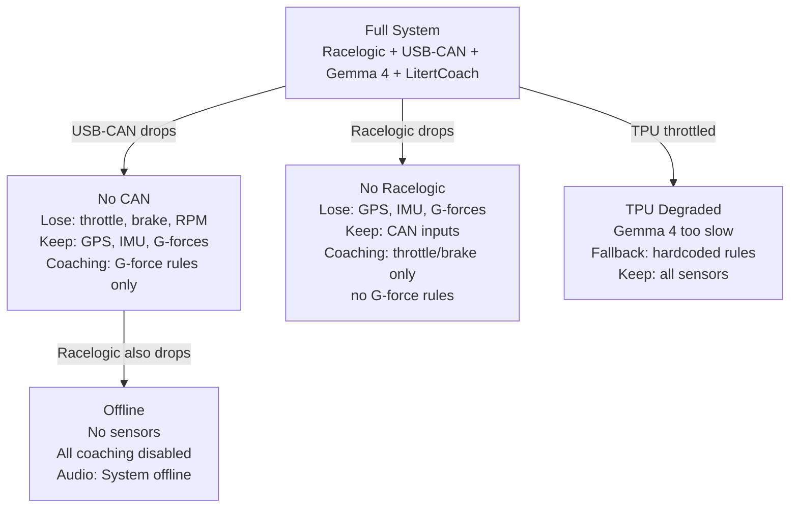

# ADR-009: Graceful Degradation Protocol

## Status
Accepted

## Origin
Adapted from Pitwall ADR-028. Simplified for single-device (Pixel 10) architecture.

## Context

> **Note:** The shipped architecture uses USB-CAN adapters (not OBDLink Bluetooth) and LitertCoach (not Gemini 3.0 cloud). The degradation tiers below have been updated accordingly.

Hardware fails mid-session: USB-CAN disconnects, Racelogic battery dies, Pixel 10 thermals throttle TPU performance. The system must degrade gracefully, never crash, and always inform the driver.

## Decision

### Detection (< 2 seconds)

| Failure | Detection | Time |
|---------|----------|------|
| USB-CAN disconnects | No CAN frames for 200ms | < 500ms |
| Racelogic Bluetooth drops | No GPS/IMU frames for 200ms | < 500ms |
| Pixel 10 TPU throttled | Gemma 4 inference > 100ms | Immediate |

### Degradation Levels

### Driver Notification

| Event | Audio Message | HUD |
|-------|-------------|-----|
| USB-CAN disconnects | "CAN disconnected. Brake coaching off." | Orange indicator |
| Racelogic disconnects | "GPS lost. G-force coaching off." | Orange indicator |
| TPU throttled | (silent — falls back to rules) | - |
| Everything fails | "System offline." | Red indicator |

### Recovery

When a disconnected sensor starts sending data again:
1. Collect 2 seconds of data
2. Validate: GPS has fix, CAN signals are in range, IMU gravity ≈ 9.81
3. If valid: restore, recalculate confidence, re-enable coaching
4. If invalid: keep disabled, warn driver

## Consequences
Positive: System never crashes. Driver always knows current capability. All coaching runs on-device with zero cloud dependency. Negative: Degraded modes provide less coaching. Frequent USB reconnects cause notification churn (mitigated: suppress if same sensor reconnects within 10 seconds).
