# ADR-016: USB-CAN Ingest + Vue PWA Frontend

**Status:** Accepted
**Date:** 2026-04-29

## Context

Through April we shipped a Flutter + Kotlin Pixel app talking to `pitwall_bridge.py` over `127.0.0.1:8765`. The native side carried five concerns:

1. BLE pairing of Racelogic VBO Mini + OBDLink MX
2. Sensor fusion + filtering (`SensorFusion.kt`, `Filters.kt`)
3. Mid-tier coaching primitives (`SonicModel.kt`, `MessageArbiter.kt`, `PedagogicalVectors.kt` — all duplicates of Python in `src/simulator/`)
4. Audio routing + the 4-layer mixer (`AudioEngine.kt`)
5. UI — `on_track_screen.dart`, `paddock_screen.dart`, ~1,200 LoC

Two things changed the calculus on this stack:

1. **Hardware decision: USB-CAN, not BLE.** A USB-CAN adapter (CANable Pro / Macchina M2 / similar) reading the BMW E46's OBD-II port via slcan over USB is a strictly better data source than two BLE devices: full powertrain bus access (200+ raw signals vs ~80 OBD-II PIDs), industrial cable reliability, no pairing dance, no foreground-tab dependency, no radio interference. None of `SensorFusion.kt` / `Filters.kt` / `PitwallService.kt` is needed once the data path is `USB → /dev/ttyACM0 → python-can → cantools → ADR-015 sink`.

2. **Frontend doesn't need to be native.** Per [ADR-013](013-frontend-backend-boundary.md) the frontend's job is rendering, not reasoning. Once BLE is gone, the rest of the on-track UI (signal-light HUD, audio playback, paddock dashboard) is achievable in a Vue PWA hitting the bridge over HTTP/SSE. The on-device LLM (Gemma 4 E2B via LiteRT-LM) is *already* in the Python bridge — it never needed the native app.

These two facts collapse the whole native stack:

- Without BLE, `SensorFusion.kt` + `Filters.kt` + `PitwallService.kt` lose their reason to exist.
- Without native UI, the duplicated `SonicModel.kt` / `MessageArbiter.kt` / `PedagogicalVectors.kt` / `AudioEngine.kt` lose theirs (the Python equivalents in `src/simulator/` are the canonical implementations anyway).
- `flutter/lib/**/*.dart` (~1,200 LoC) is replaced by a Vue 3 PWA that any browser can load.

This ADR records the pivot.

## Decision

Three sibling repos, each owning one concern:

| Repo | Role | Stack |
|---|---|---|
| **`pitwall`** | Brain. All decision logic, persistence, LLM, analytics, ingest. | Python (Flask + DuckDB + python-can + cantools + LiteRT-LM) |
| **`pitwall-web`** | Face. Pure presentation — HUD, paddock dashboard, replay. | Vue 3 + Vite + Tailwind + DuckDB-Wasm; installable PWA |
| (no `pitwall-ble`) | — | killed by the USB-CAN decision |

The `flutter/` directory in `pitwall` is frozen as a v1 reference and will be deleted once `pitwall-web` reaches feature parity.

### Ingest path

```mermaid
flowchart LR
  classDef car fill:#5d4a1a,stroke:#8a6e3a,color:#e0e0e0
  classDef bridge fill:#1a3a52,stroke:#4a6e8a,color:#e0e0e0
  classDef pwa fill:#2e5d3a,stroke:#5a8a6e,color:#e0e0e0

  CAR[OBD-II port<br/>powertrain CAN bus]:::car
  ADAPTER[USB-CAN adapter<br/>CANable Pro / Macchina M2]:::car
  TTY["/dev/ttyACM0<br/>(Termux)"]:::bridge
  BUS[python-can Bus<br/>interface=slcan]:::bridge
  DECODE[cantools<br/>DBC decode]:::bridge
  SINK[ADR-015 sink<br/>tall + wide]:::bridge
  COACH[coach_engine<br/>+ sonic_model<br/>+ LiteRT-LM Gemma]:::bridge
  HTTP[Flask HTTP/SSE<br/>127.0.0.1:8765]:::bridge
  PWA[pitwall-web<br/>Vue PWA]:::pwa

  CAR --> ADAPTER --> TTY --> BUS --> DECODE --> SINK --> COACH --> HTTP --> PWA
```



Same code path for development, testing, and production — only the python-can `interface` differs:

| Mode | Interface | Channel | Notes |
|---|---|---|---|
| Production (Pixel + USB-CAN) | `slcan` | `/dev/ttyACM0` | Real CAN at 500 kbps over USB CDC |
| Linux dev box | `socketcan` | `vcan0` | `sudo modprobe vcan && sudo ip link add dev vcan0 type vcan` |
| Cross-platform dev / CI | `virtual` | `pitwall_dev` | Pure Python, no kernel modules, no permissions |

### Components shipped 2026-04-29

| Path | Lines | Purpose |
|---|---|---|
| `data/dbc/pitwall.dbc` | ~50 | Custom DBC: 9 messages, 29 signals covering 11 wide-table canonicals + ADR-015 sink seeds (oil/coolant/clutch/TPMS/wheel speeds/AFR) |
| `tools/can_reader.py` | ~270 | Consumes a python-can Bus, decodes via cantools, sinks: wide canonicals → `telemetry`; everything else → `telemetry_signals` (ADR-015). Standalone CLI + thread-embedded |
| `tools/can_simulator.py` | ~200 | Replays a VBO file or synthesizes Sonoma laps as CAN frames over a Bus. Supports realtime / fast-as-possible / arbitrary-multiplier playback. Optional sink-signal injection (oil temp warm curve, 1 Hz TPMS, etc.) |
| `tests/test_can_pipeline.py` | ~180 | 6 round-trip tests on `interface='virtual'`: motion → wide table, powertrain → tall sink, novel signal auto-register, unknown CAN ID drops cleanly, capabilities advertisement |
| `pitwall_bridge.py` `--can-channel` flag | + | New flags: `--can-interface`, `--can-channel`, `--can-bitrate`, `--can-dbc`, `--can-session-id`, `--can-flush-ms`. Bridge spawns reader thread on startup; clean shutdown on Ctrl-C |

### Repository layout

```
pitwall/                              ← brain. All non-presentation lives here.
├── tools/
│   ├── pitwall_bridge.py             ← +CAN reader hookup (~50 lines added)
│   ├── can_reader.py                 ← NEW
│   ├── can_simulator.py              ← NEW
│   └── smoke_test_endpoints.py       ← exercises 50 routes against real VBO
├── data/
│   ├── dbc/pitwall.dbc               ← NEW; per-car DBCs added alongside later
│   └── registry/obd2_pids.json       ← seed (54 entries)
├── src/simulator/                    ← unchanged: sonic_model, coach_engine, etc.
├── docs/
│   ├── adr/016-can-bus-ingest-and-frontend-pivot.md  ← THIS DOC
│   └── api.md                        ← + --can-channel section
├── tests/
│   ├── test_can_pipeline.py          ← NEW (6 tests)
│   └── ... (existing 283 tests)
└── flutter/                          ← FROZEN. Deletes when pitwall-web ships.

pitwall-web/                          ← NEW sibling repo
├── src/
│   ├── views/                        ← OnTrack, Paddock, Brief, Debrief
│   ├── stores/                       ← Pinia: telemetry, session, duckdb
│   └── lib/
│       ├── bridge.ts                 ← typed client for the 50 endpoints
│       ├── duckdb.ts                 ← DuckDB-Wasm + OPFS cache
│       └── tts.ts                    ← Web Speech + pre-rendered fallback
├── public/manifest.json              ← installable
└── public/sw.js                      ← service worker
```

## Why USB-CAN beats BLE

| | BLE (Racelogic + OBDLink) | USB-CAN (CANable / Macchina) |
|---|---|---|
| Pairing | Per-session prompts; fragile | Plug in, `/dev/ttyACM0` appears |
| Reconnect after pit-lane stop | Re-pair, may fail | Cable is in. No event. |
| Foreground / background dependence | BLE dies if app loses focus | OS-level, doesn't care |
| Native code required | Yes (Kotlin BLE GATT) | **None.** Python on Termux reads serial. |
| Data rate | 10 Hz GPS + 5–8 Hz OBD-II (~80 PIDs) | **500 kbps raw bus** (200+ signals available) |
| Deterministic | RF interference possible | Industrial cable |
| Stack complexity | App + service + permissions matrix | One Python process |

The hardware change ($80 USB-CAN adapter) eliminates ~1,200 LoC of native code.

## Why the frontend pivots to Vue PWA

Restated from this session's discussion:

- **The Flutter app's intelligence wasn't in the Flutter app.** It was in the Python bridge (sonic_model, coach_engine, LLM). The native side carried duplicated logic (per [ADR-013](013-frontend-backend-boundary.md)) and BLE plumbing. Both go away here.
- **A Vue PWA running in Pixel Chrome (standalone manifest, Wake Lock, service worker) is sufficient** for the on-track signal-light HUD + paddock dashboard, *given* that BLE has moved off the phone.
- **DuckDB-Wasm in the PWA** unlocks client-side SQL analytics — Monaco editor, ad-hoc queries, OPFS-cached parquet snapshots for offline review on a flight home from the track. Codelab-class differentiation that Flutter couldn't reach.
- **Demo-able anywhere** — laptop browser, Pixel Chrome, iPad. Everyone connects to the same bridge.

The PWA does not need to handle BLE. It does not need to run a foreground service. It does not need to own the LLM (the bridge does). It is *purely* presentation.

## What changes vs ADR-013

ADR-013 said: "Frontend visualizes, backend reasons." That's preserved. ADR-016 only narrows what *frontend* means — from "Flutter app on Pixel" to "Vue PWA in any browser." The contract is the same: HTTP + SSE between brain and face.

## What changes vs ADR-006

ADR-006 fused Racelogic + OBDLink at the ingest boundary in the (then-Flutter) app. With USB-CAN, fusion happens earlier — at the OBD-II port itself: the powertrain bus already carries everything OBDLink would have given us, plus everything Racelogic-style GPS+IMU we choose to inject (we send those over our own DBC messages). The fusion *boundary* moves from the app to the python-can `_consume()` callback in `can_reader.py`.

ADR-006 is not retired; it documents the fusion concept. ADR-016 says: same idea, different transport, single producer.

## Migration plan

Already done by 2026-04-29:

- [x] python-can + cantools added (verified with cross-platform `interface='virtual'`)
- [x] `data/dbc/pitwall.dbc` shipped (29 signals, round-trip-tested)
- [x] `tools/can_reader.py` shipped (270 lines, threadable, standalone-CLI)
- [x] `tools/can_simulator.py` shipped (VBO + synthetic modes)
- [x] `tests/test_can_pipeline.py` — 6 tests, all green
- [x] Bridge `--can-channel` flag, in-process reader thread
- [x] End-to-end smoke: simulator + reader + DuckDB + capabilities

Still to do before May 23 Sonoma:

| Item | Owner | Status | Target |
|---|---|---|---|
| Buy USB-CAN adapter (CANable Pro recommended) | Taha | open | week 1 |
| Powered USB-C OTG hub for Pixel charge passthrough | Taha | open | week 1 |
| Termux foreground service with `pitwall_bridge.py` | open | runs already in foreground; promote to `sv` | week 1 |
| First end-to-end run with real CAN data (BMW E46 in driveway) | Taha | open | week 2 |
| `pitwall-web` Vue PWA scaffold | open | needs ADR-013 contract + bridge SSE endpoint | week 2 |
| `pitwall-web` paddock dashboard (sessions / laps / corners / debrief) | open | depends on scaffold | week 3 |
| `pitwall-web` on-track HUD (signal-light bars, audio, Wake Lock) | open | depends on dashboard | week 3 |
| Sonoma rehearsal day | Taha | open | week 4 |
| Delete `flutter/` from `pitwall` | open | once PWA reaches parity | post-Sonoma |

## Pressure tests

Things this design must handle without crashing:

1. **Unknown CAN ID arrives** — typical when a foreign car or aftermarket ECU broadcasts on the powertrain bus. The reader silently drops the frame (test: `test_unknown_can_id_is_silently_dropped`).
2. **DBC describes a signal pitwall has never seen** — reader auto-registers via `_resolve_signal_id` as `discovery='discovered'` (test: `test_novel_signal_auto_registers_via_decoded_name`). The capabilities endpoint advertises it; coach rules that don't `requires=` it stay enabled; widgets that don't render it ignore it.
3. **USB cable yanked mid-session** — the python-can Bus raises on the next `recv`; the reader thread catches `CanOperationError` and exits cleanly. Wide-row buffer is preserved; reconnect re-opens the bus.
4. **`virtual` bus replays compress timestamps** — known artifact; for fast simulator playback the bus rewrites `msg.timestamp` to wall-clock so capability `mean_hz` looks inflated. Real USB hardware preserves driver timestamps. Documented; not a production concern.
5. **DBC mismatch between simulator and reader** — both load the same `data/dbc/pitwall.dbc` by default. Real-vehicle DBCs may layer on top via `--can-dbc data/dbc/bmw_e46_m3.dbc` once we have one. Per-DBC namespace collisions are a `cantools` import error, not a runtime failure.
6. **Multiple DBCs loaded** — `cantools.database.add_dbc_file()` allows merging. Typical config in production: `pitwall.dbc` (our synthetic GPS+IMU+canonicals) + a vehicle-specific DBC. Reader doesn't care.

## Consequences

**Positive**
- One Python process owns all telemetry decision-making. Coverage of "what's pitwall doing right now" is a single `pitwall_bridge.py` process tree.
- Dev/test/prod data paths are byte-identical. Tests against `interface='virtual'` exercise the same code as production over `slcan`.
- The frontend is no longer load-bearing for the AI demo. A laptop with Chrome and `localhost:8765` is enough to show the system working.
- ADR-015's tall-store + capability gating becomes the *primary* persistence path, not the secondary one. Wide-table mirroring of the 11 canonicals stays for backward compatibility with the 11 Phase-6 endpoints.

**Negative**
- **DBC discipline becomes load-bearing.** A wrong DBC entry produces silently-wrong values. Mitigation: every coach rule comparing against thresholds declares units; cross-DBC unit collisions assert at registration time (already done in ADR-015).
- **Termux + foreground service is its own discipline.** The bridge process needs to survive screen-off + Doze + App-Standby on the Pixel. Solved by `termux-services` `sv` configs; needs validation before the field test.
- **No more native fallback.** If python-can can't open the bus, there is no second path. Mitigation: the existing VBO replay path stays — `/session/import` ingests a session post-hoc if live CAN dies.
- **Web Speech TTS quality < Android TTS.** For the live HUD's spoken cues. Mitigation: pre-render P3 safety phrases via `gemini-2.5-flash-tts` on the bridge → cache as MP3 → PWA plays the right one with low latency. The codelab calls this "planned" on their landing page; we can actually ship it.

## Related

- [ADR-006 — Sensor Fusion for Racelogic + OBDLink](006-sensor-fusion.md) — generalised here; same idea, USB transport instead of BLE.
- [ADR-009 — Graceful Degradation](009-graceful-degradation.md) — VBO replay path stays as the post-hoc fallback when live CAN is unavailable.
- [ADR-010 — HTTP Bridge as Warm-Path Tier 1](010-http-bridge-warm-path.md) — bridge stays as the only HTTP server; PWA is the only client architecture.
- [ADR-013 — Frontend Visualises, Backend Reasons](013-frontend-backend-boundary.md) — re-affirmed; frontend definition narrows to "Vue PWA" instead of "Flutter app."
- [ADR-015 — Universal Telemetry Sink](015-universal-telemetry-sink.md) — the ingest target. CAN reader is the producer ADR-015 was designed for.
- [API — Pitwall HTTP Bridge](../api.md) — `--can-channel` flag and the new ingest model.
- [Internal Architecture](../internal_architecture.md) — needs an updated topology diagram showing CAN reader thread inside the bridge.
