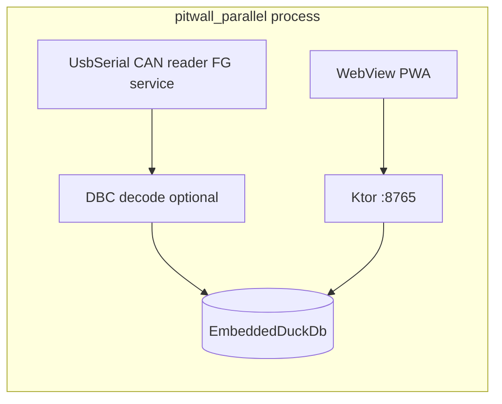

# Native USB-serial + CAN ingest on Android (roadmap)

**Status:** **Phase 2** — bundled **`pitwall.dbc`** decode + AIM canonical mapping (parity with Python [`can_reader.py`](../src/pitwall/features/telemetry/can_reader.py)), ADR-015 **`telemetry_signals`** tall sink + **`signal_registry`** seed (`assets/registry/obd2_pids.json`), and **`GET /signals/registry?include_can_state=true`** live **`can_state`** from [`UsbSerialProbeService`](../android-app/pitwall-parallel/src/main/java/com/pitwall/parallel/usb/UsbSerialProbeService.kt) + [`EmbeddedNativeCanState`](../android-app/pitwall-bridge-ktor/src/main/java/com/pitwall/bridge/ktor/embedded/EmbeddedNativeCanState.kt). Full Flask/Kalman dead-reckoning parity is still Python-only.  
**Goal:** Read CAN (via USB adapter such as CANable/slcan-style serial) **inside** the Android app and feed the same telemetry pipeline as `POST /session/{sid}/frames`, removing the hard dependency on Termux for ingest when using the embedded bridge.

## Why this is separate from Termux

- Termux sees a Linux-like environment and can use `python-can` against `/dev/ttyACM0` ([`deploy/termux/INSTALL.md`](../deploy/termux/INSTALL.md)).
- Stock Android apps **do not** open `/dev/ttyACM0` directly. Access is via **`UsbManager`** + **`UsbDeviceConnection`** (bulk/interrupt transfers on CDC ACM), or vendor SDKs.

## Target integration point (reuse existing bridge)

Frame persistence already exists in the embedded bridge: **`POST /session/{sid}/frames`** parses JSON into `EmbeddedDuckDb.FrameRow` ([`StandaloneBridgeRouting.kt`](../android-app/pitwall-bridge-ktor/src/main/java/com/pitwall/bridge/ktor/embedded/StandaloneBridgeRouting.kt)).

The native shim should **either**:

1. **Call the same Kotlin insert path** used by that route (inject frames into `EmbeddedDuckDb` / `EmbeddedSessionRepository` from a foreground service), or  
2. **HTTP loopback** to `http://127.0.0.1:8765/session/{sid}/frames` (works but adds serialization overhead).

Prefer **(1)** for latency and simplicity once `StandaloneBridgeRuntime` / DuckDB are reachable from an Android service in-process.

## Architecture (high level)

## Implementation phases

### Phase 1 — USB-serial MVP

- **Foreground service** (type aligned with long-running sensor/data capture; exact FGS type TBD with Android 14+ policies).
- **USB permission UX**: `UsbManager.requestPermission`, intent filters for **CDC ACM** (common for CANable/slcan dongles).
- Integrate a maintained **USB serial library** (evaluate **felHR85/usb-serial-for-android** or equivalent) rather than reinventing bulk endpoints.
- Prove **read loop** (bytes → lines) on a bench adapter.

### Phase 2 — CAN / slcan framing

- Parse **slcan** ASCII frames from serial lines (matches Termux mental model and [`PitStall.vue`](../src/pwa/src/pages/pit-stall/PitStall.vue) copy).
- Map decoded IDs + payloads → **physical signals** using existing **DBC** assets or a bundled DBC parser (Kotlin port or JNI to cantools-like decode — scope TBD).

### Phase 3 — Session wiring

- Bind ingest to **active session id** (same source as bridge `activeSessionId` / PWA session start).
- Insert **`FrameRow`** fields consistent with [`EmbeddedDuckDb.FrameRow`](../android-app/pitwall-bridge-ktor/src/main/java/com/pitwall/bridge/ktor/embedded/EmbeddedDuckDb.kt) (timestamp, distance_m, speed, rpm, throttle, brake_pressure, steering, lat/lon, etc.).
- **GPS**: continue using phone location APIs if required for map routes; CAN alone may not supply lat/lon.

### Phase 4 — UX honesty

- Replace **simulated** Pit stall boot sequence in the PWA with **real** connection state fed by native (USB granted, serial open, frames/sec counters). Keep graceful degradation when no dongle.

## Risks and constraints

- **Adapter variance**: Not all USB-CAN devices expose standard CDC ACM; some need proprietary drivers (out of scope unless explicitly supported).
- **Power / hub**: Same hardware caveats as Termux doc (powered hub, cable quality).
- **Performance**: Foreground service + tight read loop; batch DuckDB inserts to avoid per-frame disk sync where possible.
- **8765 conflict**: Native ingest must **not** start a second listener on `8765`; only **pitwall-parallel** embedded Ktor owns that port.

## Deliverables checklist

- New module or package under [`android-app/`](../android-app/) (e.g. `pitwall-can-ingest` or inside `pitwall-parallel`) with **minimal permissions** (`USB` feature + runtime permission flow).
- Documentation updates: [`android_parallel_llm_install.md`](android_parallel_llm_install.md) companion section **Hardware CAN** pointing here.
- Optional: retire or narrow Termux-only instructions once Pixel path is validated on hardware.

## Open decisions (before coding)

1. **Minimum adapter**: CANable-only vs any slcan-compatible serial device.
2. **DBC runtime**: Bundle one vehicle DBC vs multi-car selector in PWA.
3. **FGS type** on Android 14+: choose compliant foreground service type and user-visible disclosure.
