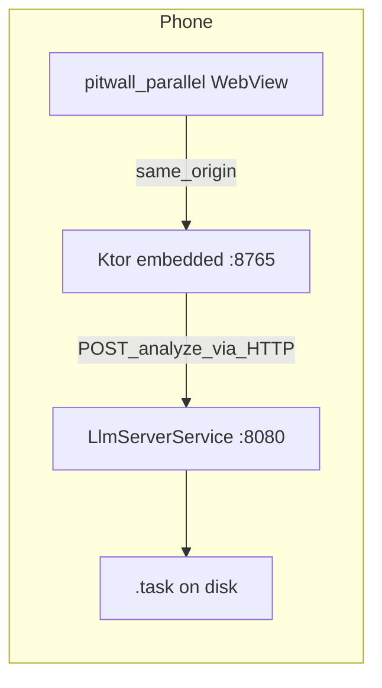

# User install checklist: pitwall-parallel + android-llm-service

This guide helps you build and sideload **both** Android apps on **one physical device** so the bundled PWA talks to the embedded bridge on **8765**, and coaching (`POST /analyze`) can use the **separate** on-device LLM service on **8080**—similar to the older **PWA + Termux/Python on localhost** workflow, without Termux.



## Prerequisites

- **JDK 17** and **Android SDK** (Platform 35 recommended; match [`android-app`](../android-app/) requirements).
- **Node/npm** — only if you build the PWA assets from source (`npm run build` under `src/pwa`).
- **USB debugging** — optional but recommended for `adb install` and pushing the model file.
- **Disk space** on the phone for the **MediaPipe `.task`** bundle (often multi‑GB; depends on which file you use).

## 1. Build `pitwall-parallel` APK

From the **repository root**:

```bash
cd src/pwa && npm ci && npm run build && cd ../..
cd android-app
./gradlew :pitwall-parallel:assembleDebug
```

Debug output (typical):

`android-app/pitwall-parallel/build/outputs/apk/debug/pitwall-parallel-debug.apk`

The `syncPwaDist` Gradle task copies `src/pwa/dist` into `pitwall-parallel` assets when `dist` exists. Without a successful `vite build`, the WebView may not load the full UI.

## 2. Build `android-llm-service` APK

This project is a **separate Gradle root** (not under `android-app/`):

```bash
cd android-llm-service
./gradlew :app:assembleDebug
```

Debug output (typical):

`android-llm-service/app/build/outputs/apk/debug/app-debug.apk`

## 3. Place the `.task` model on the device

`android-llm-service` loads the model from a **fixed path** in code:

`/sdcard/Pitwall/models/gemma-4-E2B-it.task`

You must supply a compatible **MediaPipe GenAI `.task`** file at **exactly** that path and filename (unless you change the path in [`LlmServerService.kt`](../android-llm-service/app/src/main/java/com/pitwall/llmservice/LlmServerService.kt) and rebuild). Obtain and accept the model license from your provider (e.g. Hugging Face / Google Gemma terms).

Example:

```bash
adb shell mkdir -p /sdcard/Pitwall/models
adb push /path/on/your/machine/gemma-4-E2B-it.task /sdcard/Pitwall/models/gemma-4-E2B-it.task
```

The APK does **not** embed large weights by default.

## 4. Install both APKs

With the device connected:

```bash
adb install -r android-app/pitwall-parallel/build/outputs/apk/debug/pitwall-parallel-debug.apk
adb install -r android-llm-service/app/build/outputs/apk/debug/app-debug.apk
```

Adjust paths if your Gradle output names differ. Install order **usually does not matter**.

If you distribute APKs without `adb`, recipients must allow **Install unknown apps** for your file manager or use their OEM sideload flow.

## 5. Runtime order (recommended)

1. Open **`android-llm-service`** once. Grant **notification** permission if prompted (foreground service). Confirm the service stays running (status notification).
2. Open **`pitwall-parallel`**. It starts the embedded server on **`127.0.0.1:8765`** and loads the WebView at that URL.

If the LLM app is not running or the model file is missing, **`pitwall-parallel`** still runs the PWA and embedded API; `/analyze` may fall back to a stub unless you configure a local `.task` via `PITWALL_LLM_MODEL_PATH` (see [`android-app/README.md`](../android-app/README.md)).

## 6. Quick verification

- **LLM service** (on device shell, if `curl` exists):

  `adb shell curl -s http://127.0.0.1:8080/health`

  Expect JSON including a healthy status (the service exposes `GET /health`).

- **Embedded bridge** (from your PC via USB; forwards are not required if you test **on** the device—the WebView hits loopback directly):

  On the phone, the PWA uses **`http://127.0.0.1:8765`**. From a desktop you can use `adb reverse tcp:8765 tcp:8765` and open `http://127.0.0.1:8765/health` on the PC, or inspect the WebView with **Chrome remote debugging**.

- **`pitwall-parallel`** defaults **`PITWALL_LLM_HTTP_BASE_URL`** to **`http://127.0.0.1:8080`** (see `pitwall-parallel/build.gradle.kts`). When that URL is set, embedded **`POST /analyze`** tries the HTTP backend first, then may fall back to an in-process `.task` if configured.

## 7. Optional: `android-app/local.properties`

All keys are optional overrides at **build** time:

| Property | Effect |
|----------|--------|
| `PITWALL_LLM_HTTP_BASE_URL` | Set to empty to **disable** HTTP coaching and use only `PITWALL_LLM_MODEL_PATH` or stub. Default for parallel builds is `http://127.0.0.1:8080`. |
| `PITWALL_LLM_HTTP_MODEL` | Model id sent to `/v1/chat/completions` (default `gemma-4-E2B-it`). Must match what `android-llm-service` expects for the request body. |
| `PITWALL_LLM_MODEL_PATH` | Absolute path to a `.task` on the device for **in-process** MediaPipe in `pitwall-parallel` (optional alternative to the 8080 service). |

## Troubleshooting

| Symptom | Things to check |
|---------|------------------|
| Blank WebView in parallel | Run `npm run build` in `src/pwa`, rebuild parallel; confirm `syncPwaDist` ran. |
| `/analyze` stub text | Start **`android-llm-service`**, confirm model exists at `/sdcard/Pitwall/models/gemma-4-E2B-it.task`, check `GET /health` on **8080**. |
| Port already in use on **8765** | Only one server may bind **8765**. Do not run the Python Flask bridge on the same port while embedded bridge is active. |
| Inference very slow or OOM | Prefer a smaller `.task` or a device with sufficient RAM/NPU; emulators are often unsuitable for large models. |

## Related

- [`android-app/README.md`](../android-app/README.md) — embedded bridge, MediaPipe notes, Paddock vs parallel.
- [`deploy/termux/INSTALL.md`](../deploy/termux/INSTALL.md) — Termux-based install (alternative to this two-APK flow).
