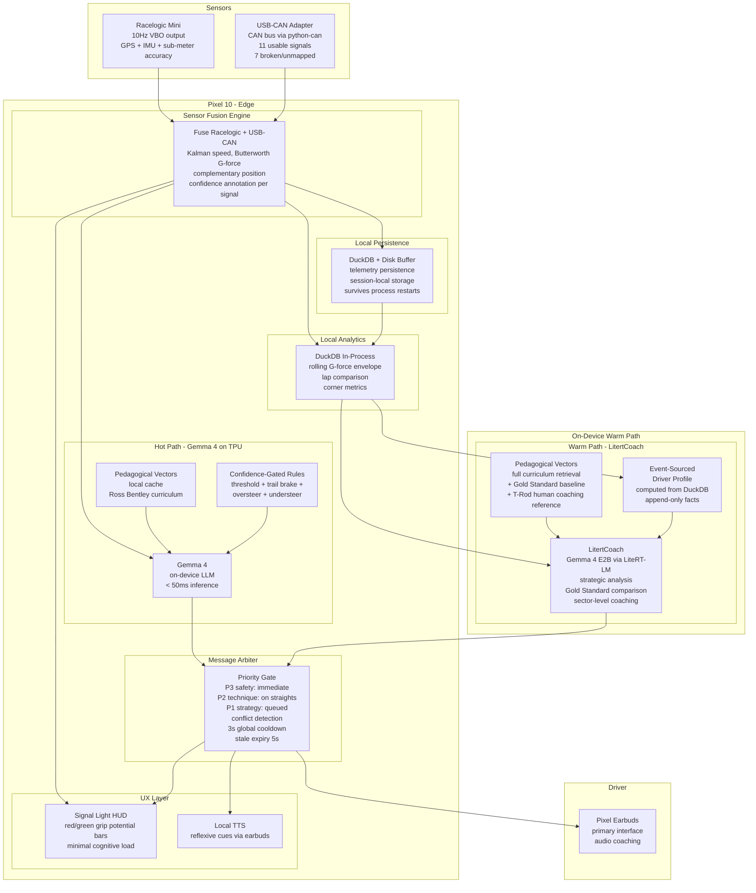
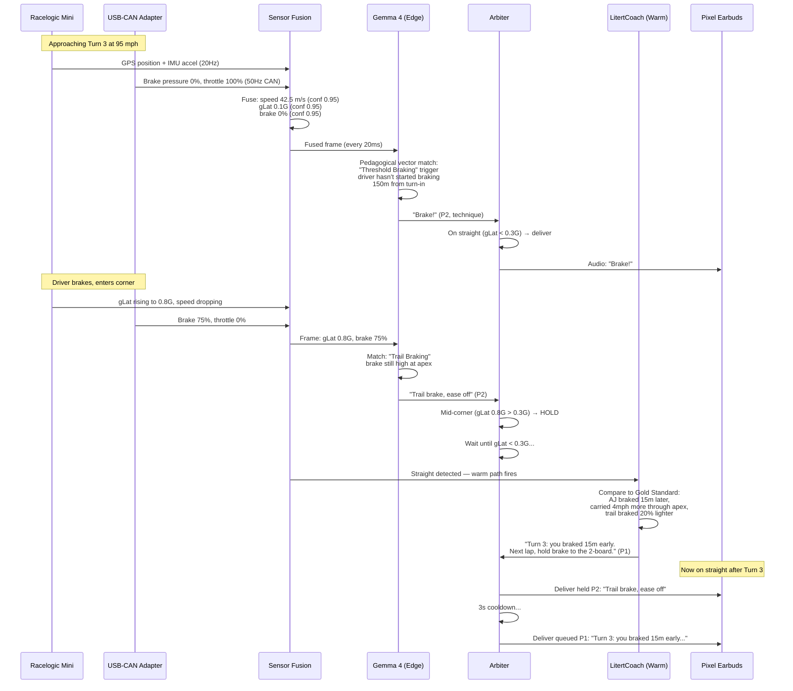

# System Architecture

!!! warning "Historical document — see [Internal Architecture](internal_architecture.md) for the as-shipped topology"
    This page documents the **original sprint-design** (April 2026). The system has since evolved to a fully on-device, three-tier architecture with no cloud dependency:

    - **Hot path (<50 ms):** `sonic_model` + `RuleCoach` — canonical phrase library, no LLM.
    - **Warm path (<100 ms):** `LitertCoach` (Gemma 4 E2B via LiteRT-LM, in-process) — rally-style pace notes.
    - **Paddock path (2–15 s):** 18 ADK agents (Gemma 4 E4B via `lit serve`) — briefings, debriefs, Q&A.
    - **No Vertex AI, no Antigravity pipeline, no Gemini 3.0** — all inference runs on-device.
    - **CAN ingest** via USB-CAN adapters (`python-can` + `cantools`), not OBDLink Bluetooth.
    - **56 HTTP endpoints** on the Flask bridge (up from the original 6).
    - **358 tests passing**, 51-assertion end-to-end smoke test.

    For the current architecture, see [Internal Architecture](internal_architecture.md) and [ADK Agent Architecture](adk-agent-architecture.md).

## Overview

The system was originally designed as a **split-brain architecture** with two concurrent reasoning paths connected by the Antigravity telemetry pipeline. The shipped system consolidated to a fully on-device three-tier architecture — see the warning above.

## Full Architecture

## Data Flow: One Corner

## What Pitwall Adds to V1

The original V1 prototype had no coordination between hot and warm paths, no signal quality tracking, and no formal pedagogical structure. This sprint adds:

### From Pitwall: Confidence-Annotated Frame (ADR-001)

Every signal from Racelogic and the USB-CAN adapter carries confidence metadata. Even with pro hardware, this matters:

- Racelogic GPS in a tunnel or under trees → confidence drops from 0.95 to 0.40
- USB-CAN adapter disconnects momentarily → CAN signals marked stale
- Gemma 4 rules check confidence before firing — no coaching on bad data

### From Pitwall: Message Arbiter (ADR-002)

V1 had both paths sending audio simultaneously. The arbiter prevents:

- Hot and warm coaching overlapping (hot says "brake", warm says "you braked too early" — conflicting)
- Mid-corner audio distraction (non-safety messages held until straight)
- Message spam (3s cooldown between different sources)

### From Pitwall: Sensor Fusion (ADR-006)

Even with Racelogic + USB-CAN (both high quality), fusion adds value:

- Racelogic GPS speed vs CAN wheel speed → Kalman filter for best estimate
- Racelogic IMU G-forces → Butterworth filter removes road surface vibration
- Racelogic position between 20Hz GPS fixes → dead-reckoning from IMU for smooth 50Hz position

### New for Sprint: Gemma 4 Edge LLM (ADR-003)

The biggest upgrade from Pitwall. Instead of hardcoded rules, the hot path runs a real LLM on the Pixel 10 TPU:

- Evaluates telemetry against Ross Bentley pedagogical vectors
- Generates contextual coaching, not just threshold alerts
- Adapts language to driver skill level (beginner vs pro persona)
- Sub-50ms inference on Pixel 10 TPU

### New for Sprint: Local Telemetry Persistence (ADR-004)

Replaces raw SSE/UDP streaming with DuckDB-backed local persistence:

- Telemetry frames are persisted to DuckDB as they arrive
- All analytics queries run locally on-device (zero cloud dependency)
- Survives process restarts — no lost frames
- Session data available immediately for warm-path analysis

### New for Sprint: Pedagogical Vector Retrieval (ADR-005)

Ross Bentley's Speed Secrets curriculum encoded as structured vectors matched to telemetry triggers:

| Telemetry Trigger | Pedagogical Concept | Level |
|-------------------|-------------------|-------|
| gLong < -0.8G, brake > 50% | Threshold Braking | Beginner |
| brake > 10%, \|gLat\| > 0.4G | Trail Braking (weight transfer to front) | Intermediate |
| \|gLat\| > 1.0G, throttle < 20% | Commitment (trust the grip circle) | Intermediate |
| yaw_rate > expected_yaw | Oversteer (look where you want to go, modulate throttle) | All |
| yaw_rate < expected_yaw, steering > 30° | Understeer (ease throttle, straighten wheel slightly) | All |
| speed decreasing, no brake, no throttle | Coasting (wasted time — brake or accelerate) | Beginner |
| approaching apex, early turn-in | Late Apex reminder (wait for turn-in, accelerate earlier) | Intermediate |
| exiting corner, throttle < 50% | Exit Speed (speed on the straight matters more than speed in the corner) | All |

## Validated Against Real Data

The architecture has been validated against 183 VBO sessions (535K frames, 14.9 hours) from 8 tracks. Key findings that shaped design decisions:

### Dataset Summary

| Metric | Value |
|--------|-------|
| Total sessions | 183 (52 hot laps, 127 transit, 4 warmup/short) |
| Total frames | 535,366 (14.9 hours) |
| Usable hot lap frames | 456,711 (12.7 hours) |
| Tracks | 8 (3 primary: Sonoma 407 min, Track 2 225 min, Track 8 180 min) |
| Auto-generated track definitions | 3 (Sonoma 11 corners, Track 2 9 corners, Track 8 11 corners) |
| Actual sample rate | **10Hz** (not 20Hz — VBO output is downsampled from Racelogic hardware) |

### Trained ML Models

| Model | Architecture | Accuracy (unseen Track 8, 1.0s horizon) | Size |
|-------|-------------|----------------------------------------|------|
| **LSTM v3 Sequence Predictor** | Multi-scale BiLSTM + corner embedding + attention + residual | Speed: **3.3 km/h** MAE, Brake: **2.7 bar** MAE | 1.1 MB |
| Phase Classifier | GradientBoosting 200 trees | 100% (deterministic labels) | 3.7 MB |
| Brake Point Predictor | Linear regression | 15.9m MAE, R²=0.515 | 436 B |
| Style Fingerprint | K-Means k=4 | 4 archetypes: aggressive, smooth, heavy braker, cautious | 23 KB |

### Sonoma Track Profile (Auto-Generated)

| Corner | Dir | Entry km/h | Apex km/h | Exit km/h | Brake Zone | Elevation |
|--------|-----|-----------|-----------|-----------|-----------|-----------|
| Turn 1 | L | 111 | 113 | 117 | — | flat |
| Turn 3 | R | 104 | 87 | 102 | 50m, 12 bar | +11m uphill |
| Turn 6 | R | 92 | 77 | 105 | 86m, 29 bar | -11m downhill |
| Turn 9 | L | 121 | 116 | 132 | 66m, 25 bar | -16m downhill |
| Turn 10 | R | 106 | **73** | 108 | **124m, 47 bar** | flat |
| Turn 11 | R | 88 | **64** | 95 | **134m, 34 bar** | flat |

Turn 10 and Turn 11 are the heaviest braking corners — primary targets for trail brake coaching.

## Technology Stack (as-shipped)

| Layer | Technology |
|-------|-----------|
| Edge compute | Pixel 10 Tensor G5 NPU (Gemma 4 inference via LiteRT-LM) |
| Edge telemetry | Racelogic Mini (10Hz VBO) + USB-CAN adapters (CANable Pro / Macchina M2) |
| Sensor fusion | Python / numpy (Kalman, Butterworth, complementary filter) |
| Hot-path coach | `sonic_model` + `RuleCoach` (<50 ms, no LLM) |
| Warm-path coach | `LitertCoach` — Gemma 4 E2B via LiteRT-LM (<100 ms) |
| Paddock agents | 18 ADK agents — Gemma 4 E4B via `lit serve` (2–15 s) |
| Sequence predictor | LSTM v3 (272K params, 1.1 MB, ~10ms CPU / ~3ms GPU) |
| HTTP bridge | Flask on :8765 — 56 endpoints |
| Local analytics | DuckDB in-process (telemetry, laps, coaching_notes, agent_traces, conversations) |
| Audio output | Pixel Earbuds via Android Audio API |
| Pedagogical vectors | JSON knowledge base with real Sonoma corner data |
| Driver profile | Event-sourced JSON (DuckDB-computed) |
| Testing | pytest — 358 tests + 51-assertion end-to-end smoke test |
