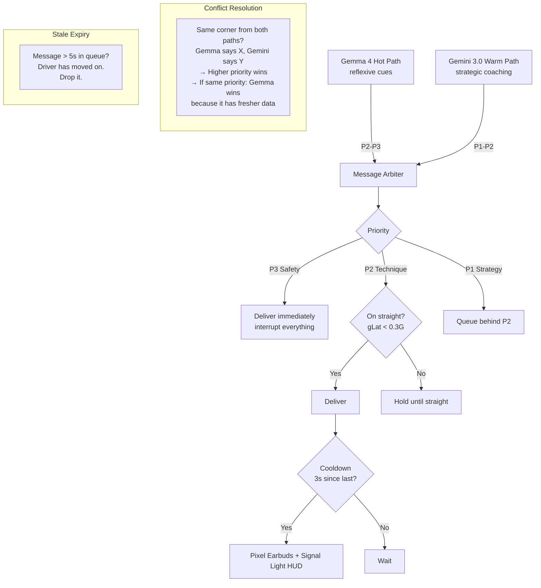

# Coaching Engine

Two reasoning paths, one message arbiter, one driver.

---

## Hot Path: Gemma 4 on Pixel 10 TPU

The hot path runs **on-device** with no network dependency. It processes every telemetry frame (50Hz) and delivers reflexive coaching in <50ms.

### What the Data Tells Us About Coaching Priorities

Analysis of 52 hot lap sessions (456K frames, 761 minutes) across 3 tracks reveals where the driver spends time:

| Phase | % of Driving Time | Coaching Priority |
|-------|:-:|---|
| **Cornering (powered)** | 43.7% | Highest — this is most of the lap. Corner speed, exit speed, throttle application. |
| **Straight** | 14.5% | Low — driver is already doing the right thing (full throttle). |
| **Transition** | 14.4% | Medium — between phases, smoothness matters. |
| **Cornering (coasting)** | 10.1% | High — should be on throttle or brake, not coasting through corners. |
| **Braking** | 8.8% | High — brake point, brake pressure, trail brake onset. |
| **Coasting (wasted)** | 6.3% | **Highest coaching ROI** — 6.3 seconds per lap wasted. |
| **Trail braking** | 2.2% | Very high per-second value — only 2.2% but highest-skill technique. |

**Key insight:** The driver spends 6.3% of the lap doing nothing (coasting). At an average speed of 115 km/h, that's ~6 seconds per lap with neither brake nor throttle applied. This is the #1 coaching target for beginners and intermediates.

**Signal statistics across all sessions:**

| Signal | Mean | P95 | Max |
|--------|------|-----|-----|
| Speed | 115 km/h | 170 km/h | 199 km/h |
| Lateral G | 0.53G | 1.21G | 1.95G |
| Longitudinal G | -0.26G | -0.92G (braking) | +0.08G (accel) |
| Brake pressure | 3.5 bar | 28.4 bar | 107 bar |
| Combined G | 0.63G | 1.20G | 2.86G |

**Friction circle utilization:** 57.3% of the time the driver uses less than 25% of available grip (straights, transition). Only 0.5% of time is spent above 50% utilization. There's significant untapped grip — the coaching system's job is to help the driver use more of it safely.

### Why an LLM, Not Just Rules

The V1 prototype and Pitwall open-source use a hardcoded decision matrix. Gemma 4 on TPU enables:

| Hardcoded Rules | Gemma 4 Edge LLM |
|----------------|-------------------|
| "brake > 50% AND gLong < -0.8G" → "Max brake" | Evaluates frame against Ross Bentley curriculum. Understands **why** threshold braking matters (weight transfer to front tires). |
| Same message for beginner and pro | Adapts language: beginner gets "Brake hard and hold", pro gets "Good threshold, hold to the 1-board" |
| Can't explain physics | Can explain: "Braking transfers weight forward, giving front tires more grip for turn-in" |
| Binary: fires or doesn't | Graduated: can give partial credit ("Good braking, but you released 10m early") |

### Gemma 4 Hot Path Prompt

```
You are a racing coach riding shotgun. The driver is {LEVEL}.
You receive a telemetry frame every 20ms. 

RULES:
- Respond ONLY when you detect a coaching moment
- Keep responses under 5 words for reflexive cues, under 15 for technique
- Safety alerts (P3) are immediate: "BRAKE!" / "Lift!" / "Car right!"
- Technique cues (P2) reference Ross Bentley concepts when relevant
- NEVER speak during heavy cornering unless safety-critical
- Check signal confidence before coaching — do not coach on stale or low-confidence data

PEDAGOGICAL VECTORS (matched to telemetry):
{MATCHED_VECTORS_JSON}

CURRENT FRAME:
{FRAME_JSON}

RECENT CONTEXT (last 5 coaching messages):
{RECENT_MESSAGES}
```

### Confidence Gating in Gemma 4

The prompt includes signal confidence. Gemma 4 is instructed to check confidence before coaching:

```
If brake.confidence < 0.70: do not comment on braking technique
If g_lat.confidence < 0.80: do not comment on cornering commitment
If speed.confidence < 0.50: do not comment on speed at all
```

This replicates the Pitwall ADR-001 confidence gate, but enforced via prompt instruction rather than hard code. The hard-coded confidence gate (from Pitwall) runs as a **pre-filter** before the frame reaches Gemma 4 — if critical signals are below threshold, the frame is not sent to the LLM at all, saving TPU inference cycles.

### Latency Budget

```
Frame arrives from fusion:     0 ms
Pre-filter (confidence gate):  <1 ms
Gemma 4 inference on TPU:     20-40 ms
Arbiter evaluation:            <1 ms
TTS generation:               10-20 ms
Audio to earbuds:              <5 ms
────────────────────────────────────
Total:                        32-67 ms (target: <100ms perceived)
```

---

## Warm Path: Gemini 3.0 on Vertex AI

The warm path runs in the cloud. It receives telemetry bursts via Antigravity, compares against the Gold Standard baseline, and generates strategic coaching for the next sector.

### Gold Standard Comparison

The system stores AJ's (pro driver) reference lap at Sonoma:

```python
gold_standard = {
    "track": "sonoma",
    "driver": "AJ",
    "lap_time": 98.2,  # seconds
    "sectors": {
        "sector_1": {"time": 32.1, "min_speed_t3": 52.3, "brake_point_t3": 185},
        "sector_2": {"time": 33.8, "min_speed_t7": 68.1, "trail_brake_pct_t7": 0.65},
        "sector_3": {"time": 32.3, "exit_speed_t11": 78.4, "max_glat_t11": 1.15},
    },
    "corners": [...]  # per-corner telemetry trace
}
```

Gemini 3.0 receives the telemetry burst + Gold Standard and identifies:

1. Where the driver is slower than AJ (and why)
2. Where the driver has improved since last lap
3. What to focus on for the next lap

### Gemini 3.0 Warm Path Prompt

```
You are a race engineer analyzing telemetry for a {LEVEL} driver.

GOLD STANDARD (AJ's reference lap):
{GOLD_STANDARD_JSON}

DRIVER'S LAST SECTOR:
{TELEMETRY_BURST_SUMMARY}

DRIVER PROFILE (event-sourced, computed):
{COMPUTED_PROFILE_JSON}

PEDAGOGICAL CURRICULUM:
{ROSS_BENTLEY_VECTORS_JSON}

Generate ONE coaching message for the driver's next sector:
- Reference specific corners and metrics ("Turn 3: you braked 15m early")
- Compare to Gold Standard ("AJ carries 4mph more through the apex")
- Reference the relevant Ross Bentley concept ("Trail braking transfers load to the front tires")
- Match the driver's level: {LEVEL} (beginner = simple, pro = data-driven)
- Under 25 words for on-track delivery
- Include a priority: P1 (strategy) for normal, P2 (technique) for critical corrections
```

### T-Rod Human Coaching Reference

The system also has recordings of T-Rod (human coach) coaching at Sonoma. Gemini 3.0 can reference these to validate its coaching approach:

```
The warm path compares its generated coaching against T-Rod's actual
coaching at the same track position. If Gemini would say something
fundamentally different from T-Rod, it flags the discrepancy for
review rather than delivering potentially wrong advice.
```

---

## Message Arbiter

All coaching from both paths flows through the arbiter before reaching the driver.



### Arbiter Rules

1. **P3 (safety):** Delivered immediately. Interrupts any queued message. Examples: "BRAKE!", "Car right!", oversteer warning.
2. **P2 (technique):** Delivered on straights only (|gLat| < 0.3G). Held during corners to avoid distraction. Examples: "Trail brake", "Commit", feedforward corner preview.
3. **P1 (strategy):** Queued behind P2. Delivered when no P2 is pending. Examples: "Turn 3: you braked 15m early vs AJ."
4. **Conflict:** If Gemma 4 and Gemini 3.0 both target the same corner within 5 seconds, the higher-priority message wins. Same priority: Gemma wins (it has the most recent frame data).
5. **Cooldown:** Minimum 3 seconds between messages from different sources. Prevents overwhelm.
6. **Stale expiry:** Messages sitting in the queue for >5 seconds are dropped. Coaching about Turn 3 is useless when the driver is in Turn 5.

### Delivery Channels

| Channel | Content | When |
|---------|---------|------|
| **Pixel Earbuds (audio)** | All coaching messages via TTS | Always (primary interface) |
| **Signal Light HUD** | Red/green grip potential bars | Always (minimal visual) |
| **Signal Light HUD** | Brake/throttle zone indicator | On approach to corners |

---

## Coaching by Driver Level

The 3-pod structure means each driver level gets different coaching:

| Situation | Beginner (Rental Car) | Intermediate (M3) | Pro (Race Car) |
|-----------|----------------------|-------------------|----------------|
| Approaching corner | "Brake now." | "Brake at the 2-board. Trail to the apex." | (silence — pro knows) |
| Good corner | "Good job!" | "Clean trail brake." | (silence) |
| Slow corner | "Try going faster here." | "Turn 3: 4mph below your best exit. Throttle earlier." | "T3: -0.3s. Released brake 8m early." |
| Oversteer | "The back is sliding! Ease off!" | "Rear stepping out. Look where you want to go, ease throttle." | "Rear slip 0.9. Modulate." |
| Understeer | "Turn the wheel less!" | "Front washing. Ease throttle, unwind steering slightly." | "Front saturated. Reduce input." |

This mapping is driven by the `driver_level` field in the Antigravity burst and the persona configuration per pod.
