# Coaching Engine

Two reasoning paths, one message arbiter, one driver.

!!! info "Current implementation status (2026-04-28)"
    The split-brain design described below is the sprint architecture. The **current implementation** consolidated as follows after the architectural decisions of 2026-04-28:

    - **Backend owns all LLM logic and system prompts** per [ADR-013](adr/013-frontend-backend-boundary.md). The Flutter / Kotlin frontend consumes coaching from the Python bridge; it does not run inference itself.
    - **One LLM coach**: `LitertCoach` (Gemma 4 E2B via MediaPipe Genai's LiteRT-LM runtime) per [ADR-012](adr/012-coach-engine-adapter.md). No `LlamaCppCoach`, no cloud Gemini tier.
    - **Pace-note voice** is grounded in Sonoma research: per-corner Bentley + T-Rod tips loaded from `data/tracks/sonoma.json`, named landmark labels surfaced in `CoachContext`. See [`pedagogy.md`](pedagogy.md), [`markers.md`](markers.md), [`sonoma_track_intelligence.md`](sonoma_track_intelligence.md), [`trod_sonoma_session.md`](trod_sonoma_session.md).
    - **Bridge is wired**: `src/pitwall/__main__.py:/analyze` returns `pace_note` + `coach_source` alongside the original `coaching` field, persists notes to a DuckDB `coaching_notes` table when `session_id` is on the burst. See [`api.md`](api.md) for the contract.

    The hot/warm split below remains the design vocabulary; the implementation puts both paths under one Python backend.

---

## Hot Path: Gemma 4 on Pixel 10 TPU

The hot path runs **on-device** with no network dependency. It processes every telemetry frame (10Hz) and delivers reflexive coaching in <50ms.

### What the Data Tells Us About Coaching Priorities

Analysis of 52 hot lap sessions (456K frames, 761 minutes) across 3 tracks reveals where the driver spends time:

| Phase | % of Driving Time | Coaching Priority |
|-------|:-:|---|
| **Cornering (powered)** | 43.7% | Highest — this is most of the lap. Corner speed, exit speed, throttle application. |
| **Straight** | 14.5% | Low — driver is already doing the right thing (full throttle). |
| **Transition** | 14.4% | Medium — between phases, smoothness matters. |
| **Cornering (coasting)** | 10.1% | High — should be on throttle or brake, not coasting through corners. |
| **Braking** | 8.8% | High — brake point, brake pressure, trail brake onset. |
| **Coasting (wasted)** | 6.3% | **Highest coaching ROI** — 6.3 seconds per lap wasted. |
| **Trail braking** | 2.2% | Very high per-second value — only 2.2% but highest-skill technique. |

**Key insight:** The driver spends 6.3% of the lap doing nothing (coasting). At an average speed of 115 km/h, that's ~6 seconds per lap with neither brake nor throttle applied. This is the #1 coaching target for beginners and intermediates.

**Signal statistics across all sessions:**

| Signal | Mean | P95 | Max |
|--------|------|-----|-----|
| Speed | 115 km/h | 170 km/h | 199 km/h |
| Lateral G | 0.53G | 1.21G | 1.95G |
| Longitudinal G | -0.26G | -0.92G (braking) | +0.08G (accel) |
| Brake pressure | 3.5 bar | 28.4 bar | 107 bar |
| Combined G | 0.63G | 1.20G | 2.86G |

**Friction circle utilization:** 57.3% of the time the driver uses less than 25% of available grip (straights, transition). Only 0.5% of time is spent above 50% utilization. There's significant untapped grip — the coaching system's job is to help the driver use more of it safely.

### Why an LLM, Not Just Rules

The V1 prototype and Pitwall open-source use a hardcoded decision matrix. Gemma 4 on TPU enables:

| Hardcoded Rules | Gemma 4 Edge LLM |
|----------------|-------------------|
| "brake > 50% AND gLong < -0.8G" → "Max brake" | Evaluates frame against Ross Bentley curriculum. Understands **why** threshold braking matters (weight transfer to front tires). |
| Same message for beginner and pro | Adapts language: beginner gets "Brake hard and hold", pro gets "Good threshold, hold to the 1-board" |
| Can't explain physics | Can explain: "Braking transfers weight forward, giving front tires more grip for turn-in" |
| Binary: fires or doesn't | Graduated: can give partial credit ("Good braking, but you released 10m early") |

### Gemma 4 Hot Path Prompt

```
You are a racing coach riding shotgun. The driver is {LEVEL}.
You receive a telemetry frame every 20ms. 

RULES:
- Respond ONLY when you detect a coaching moment
- Keep responses under 5 words for reflexive cues, under 15 for technique
- Safety alerts (P3) are immediate: "BRAKE!" / "Lift!" / "Car right!"
- Technique cues (P2) reference Ross Bentley concepts when relevant
- NEVER speak during heavy cornering unless safety-critical
- Check signal confidence before coaching — do not coach on stale or low-confidence data

PEDAGOGICAL VECTORS (matched to telemetry):
{MATCHED_VECTORS_JSON}

CURRENT FRAME:
{FRAME_JSON}

RECENT CONTEXT (last 5 coaching messages):
{RECENT_MESSAGES}
```

### Confidence Gating in Gemma 4

The prompt includes signal confidence. Gemma 4 is instructed to check confidence before coaching:

```
If brake.confidence < 0.70: do not comment on braking technique
If g_lat.confidence < 0.80: do not comment on cornering commitment
If speed.confidence < 0.50: do not comment on speed at all
```

This replicates the Pitwall ADR-001 confidence gate, but enforced via prompt instruction rather than hard code. The hard-coded confidence gate (from Pitwall) runs as a **pre-filter** before the frame reaches Gemma 4 — if critical signals are below threshold, the frame is not sent to the LLM at all, saving TPU inference cycles.

### Latency Budget

```
Frame arrives from fusion:     0 ms
Pre-filter (confidence gate):  <1 ms
Gemma 4 inference on TPU:     20-40 ms
Arbiter evaluation:            <1 ms
TTS generation:               10-20 ms
Audio to earbuds:              <5 ms
────────────────────────────────────
Total:                        32-67 ms (target: <100ms perceived)
```

---

## Warm Path: LitertCoach (Gemma 4 E2B, on-device)

The warm path runs **on-device** via LiteRT-LM (Gemma 4 E2B in-process). It generates rally-style verbal pace notes, debounced to fire on straights only. No cloud dependency.

!!! note "Architecture evolution"
    The original design used Gemini 3.0 on Vertex AI via the Antigravity store-and-forward pipeline. Per [ADR-012](adr/012-coach-engine-adapter.md) and [ADR-017](adr/017-litert-lm-migration.md), the project consolidated to fully on-device inference. The warm path now uses `LitertCoach` with the same system prompts and pedagogical grounding.

### Gold Standard Comparison

The system stores AJ's (pro driver) reference lap at Sonoma as a per-corner `GoldStandard` (see `gold_standard.py`). The corner grader compares each pass against gold across 6 dimensions (entry speed, apex speed, exit speed, time, trail brake quality, nothing-time) and produces time-loss attributions.

### System Prompt Design

All system prompts are owned by the backend (`coach_engine.py`). The LLM receives:

- **Base prompt:** Rally co-driver persona grounded in Ross Bentley's Speed Secrets curriculum
- **Level-specific prompt:** Beginner (full sentences, 8-12 words), Intermediate (rally shorthand, 6-12 words), Pro (terse, 3-7 words)
- **Track lore:** Sonoma-specific named landmarks, strategy tips, T-Rod voice phrasings
- **Emotion tag contract:** LLM declares mood (`[EMOTION: excited]`) for the Vue PWA avatar

Three coaching modes share this prompt architecture:
- `DURING_DRIVE` — one-line pace note per burst
- `PRE_BRIEF` — pre-session focus plan (~150 words)
- `POST_SESSION` — full session debrief narrative (~300 words)

### Paddock Path: ADK Multi-Agent Backend

For off-track interactions (briefings, debriefs, multi-turn Q&A), the system uses an **18-agent ADK backend** powered by Gemma 4 E4B via `lit serve`. See [ADK Agent Architecture](adk-agent-architecture.md) for the full topology.

---

## Message Arbiter

All coaching from both paths flows through the arbiter before reaching the driver.

```mermaid
graph TB
    SONIC[sonic_model + RuleCoach<br/>Hot Path — reflexive cues] -->|P2-P3| ARB[CoachArbiter]
    LITERT[LitertCoach<br/>Warm Path — pace notes] -->|P1-P2| ARB

    ARB --> PRIO{Priority}
    
    PRIO -->|P3 Safety| IMM[Deliver immediately<br/>interrupt everything]
    PRIO -->|P2 Technique| CHECK_CORNER{On straight?<br/>gLat < 0.3G}
    CHECK_CORNER -->|Yes| DELIVER[Deliver]
    CHECK_CORNER -->|No| HOLD[Hold until straight]
    PRIO -->|P1 Strategy| QUEUE[Queue behind P2]

    DELIVER --> COOL{Cooldown<br/>3s since last?}
    COOL -->|Yes| OUT[Pixel Earbuds]
    COOL -->|No| WAIT[Wait]

    subgraph Conflict Resolution
        CONFLICT[Same corner from both paths?<br/>Hot says X, Warm says Y<br/>→ Higher priority wins<br/>→ If same priority: Hot wins<br/>because it has fresher data]
    end

    subgraph Stale Expiry
        STALE[Message > 5s in queue?<br/>Driver has moved on.<br/>Drop it.]
    end
```



### Arbiter Rules

1. **P3 (safety):** Delivered immediately. Interrupts any queued message. Examples: "BRAKE!", "Car right!", oversteer warning.
2. **P2 (technique):** Delivered on straights only (|gLat| < 0.3G). Held during corners to avoid distraction. Examples: "Trail brake", "Commit", feedforward corner preview.
3. **P1 (strategy):** Queued behind P2. Delivered when no P2 is pending. Examples: "Turn 3: you braked 15m early vs AJ."
4. **Conflict:** If the hot and warm paths both target the same corner within 5 seconds, the higher-priority message wins. Same priority: hot path wins (it has the most recent frame data).
5. **Cooldown:** Minimum 3 seconds between messages from different sources. Prevents overwhelm.
6. **Stale expiry:** Messages sitting in the queue for >5 seconds are dropped. Coaching about Turn 3 is useless when the driver is in Turn 5.

### Delivery Channels

| Channel | Content | When |
|---------|---------|------|
| **Pixel Earbuds (audio)** | All coaching messages via TTS | Always (primary interface) |
| **Signal Light HUD** | Red/green grip potential bars | Always (minimal visual) |
| **Signal Light HUD** | Brake/throttle zone indicator | On approach to corners |

---

## Coaching by Driver Level

The 3-pod structure means each driver level gets different coaching:

| Situation | Beginner (Rental Car) | Intermediate (M3) | Pro (Race Car) |
|-----------|----------------------|-------------------|----------------|
| Approaching corner | "Brake now." | "Brake at the 2-board. Trail to the apex." | (silence — pro knows) |
| Good corner | "Good job!" | "Clean trail brake." | (silence) |
| Slow corner | "Try going faster here." | "Turn 3: 4mph below your best exit. Throttle earlier." | "T3: -0.3s. Released brake 8m early." |
| Oversteer | "The back is sliding! Ease off!" | "Rear stepping out. Look where you want to go, ease throttle." | "Rear slip 0.9. Modulate." |
| Understeer | "Turn the wheel less!" | "Front washing. Ease throttle, unwind steering slightly." | "Front saturated. Reduce input." |

This mapping is driven by the `driver_level` field in the session configuration and the per-level system prompt in `coach_engine.py`.
