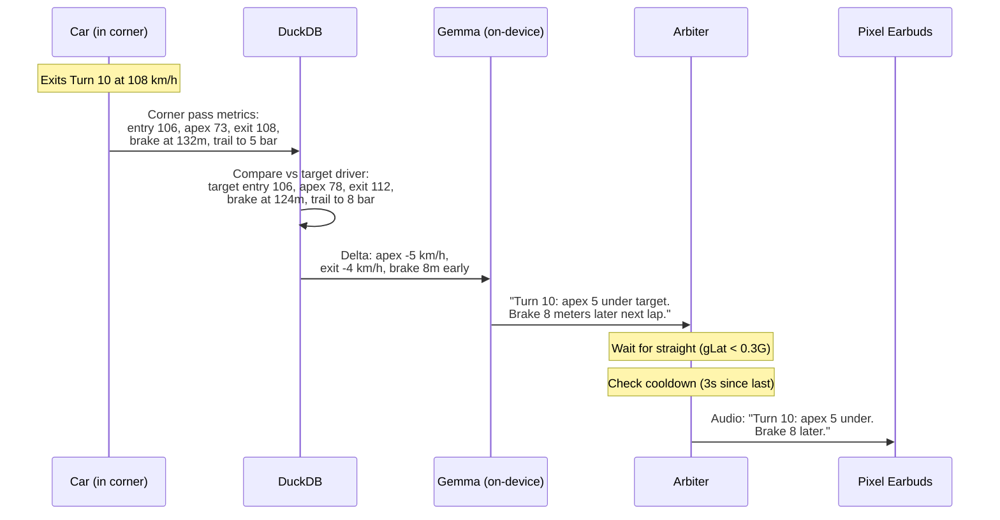
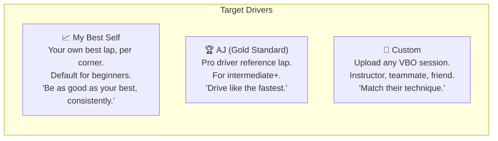
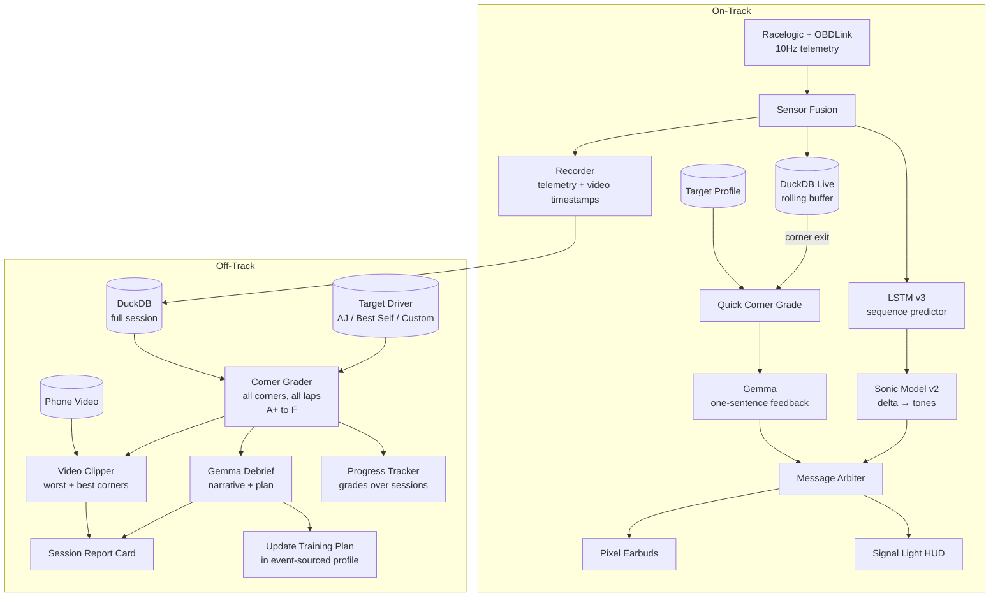

# Feedback System

Three layers of coaching feedback: real-time sonic cues (during driving), post-corner quick feedback (between corners), and full session review (off-track).

---

## The Three Layers

```mermaid
graph TB
    subgraph Layer 1 — Real-Time Sonic - During Driving
        LSTM[LSTM v3<br/>predicts next 2s<br/>3ms inference] --> SONIC[Sonic Model v2<br/>delta → continuous tones]
        SONIC --> EARBUDS1[Pixel Earbuds<br/>reflexive, subconscious<br/>no words needed]
    end

    subgraph Layer 2 — Post-Corner Quick - Between Corners
        CORNER_EXIT[Corner exit detected<br/>gLat drops below 0.3G] --> DUCK1[DuckDB query:<br/>this pass vs target driver]
        DUCK1 --> GEMMA_RT[Gemma formats<br/>one sentence, < 15 words]
        GEMMA_RT --> ARB[Arbiter<br/>delivers on next straight]
        ARB --> EARBUDS2[Pixel Earbuds<br/>brief voice feedback]
    end

    subgraph Layer 3 — Session Review - Off-Track
        DUCK2[(Full Session<br/>DuckDB)] --> GRADE[Corner Grader<br/>A+ to F vs target]
        TARGET[(Target Driver<br/>AJ / Best Self / Custom)] --> GRADE
        VIDEO[(Phone Video<br/>synced to telemetry)] --> CLIPS[Auto-Clipper<br/>worst + best corners]
        GRADE --> CLIPS
        GRADE --> GEMMA_POST[Gemma Debrief<br/>narrative + plan]
        CLIPS --> REPORT[Session Report Card]
        GEMMA_POST --> REPORT
        GRADE --> PROGRESS[Progress Tracker<br/>grades over sessions]
    end
```

---

## Layer 1: Real-Time Sonic (During Driving)

**Built and tested.** The LSTM v3 predicts what should happen in the next 2 seconds. The gap between prediction and reality drives continuous audio tones.

| Cue | What It Sounds Like | When It Fires |
|-----|-------------------|---------------|
| Speed delta | Pitch rises/falls with gap vs prediction | Continuous — IS the delta |
| Brake approach | Ascending pulse as corner approaches | When LSTM predicts speed drop ahead |
| Grip tone | Low hum that rises with friction circle usage | Always (background, P0) |
| Over-limit buzz | Harsh buzz | combo_g > max observed (sliding) |
| Silence | Nothing | On the prediction. Everything is correct. |

**No words. No processing. No distraction.** The driver's reflexes learn the tones in 3-5 laps. Validated on 11,737 frames of Sonoma telemetry: 78% of frames have active cues, 22% silence.

---

## Layer 2: Post-Corner Quick Feedback (Between Corners)

On the next straight after each corner, Gemma delivers a **one-sentence audio verdict**. This is the equivalent of a chess move evaluation — immediate, specific, one thing to try.

### How It Works



### Message Adaptation by Level

| Situation | Beginner | Intermediate | Advanced |
|-----------|----------|-------------|---------|
| Apex too slow | "Try going faster through there" | "Turn 10: 5 under target apex. Hold brake 8m longer." | "T10: -5 apex, -8m BP. Trail 3 more." |
| Great corner | "Nice one!" | "Turn 10: matched target exit speed. Clean." | (silence — pro doesn't need praise) |
| Braking too early | "Brake a bit later next time" | "You braked at 132m. Target brakes at 124m." | "BP +8m" |
| Coasting detected | "Don't coast — brake or throttle" | "2.3s coast before Turn 6. Wasted time." | "Coast -2.3s" |

### Timing

A lap at Sonoma is ~100 seconds with 11 corners. Straights between corners range from 2s (Turn 7→8) to 15s (Turn 11→1). The arbiter delivers post-corner feedback only on straights longer than 5 seconds — enough time to process without rushing into the next corner.

With 3-second cooldown between messages, maximum ~5 corners get verbal feedback per lap. The arbiter prioritizes: worst-graded corners first, then corners where the driver improved.

---

## Layer 3: Session Review (Off-Track)

When the car enters the paddock (speed < 5 mph for 30+ seconds), the system switches to review mode.

### Corner-by-Corner Grading

Each corner pass is graded A+ to F based on the gap to the target driver. This is the chess.com game review equivalent.

| Grade | Gap to Target | Meaning | Color |
|-------|:---:|---|---|
| **A+** | < 2% | Matched or exceeded the target | Gold |
| **A** | < 5% | Near-target performance | Green |
| **B** | < 10% | Solid, room to improve | Blue |
| **C** | < 20% | Significant gap | Yellow |
| **D** | < 30% | Major gap — coaching needed | Orange |
| **F** | > 30% | Far from target — fundamental issue | Red |

**Grading formula:**

```python
def grade_corner(actual, target):
    """
    Weighted gap across 5 metrics.
    Exit speed weighted highest — it matters most for lap time.
    """
    gaps = {
        "exit_speed":  (abs(actual.exit - target.exit) / target.exit,     0.30),
        "apex_speed":  (abs(actual.apex - target.apex) / target.apex,     0.25),
        "entry_speed": (abs(actual.entry - target.entry) / target.entry,  0.15),
        "brake_point": (abs(actual.bp - target.bp) / max(target.bp, 1),   0.15),
        "trail_brake": (abs(actual.trail - target.trail) / max(target.trail, 1), 0.15),
    }

    weighted_gap = sum(gap * weight for gap, weight in gaps.values())

    if weighted_gap < 0.02: return "A+"
    if weighted_gap < 0.05: return "A"
    if weighted_gap < 0.10: return "B"
    if weighted_gap < 0.20: return "C"
    if weighted_gap < 0.30: return "D"
    return "F"
```

### Target Driver Selection

The driver chooses who they're compared against:



**"My Best Self"** is the default — it uses the driver's own best corner passes from their session history. This means the target automatically improves as the driver improves. No demoralization from comparing a beginner to a pro.

**AJ (Gold Standard)** is extracted from the fastest session in the dataset (VBOX0318: 198 km/h top speed, 104 bar max brake, 1.84G max lateral). Available for intermediate and advanced drivers who want to see the gap to a pro.

**Custom** accepts any VBO file. An instructor drives 3 laps, uploads the VBO, and becomes the target for their student. The system extracts their corner profile automatically using the track builder.

### Target Profile Schema

```json
{
  "name": "AJ (Gold Standard)",
  "source": "VBOX0318.vbo",
  "track": "Sonoma",
  "corners": {
    "Turn 10": {
      "entry_speed_ms": 29.4,
      "apex_speed_ms": 21.7,
      "exit_speed_ms": 30.0,
      "brake_point_m": 124,
      "peak_brake_bar": 47,
      "trail_brake_at_apex_bar": 8,
      "throttle_at_exit_pct": 65,
      "corner_time_s": 4.2
    }
  }
}
```

### Video Integration

The phone records dashcam video while mounted. Synced to telemetry via the VBO `avitime` column.

**Auto-clipping at coaching moments:**

For each corner graded D or F, the system clips 3 seconds before entry to 2 seconds after exit. For A+ corners, it clips too — positive reinforcement.

**Video overlay:**

```
┌──────────────────────────────────────────┐
│                                          │
│          [Dashcam Video Feed]            │
│                                          │
│  ┌─────────┐              ┌───────────┐ │
│  │ Turn 10  │              │  Grade: D │ │
│  │ Apex: 73 │              │  -5 km/h  │ │
│  │ Tgt: 78  │              │  vs target│ │
│  └─────────┘              └───────────┘ │
│                                          │
│  Speed  ━━━━━━━━━━━━━━━━━ (you)         │
│  Target ┅┅┅┅┅┅┅┅┅┅┅┅┅┅┅┅┅ (target)     │
│  Brake  ━━━━━━━━━━━━━━━━━               │
│                                          │
└──────────────────────────────────────────┘
```

The driver sees their speed trace overlaid with the target's trace. Where the lines diverge is where time is gained or lost.

### Gemma Session Debrief

After the session, Gemma generates a narrative report from the graded corners:

**Input to Gemma:**

- Corner grades table (all corners, all laps)
- Top 3 worst corners (largest gap to target)
- Top 3 improved corners (vs last session)
- Previous training plan focus areas
- Session statistics (laps, best time, consistency)

**Output:**

1. **Session summary** — one paragraph: what improved, what didn't
2. **Top 3 focus areas** — the corners with worst grades, with specific numbers
3. **One technique drill** — targeted exercise for the weakest area
4. **Encouragement** — what genuinely improved from last session

**Example output for an intermediate driver:**

> "Good session — 23 laps, best 1:47.5. Your Turn 11 exit speed improved 4 km/h from last session, and consistency tightened from 2.1s spread to 1.4s.
>
> **Focus for next session:**
>
> 1. **Turn 10** (Grade D avg): You brake at 132m — target brakes at 124m. That 8m costs 0.4s per lap. Try the 124m marker next lap.
> 2. **Turn 6** (Grade C avg): Downhill entry — you're 3 km/h too slow because you don't trust the grip on the downhill. The car has more than you're using.
> 3. **Turn 3** (Grade C avg): Trail braking improved but you release 10m before the apex. Hold 5 bar to the apex.
>
> **Drill:** First 3 laps, focus ONLY on Turn 10 brake point. Ignore everything else. Find the 124m marker and commit."

### Progress Tracking Over Sessions

Each session produces a set of corner grades. Over time, the driver sees their grades improve:

```
Session 1:  T1:B  T2:A  T3:C  T6:D  T9:C  T10:F  T11:D
Session 2:  T1:B  T2:A  T3:B  T6:C  T9:B  T10:D  T11:C
Session 3:  T1:A  T2:A  T3:B  T6:B  T9:B  T10:C  T11:B
Session 4:  T1:A  T2:A+ T3:A  T6:B  T9:A  T10:B  T11:B
```

Turn 10 went from F → D → C → B over 4 sessions. The system tracks this and celebrates: "Turn 10 improved 3 grades in 4 sessions."

**DuckDB query for progress:**

```sql
SELECT
    session_date,
    corner_name,
    AVG(grade_score) AS avg_grade,
    MIN(grade_score) AS worst_pass,
    MAX(grade_score) AS best_pass
FROM corner_grades
WHERE driver = ? AND track = 'sonoma'
GROUP BY session_date, corner_name
ORDER BY session_date, corner_name;
```

---

## Architecture: Full Feedback Loop



---

## Implementation Priority

| # | Component | Effort | What It Unlocks |
|---|-----------|--------|----------------|
| 1 | **Corner grader** (A-F formula) | Low — DuckDB query + formula | Everything else |
| 2 | **Target profiles** (Best Self + AJ) | Low — extract from existing VBOs | Personalized comparison |
| 3 | **Post-corner quick feedback** (Gemma one-liner) | Medium — Gemma prompt + arbiter | First "intelligent" voice coaching |
| 4 | **Session report card** (Gemma narrative) | Medium — DuckDB queries + Gemma | The chess.com review experience |
| 5 | **Video auto-clips** (ffmpeg + overlay) | Medium — timestamp sync | Visual proof of coaching |
| 6 | **Progress tracker** (grades over sessions) | Low — DuckDB cross-session | Long-term motivation |
| 7 | **Custom target upload** (VBO → profile) | Low — track builder already does this | Instructor/student pairing |
