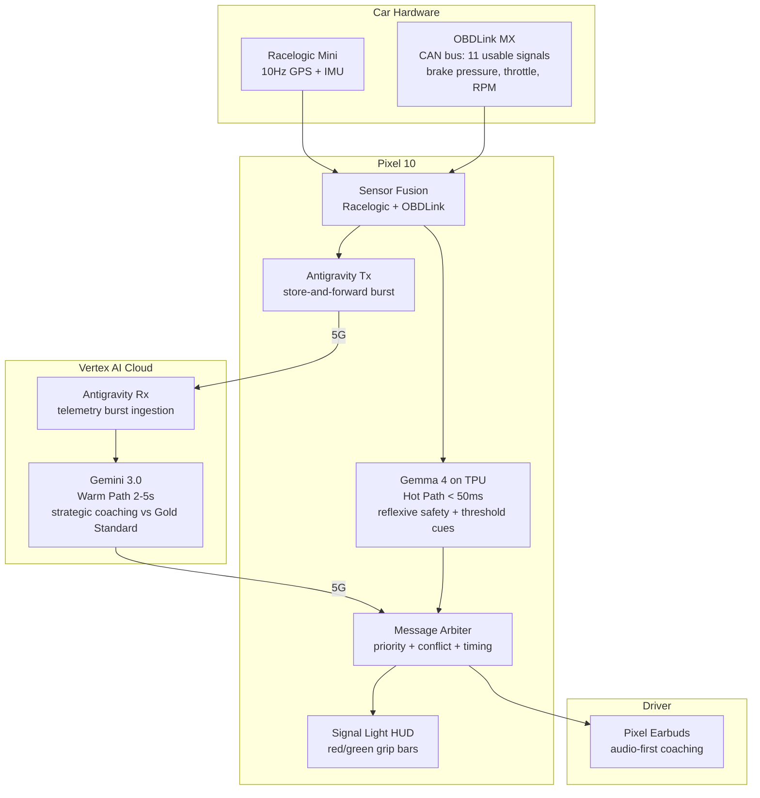

# Pitwall Sprint — Trustable AI Racing Coach

**Prove that a split-brain AI system can be trusted at 130 mph.**

This is the engineering documentation for the Trustable AI racing coach sprint (April--May 2026). The system coaches drivers in real time at Sonoma Raceway using Gemma 4 on-device for reflexive cues and Gemini 3.0 on Vertex AI for strategic reasoning, connected by the Antigravity telemetry pipeline.

## Current Status (April 9, 2026)

| Component | Status | Key Metric |
|-----------|:------:|------------|
| VBO parser + data pipeline | Done | 183 files parsed, 535K frames, 14.9 hours |
| Track auto-builder | Done | 3 tracks: Sonoma (11 corners), Track 2 (9), Track 8 (11) |
| Data analysis + documentation | Done | 52 hot lap sessions profiled, 6 data docs written |
| LSTM sequence predictor (v3) | Done | **Speed: 3.3 km/h MAE, Brake: 2.7 bar MAE** (unseen track, 1s horizon) |
| Sonic model v2 (LSTM-driven) | Done | Delta-based coaching cues tested on Sonoma replay |
| Simulator | Done | Replays VBO with real track data + LSTM predictions |
| Architecture docs + 9 ADRs | Done | Updated with real data from all 183 sessions |
| Antigravity pipeline | Not started | Sprint deliverable |
| Pixel 10 app | Not started | Sprint deliverable |
| Field test at Sonoma | May 23 | — |

---

## What We're Building

A single Pixel 10 device replaces the laptop-in-footwell setup from V1. It acts as edge compute (TPU), HUD display, 5G modem, and audio output — coaching the driver through Pixel Earbuds while showing minimal visual cues on screen.

## Key Dates

| Date | Milestone |
|------|-----------|
| April 8 | Technical kickoff |
| April 29 | **Architecture review + travel approval (hard gate)** |
| May 23 | **Field test at Sonoma Raceway** |
| May 30 | Sprint wrap + documentation |

## What's Different from Pitwall Open Source

This sprint takes Pitwall's architecture and adapts it for a specific production deployment:

| Pitwall (Open Source) | Sprint (Google Edition) |
|----------------------|------------------------|
| Commodity hardware ($40-230) | Pro hardware: Racelogic Mini + OBDLink MX + Pixel 10 |
| Hot path: hardcoded rules engine | Hot path: **Gemma 4 LLM on Pixel 10 TPU** (real reasoning at <50ms) |
| Cold path: Gemini API via SSE | Warm path: **Gemini 3.0 on Vertex AI** via Antigravity pipeline |
| SSE + UDP streaming | **Antigravity store-and-forward** (guaranteed delivery) |
| Generic coaching rules | **Ross Bentley Pedagogical Vector Retrieval** (structured driving curriculum) |
| Driver's personal best as baseline | **Gold Standard: AJ's pro lap + T-Rod's human coaching audio** |
| Single-user, single-tier | **3 pods: Beginner / Intermediate / Pro** with tuned personas |
| Laptop + phone + tablet + dongle | **Single device: Pixel 10** (compute + HUD + 5G + audio) |

What we **keep from Pitwall** (better than the original V1 prototype):

- Confidence-annotated telemetry frame (ADR-001)
- Message arbiter with priority + conflict resolution (ADR-002)
- Sensor fusion engine for Racelogic + OBDLink (ADR-006)
- Event-sourced driver profile across sessions (ADR-007)
- Rule / pedagogical vector regression testing (ADR-008)
- Graceful degradation protocol (ADR-009)

What we **built and validated** from the data (new):

- **LSTM v3 sequence predictor** — 3.3 km/h speed MAE at 1 second on an unseen track (272K params, 1.1 MB)
- **Auto track builder** — GPS curvature → corner definitions. 3 tracks generated, 31 total corners with brake zones
- **Sonic model v2** — LSTM delta drives continuous audio cues. Tested: 78% of frames have active cues, 22% silence
- **Driving phase profiling** — 43.7% cornering, 6.3% coasting (wasted), 2.2% trail braking across 456K frames
- **Complete signal audit** — 11 working CAN signals, 7 broken/unmapped, documented with real ranges

## Quick Links

- [Feedback System](feedback-system.md) — 3-layer coaching: sonic cues + corner grading (A-F) + session review with video + target driver comparison
- [Architecture](architecture.md) — System design + validated data (track profiles, signal stats, trained models)
- [Telemetry Pipeline](telemetry-pipeline.md) — 10Hz Racelogic + OBDLink, sensor fusion, confidence frame
- [Coaching Engine](coaching-engine.md) — Driving phase analysis, coaching priorities from real data
- [Pedagogy](pedagogy.md) — Ross Bentley curriculum with real Sonoma corner profiles
- [Hardware](hardware.md) — Pixel 10 + Racelogic (10Hz) + OBDLink (11 working / 7 broken signals)
- [UX](ux.md) — Audio cue distribution validated: 55% grip, 42% brake approach, 22% silence
- [ML Models](ml-models.md) — 7 models, 4 trained, results on held-out track
- [Model Methodology](model-methodology.md) — LSTM v3: 3 versions, all features, all results, failure modes
- [Sprint Plan](sprint-plan.md) — Timeline, pods, deliverables (pre-sprint work marked complete)
- [ADRs](adr/index.md) — 9 architecture decisions
