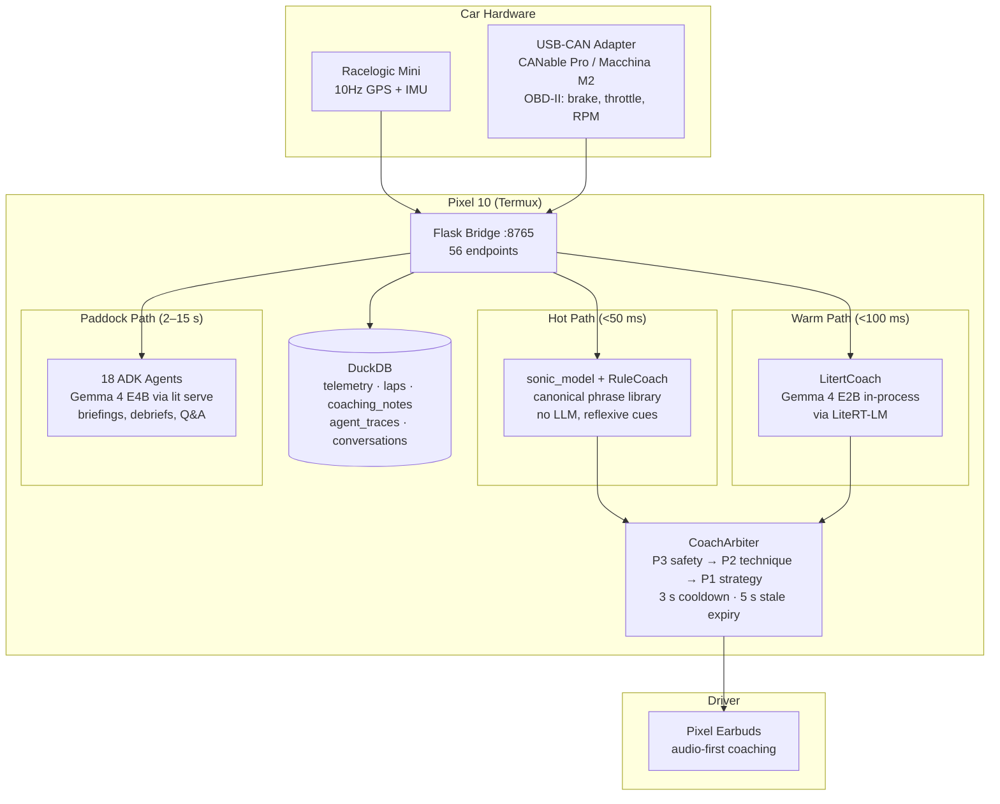

# Pitwall Sprint — Trustable AI Racing Coach

**Prove that an on-device AI system can be trusted at 130 mph.**

This is the engineering documentation for the Trustable AI racing coach sprint (April–May 2026). The system coaches drivers in real time at Sonoma Raceway using a **three-tier, fully on-device architecture** — all inference runs on the Pixel 10 with no cloud dependency during driving.

## Current Status (May 2, 2026)

| Component | Status | Key Metric |
|-----------|:------:|------------|
| VBO parser + data pipeline | ✅ Done | 183 files parsed, 535K frames, 14.9 hours |
| Track auto-builder | ✅ Done | 3 tracks: Sonoma (11 corners), Track 2 (9), Track 8 (11) |
| Data analysis + documentation | ✅ Done | 52 hot lap sessions profiled, 6 data docs written |
| LSTM sequence predictor (v3) | ✅ Done | **Speed: 3.3 km/h MAE, Brake: 2.7 bar MAE** (unseen track, 1s horizon) |
| Sonic model v2 (LSTM-driven) | ✅ Done | Delta-based coaching cues tested on Sonoma replay |
| **Python HTTP bridge** | ✅ Done | `src/pitwall/__main__.py` :8765 — 56 endpoints, DuckDB-backed, CAN ingest |
| **Rally-style coach engine** | ✅ Done | `RuleCoach` + `LitertCoach` (Gemma 4 E2B via LiteRT-LM), Bentley pedagogy, T-Rod voice |
| **ADK multi-agent paddock backend** | ✅ Done | 18 agents, 15 tools, `PitwallOrchestrator`, DuckDB tracing (ADR-019–021) |
| **CAN pipeline** | ✅ Done | `python-can` + `cantools` DBC decoding, USB-CAN adapters (CANable Pro / Macchina M2) |
| **Gold Standard (AJ) reference lap** | ✅ Done | Per-corner grading, time-loss decomposition, A-F scorecard |
| **Test suite** | ✅ Done | 358 tests passing, 51-assertion smoke test on 8273-frame VBO |
| **Vue PWA (pitwall-web)** | Design-only | 38 screens specced in `docs/vue/`, implementation not started |
| Gemma 4 E2B sideload | Pending | `gemma-4-E2B-it.litertlm` to Pixel 10 |
| Field test at Sonoma | **May 23** | — |

---

## What We're Building

A single Pixel 10 device replaces the laptop-in-footwell setup from V1. It acts as edge compute (Tensor G5 NPU), audio output, and CAN bus reader — coaching the driver through Pixel Earbuds while running the full analytics pipeline on-device via Termux.

## Key Dates

| Date | Milestone |
|------|-----------| 
| April 8 | Technical kickoff |
| April 29 | Architecture review |
| May 23 | **Field test at Sonoma Raceway** |
| May 30 | Sprint wrap + documentation |

## Three-Tier Coaching Architecture

| Tier | Engine | Latency | When | What |
|------|--------|---------|------|------|
| 🔴 Hot | `sonic_model` + `RuleCoach` | <50 ms | Every frame (10 Hz) | Reflexive tone cues, threshold alerts, canonical pace notes |
| 🟡 Warm | `LitertCoach` (Gemma 4 E2B) | <100 ms | On straights, debounced | Rally-style pace notes, Bentley pedagogy, T-Rod voice |
| 🟢 Paddock | 18 ADK agents (Gemma 4 E4B) | 2–15 s | Off-track only | Pre-briefs, post-session debriefs, multi-turn Q&A |

## What's Different from Pitwall Open Source

| Pitwall (Open Source) | Sprint (Google Edition) |
|----------------------|------------------------|
| Commodity hardware ($40–230) | Pro hardware: Racelogic Mini + USB-CAN + Pixel 10 |
| Hot path: hardcoded rules engine | Hot path: **canonical phrase library + sonic model** (<50 ms) |
| Cold path: Gemini API via SSE | Warm path: **Gemma 4 E2B on-device** via LiteRT-LM (<100 ms) |
| No paddock intelligence | Paddock: **18 ADK agents** (Gemma 4 E4B, briefings, debriefs, Q&A) |
| Generic coaching rules | **Ross Bentley Pedagogical Vector Retrieval** (structured curriculum) |
| Driver's personal best as baseline | **Gold Standard: AJ's pro lap + T-Rod's human coaching audio** |
| Single-user, single-tier | **3 pods: Beginner / Intermediate / Pro** with tuned personas |
| Laptop + phone + tablet + dongle | **Single device: Pixel 10** (compute + CAN + audio) |

What we **keep from Pitwall** (better than the original V1 prototype):

- Confidence-annotated telemetry frame (ADR-001)
- Message arbiter with priority + conflict resolution (ADR-002)
- Sensor fusion engine for Racelogic + CAN (ADR-006)
- Event-sourced driver profile across sessions (ADR-007)
- Rule / pedagogical vector regression testing (ADR-008)
- Graceful degradation protocol (ADR-009)

What we **built and validated** (new):

- **LSTM v3 sequence predictor** — 3.3 km/h speed MAE at 1 second on an unseen track (272K params, 1.1 MB)
- **Auto track builder** — GPS curvature → corner definitions. 3 tracks generated, 31 total corners with brake zones
- **Sonic model v2** — LSTM delta drives continuous audio cues. 78% of frames have active cues, 22% silence
- **Corner grader + time-loss decomposition** — A-F grades per corner, weighted by Sonoma lap-time leverage
- **18-agent ADK paddock backend** — briefings, debriefs, Q&A with DuckDB-backed tools and agent tracing
- **CAN pipeline** — USB-CAN → `python-can` → DBC decoding → DuckDB, with 6 adapter types supported
- **358-test suite** — including 51-assertion end-to-end smoke test on real Sonoma VBO data

## Quick Links

- [Internal Architecture](internal_architecture.md) — As-built backend topology with Mermaid diagrams
- [API Reference](api.md) — 56 endpoint reference for the Flask bridge
- [ADK Agent Architecture](adk-agent-architecture.md) — 18-agent paddock backend topology
- [ADK Implementation Plan](adk-implementation-plan.md) — As-built status, all phases complete
- [Coaching Engine](coaching-engine.md) — Hot/warm path coaching, Bentley pedagogy
- [Feedback System](feedback-system.md) — 3-layer coaching: sonic cues + corner grading + session review
- [Pedagogy](pedagogy.md) — Ross Bentley curriculum with real Sonoma corner profiles
- [Sonoma Track Intelligence](sonoma_track_intelligence.md) — Per-corner technique, landmarks, common mistakes
- [Architecture](architecture.md) — Original sprint-design diagram (historical — see Internal Architecture for current)
- [ADRs](adr/index.md) — 21 architecture decisions
