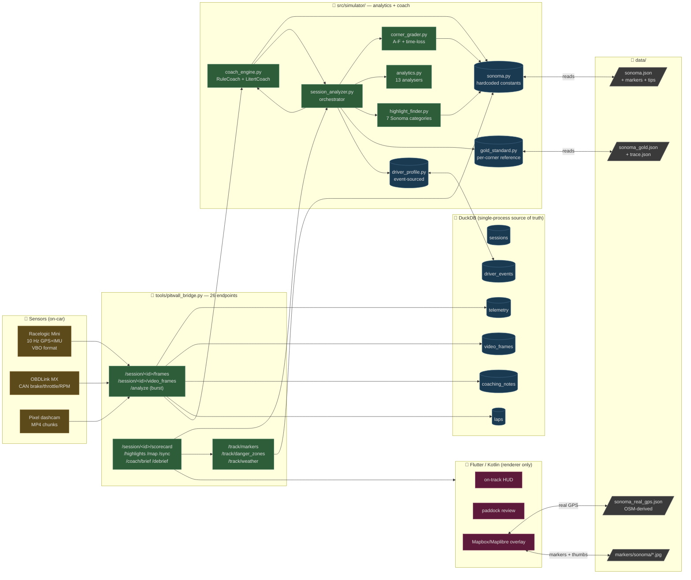
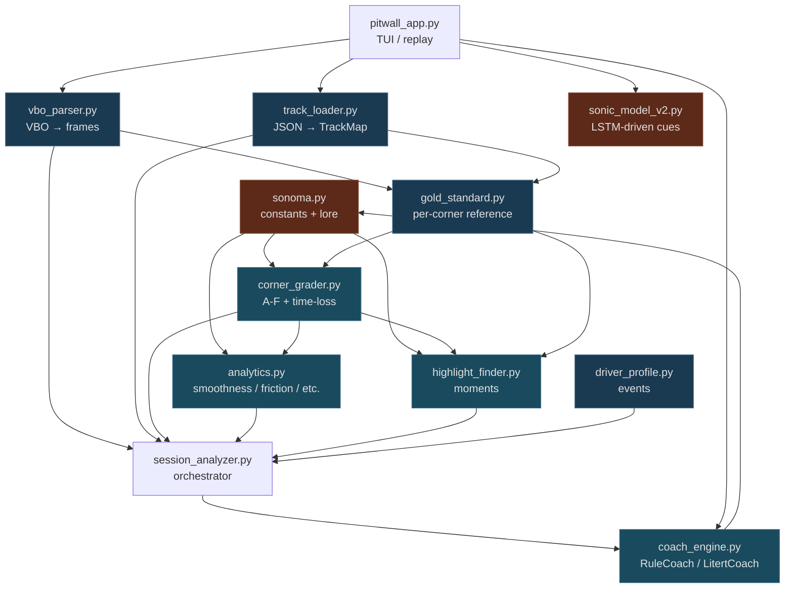
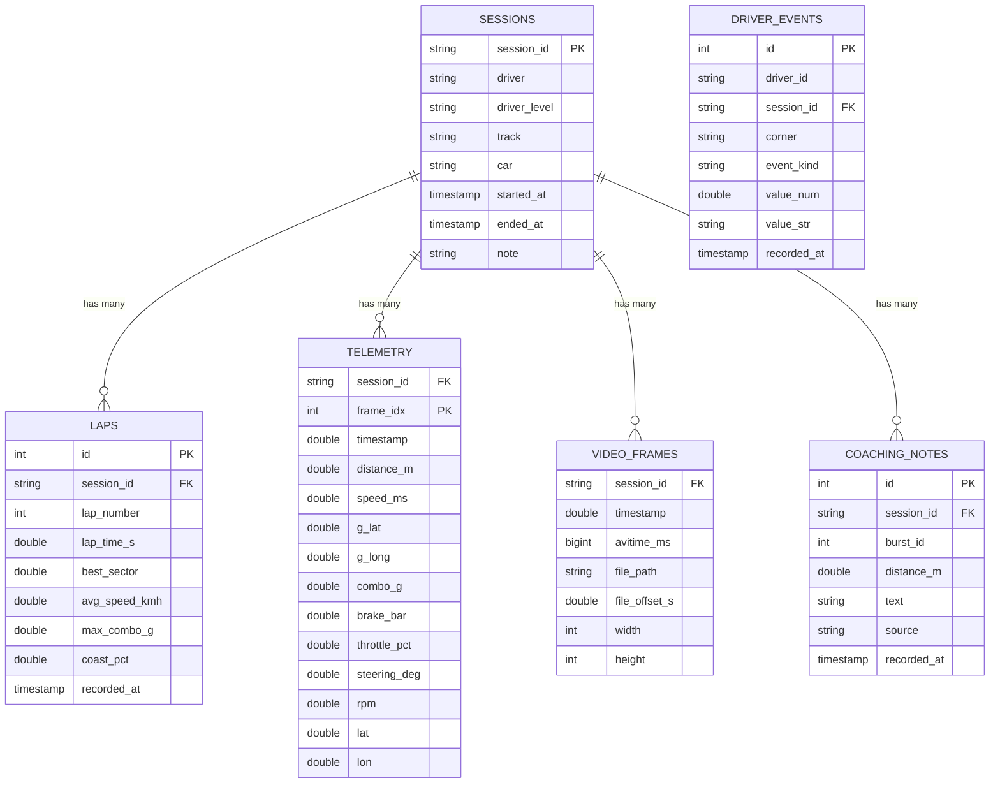
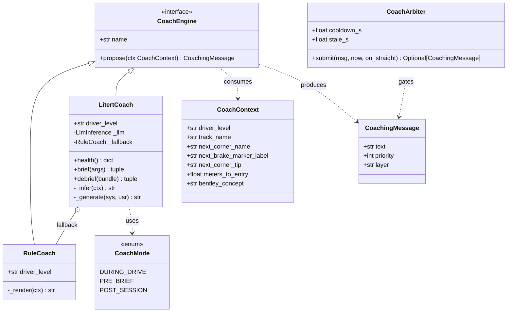
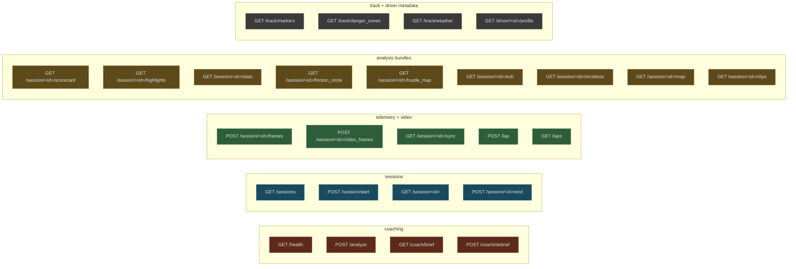

# Internal Architecture

This is the **as-shipped** view of the Python backend (post 2026-04-28). [`architecture.md`](architecture.md) is the original sprint-design diagram (split-brain hot/warm path conceptually); this doc shows what the code actually does today, with mermaid diagrams generated against the live codebase.

---

## High-level system

The Python backend is the source of truth. The Flutter Pixel app is a renderer per [ADR-013](adr/013-frontend-backend-boundary.md). All LLM logic, system prompts, and analytics live in `src/simulator/`. The bridge (`tools/pitwall_bridge.py`) exposes them over HTTP.



---

## Module dependency graph (`src/simulator/`)



---

## DuckDB schema



`session_id` is the universal join key. `timestamp` (epoch seconds) is the universal clock for telemetry × video sync.

---

## Three coaching modes


---

## Session lifecycle (sequence)

```mermaid
sequenceDiagram
  participant App as Flutter app
  participant Bridge as bridge :8765
  participant Coach as coach_engine
  participant DB as DuckDB
  participant Analyzer as session_analyzer

  Note over App,DB: Pre-session
  App->>Bridge: POST /session/start
  Bridge->>DB: INSERT INTO sessions
  Bridge-->>App: {session_id}

  App->>Bridge: GET /coach/brief?driver=...
  Bridge->>DB: SELECT events for driver
  Bridge->>Coach: brief(driver, focus, weather)
  Coach-->>Bridge: narrative + 3 focus
  Bridge-->>App: pre-brief bundle

  Note over App,DB: During session (every 7.5s)
  loop For each burst
    App->>Bridge: POST /session/&lt;id&gt;/frames {batch}
    Bridge->>DB: INSERT INTO telemetry
    App->>Bridge: POST /session/&lt;id&gt;/video_frames {meta}
    Bridge->>DB: INSERT INTO video_frames
    App->>Bridge: POST /analyze {burst}
    Bridge->>Coach: propose(ctx)
    Coach-->>Bridge: pace_note
    Bridge->>DB: INSERT INTO coaching_notes
    Bridge-->>App: {pace_note, cues, coaching}
  end

  Note over App,DB: End of session
  App->>Bridge: POST /session/&lt;id&gt;/end
  Bridge->>DB: UPDATE sessions SET ended_at

  App->>Bridge: POST /coach/debrief {session_id}
  Bridge->>Analyzer: analyze_session(sid)
  Analyzer->>DB: SELECT * FROM telemetry WHERE session_id
  Analyzer->>Analyzer: grade + analyze + find highlights
  Analyzer->>Coach: debrief(bundle)
  Coach-->>Analyzer: narrative + next_focus
  Analyzer-->>Bridge: bundle JSON
  Bridge->>DB: INSERT into driver_events (longitudinal)
  Bridge-->>App: bundle

  Note over App,DB: Off-track review
  App->>Bridge: GET /session/&lt;id&gt;/scorecard
  Bridge-->>App: A-F per corner

  App->>Bridge: GET /session/&lt;id&gt;/sync?from=&to=
  Bridge->>DB: JOIN telemetry × video_frames on time
  Bridge-->>App: telemetry + video offsets

  App->>Bridge: GET /session/&lt;id&gt;/highlights
  Bridge-->>App: 8 ranked moments + clip cuts
```

---

## Coach-engine internals



`make_coach(kind="auto"|"litert"|"rule")` is the factory. `auto` tries `LitertCoach`; if MediaPipe isn't installed or the `.task` file is missing, it falls back to `RuleCoach`. `LitertCoach` itself also falls back per-call when its runtime fails — calling code can always rely on getting *something* back.

---

## Bridge endpoint topology



---

## File tree (post 2026-04-28)

```
pitwall/
├── data/
│   ├── reference/
│   │   ├── sonoma_gold.json          (per-corner gold)
│   │   └── sonoma_gold_trace.json    (986-frame trace)
│   ├── markers/sonoma/
│   │   ├── manifest.json             (16 thumbnail cut points)
│   │   └── *.jpg                     (when ffmpeg run)
│   └── tracks/
│       ├── sonoma.json               (canonical, w/ markers + GPS)
│       ├── sonoma_real_gps.json      (OSM real coords)
│       ├── sonoma.json.bak
│       └── training_data/
│           ├── track2.json           (ML-only, not deployed)
│           └── track8.json
├── docs/                              (mkdocs site)
│   ├── architecture.md                (sprint design — concept)
│   ├── internal_architecture.md      (this file — code)
│   ├── api.md                         (endpoint reference)
│   ├── markers.md
│   ├── sonoma_track_intelligence.md
│   ├── sonoma_maneuvers.md            (Part A/B/C attribution)
│   ├── trod_sonoma_session.md
│   ├── litert_termux_validation.md
│   ├── AUDIT.md                       (this turn's audit)
│   └── adr/
│       ├── 001…013-*.md               (sprint ADRs)
│       └── 014-sonoma-as-the-product.md
├── flutter/                           (Pixel 10 deployment, ADR-013)
├── src/
│   └── simulator/
│       ├── sonoma.py                  (constants + lore)
│       ├── track_loader.py
│       ├── vbo_parser.py
│       ├── gold_standard.py
│       ├── corner_grader.py
│       ├── analytics.py
│       ├── highlight_finder.py
│       ├── driver_profile.py
│       ├── session_analyzer.py
│       ├── coach_engine.py            (RuleCoach + LitertCoach + 3 modes)
│       ├── audio_engine.py
│       ├── sonic_model_v2.py
│       └── pitwall_app.py
├── tests/                             (this turn's audit suite)
└── tools/
    ├── pitwall_bridge.py              (Flask, 26 endpoints)
    ├── enrich_sonoma_track.py
    ├── extract_gold_lap.py
    ├── best_sonoma_lap.py             (S/F line-projection)
    ├── import_sonoma_real_gps.py      (OSM Overpass)
    ├── extract_marker_thumbnails.py
    └── validate_litert.py             (Pixel-side smoke)
```

---

## Key invariants the architecture enforces

1. **Backend owns inference** ([ADR-013](adr/013-frontend-backend-boundary.md)). Frontend never imports `mediapipe`, never builds prompts, never grades a corner.
2. **One source of truth** for system prompts: `coach_engine.build_system_prompt(driver_level, track, mode)`. Every coach (RuleCoach, LitertCoach, future GeminiCoach) consumes the same composer.
3. **Sonoma is the product** ([ADR-014](adr/014-sonoma-as-the-product.md)). `sonoma.py` is hardcoded; track JSON is the only data file the bridge needs at runtime.
4. **DuckDB is the source-of-truth store** for sessions, laps, telemetry, video metadata, coaching notes, and driver events. `session_id` is the universal join key. `timestamp` (epoch seconds) is the universal clock.
5. **Markers carry both anonymized and real GPS** so analytics that join against the dataset's anonymized frame and frontend that renders on a real-world map both work without conflict.
6. **Three-tier graceful degradation** for the LLM: LitertCoach → RuleCoach → mock. Anything that calls a coach can always rely on a string back.
