# Internal Architecture

This is the **as-shipped** view of the Python backend (post 2026-04-28). [`architecture.md`](architecture.md) is the original sprint-design diagram (split-brain hot/warm path conceptually); this doc shows what the code actually does today, with mermaid diagrams generated against the live codebase.

---

## High-level system

The Python backend is the source of truth. The Flutter Pixel app is a renderer per [ADR-013](adr/013-frontend-backend-boundary.md). All LLM logic, system prompts, and analytics live in `src/pitwall/features/`. The bridge (`src/pitwall/__main__.py`) exposes them over HTTP.


---

## Module dependency graph (`src/pitwall/features/`)

The `coaching/` slice was split into focused modules in PR #30. `coach_engine` is now a back-compat re-export shim — old imports (`from pitwall.features.coaching.coach_engine import …`) keep working.

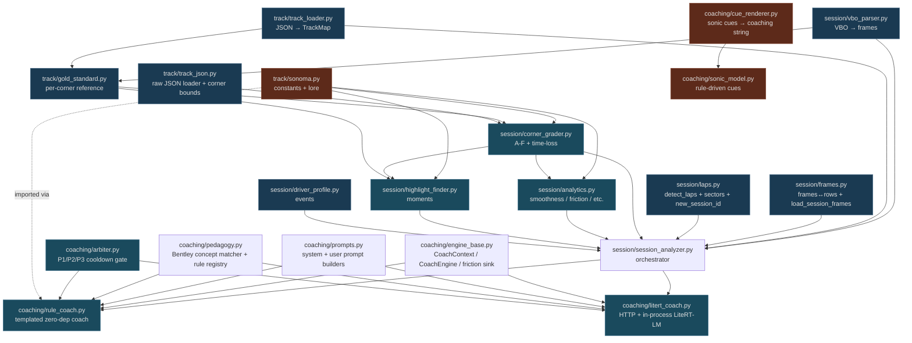

Removed in PR #30 (dead code): `audio_engine.py`, `lstm_predictor.py`, `lstm_predictor_v3.py`, `sequence_predictor.py`, `sonic_model_v2.py`, `track_map.py`, and the top-level `helpers.py`. The promoted home of every helper:

| Old | New |
|---|---|
| `helpers.py:_detect_laps` | `features/session/laps.py:detect_laps` |
| `helpers.py:_lap_sectors` | `features/session/laps.py:lap_sectors` |
| `helpers.py:_new_session_id` | `features/session/laps.py:new_session_id` |
| `helpers.py:_quantile` | `features/session/laps.py:quantile` |
| `helpers.py:_frames_to_rows` / `_rows_to_frames` | `features/session/frames.py:frames_to_rows` / `rows_to_frames` |
| `helpers.py:_load_session_frames` | `features/session/frames.py:load_session_frames` |
| `helpers.py:_cues_to_coaching` / `_sonic_coaching` / `_rule_coaching` / `_estimate_tts_ms` | `features/coaching/cue_renderer.py:cues_to_coaching` / `sonic_coaching` / `rule_coaching` / `estimate_tts_ms` |
| `helpers.py:_load_track_json` / `_corner_bounds_from_track` | `features/track/track_json.py:load_track_json` / `corner_bounds_from_track` |

---

## DuckDB schema

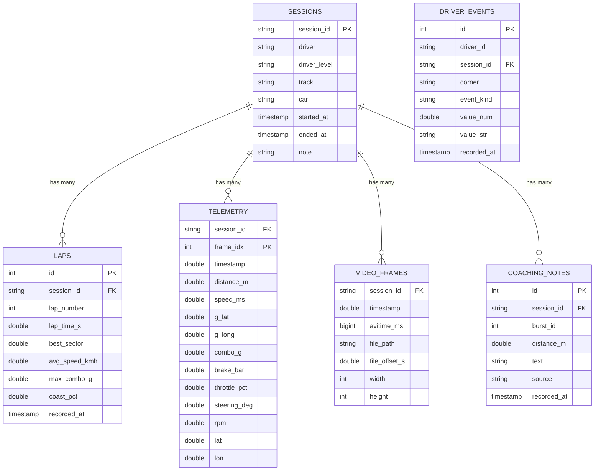

`session_id` is the universal join key. `timestamp` (epoch seconds) is the universal clock for telemetry × video sync.

---

## Three coaching modes

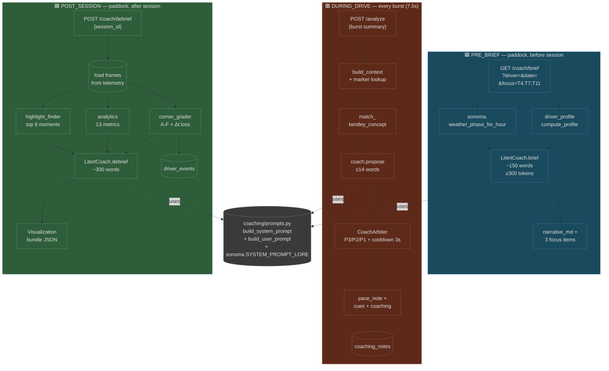

---

## Session lifecycle (sequence)

```mermaid
sequenceDiagram
  participant App as Flutter app
  participant Bridge as bridge :8765
  participant Coach as coach_engine
  participant DB as DuckDB
  participant Analyzer as session_analyzer

  Note over App,DB: Pre-session
  App->>Bridge: POST /session/start
  Bridge->>DB: INSERT INTO sessions
  Bridge-->>App: {session_id}

  App->>Bridge: GET /coach/brief?driver=...
  Bridge->>DB: SELECT events for driver
  Bridge->>Coach: brief(driver, focus, weather)
  Coach-->>Bridge: narrative + 3 focus
  Bridge-->>App: pre-brief bundle

  Note over App,DB: During session (every 7.5s)
  loop For each burst
    App->>Bridge: POST /session/&lt;id&gt;/frames {batch}
    Bridge->>DB: INSERT INTO telemetry
    App->>Bridge: POST /session/&lt;id&gt;/video_frames {meta}
    Bridge->>DB: INSERT INTO video_frames
    App->>Bridge: POST /analyze {burst}
    Bridge->>Coach: propose(ctx)
    Coach-->>Bridge: pace_note
    Bridge->>DB: INSERT INTO coaching_notes
    Bridge-->>App: {pace_note, cues, coaching}
  end

  Note over App,DB: End of session
  App->>Bridge: POST /session/&lt;id&gt;/end
  Bridge->>DB: UPDATE sessions SET ended_at

  App->>Bridge: POST /coach/debrief {session_id}
  Bridge->>Analyzer: analyze_session(sid)
  Analyzer->>DB: SELECT * FROM telemetry WHERE session_id
  Analyzer->>Analyzer: grade + analyze + find highlights
  Analyzer->>Coach: debrief(bundle)
  Coach-->>Analyzer: narrative + next_focus
  Analyzer-->>Bridge: bundle JSON
  Bridge->>DB: INSERT into driver_events (longitudinal)
  Bridge-->>App: bundle

  Note over App,DB: Off-track review
  App->>Bridge: GET /session/&lt;id&gt;/scorecard
  Bridge-->>App: A-F per corner

  App->>Bridge: GET /session/&lt;id&gt;/sync?from=&to=
  Bridge->>DB: JOIN telemetry × video_frames on time
  Bridge-->>App: telemetry + video offsets

  App->>Bridge: GET /session/&lt;id&gt;/highlights
  Bridge-->>App: 8 ranked moments + clip cuts
```

---

## Coach-engine internals

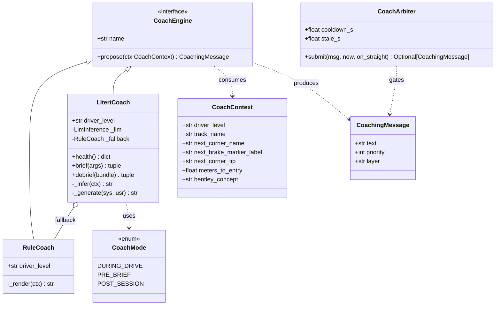

`make_coach(kind="auto"|"litert"|"rule")` is the factory. `auto` tries `LitertCoach`; if MediaPipe isn't installed or the `.task` file is missing, it falls back to `RuleCoach`. `LitertCoach` itself also falls back per-call when its runtime fails — calling code can always rely on getting *something* back.

---

## Bridge endpoint topology

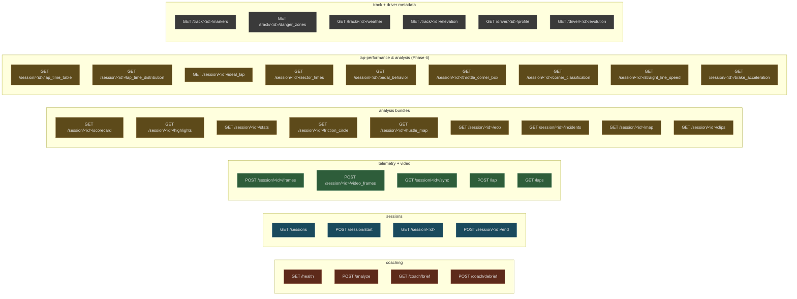

---

## File tree (FSD Migration)

```
pitwall/
├── data/
│   ├── reference/
│   │   ├── sonoma_gold.json          (per-corner gold)
│   │   └── sonoma_gold_trace.json    (986-frame trace)
│   ├── markers/sonoma/
│   │   ├── manifest.json             (16 thumbnail cut points)
│   │   └── *.jpg                     (when ffmpeg run)
│   └── tracks/
│       ├── sonoma.json               (canonical, w/ markers + GPS)
│       ├── sonoma_real_gps.json      (OSM real coords)
│       ├── sonoma.json.bak
│       └── training_data/
│           ├── track2.json           (ML-only, not deployed)
│           └── track8.json
├── docs/                              (mkdocs site)
│   ├── architecture.md                (sprint design — concept)
│   ├── internal_architecture.md       (this file — code)
│   ├── api.md                         (endpoint reference)
│   └── ...
├── src/
│   ├── pitwall/
│   │   ├── __main__.py                (Flask app, 56 endpoints)
│   │   ├── db.py                      (db_conn() context mgr + DuckDbUnavailable; init_schema_once() at boot)
│   │   ├── state.py                   (process-state holder; no longer stores function pointers — callers import directly)
│   │   └── features/                  (Feature-Sliced Design)
│   │       ├── telemetry/             (can_reader, signals API)
│   │       ├── session/               (analyzer, profiles, debrief, laps.py, frames.py)
│   │       ├── coaching/              (engine_base, prompts, pedagogy, rule_coach, litert_coach,
│   │       │                           arbiter, cue_renderer, ADK agents — coach_engine.py is a
│   │       │                           back-compat shim re-exporting public symbols)
│   │       ├── track/                 (sonoma, track_loader, track_json, gold_standard)
│   │       └── realtime/              (live cue streaming via SSE)
│   └── simulator/
│       ├── pitwall_app.py             (TUI / replay)
│       ├── simulator.py               (VBO-driven simulation)
│       └── can_simulator.py           (CAN bus synthetic playback)
├── tests/
│   └── features/                      (Modularized tests mirroring FSD)
└── scripts/
    ├── enrich_sonoma_track.py
    ├── extract_gold_lap.py
    ├── best_sonoma_lap.py             (S/F line-projection)
    ├── import_sonoma_real_gps.py      (OSM Overpass)
    ├── extract_marker_thumbnails.py
    └── validate_litert.py             (Pixel-side smoke)
```

---

## Lap-performance & analysis pipeline (Phase 6)

The 11 new analysis endpoints all share the same back-end shape: they read frames from `telemetry`, slice them into laps using S/F-line projection, compute per-lap or per-corner aggregates, and return a JSON envelope ready for chart rendering. The frontend never touches raw frames for these views.

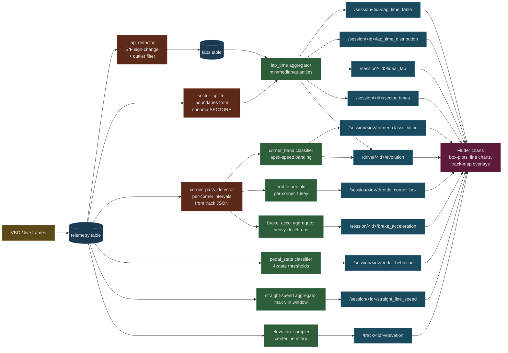

The `lap_detector` runs once per session and persists boundaries into the existing `laps` table (no new schema). The aggregators are pure functions over telemetry rows + lap boundaries — no global state, easy to test.

---

## Pedal-state classifier (4-state model)

Every frame's `(throttle_pct, brake_bar)` pair maps deterministically to exactly one of four states. `pedal_behavior` returns the distribution; `lap_time_table` and `ideal_lap` use the same classifier internally for sector "trail-brake fraction" annotations.

```mermaid
flowchart TB
  classDef state fill:#1a4a5d,stroke:#3a6e8a,color:#e0e0e0
  classDef axis fill:#3a3a3a,stroke:#6e6e6e,color:#e0e0e0

  F[frame<br/>&#40;throttle_pct, brake_bar&#41;]
  T{throttle_pct &gt; 5%}:::axis
  B1{brake_bar &gt; 1.0}:::axis
  B2{brake_bar &gt; 1.0}:::axis

  TR[trail_brake<br/>both pedals modulating]:::state
  TO[throttle_only<br/>cruise / WOT]:::state
  BO[brake_only<br/>pure stopping]:::state
  CO[coast<br/>off both pedals — alarm]:::state

  F --> T
  T -- yes --> B1
  T -- no --> B2
  B1 -- yes --> TR
  B1 -- no --> TO
  B2 -- yes --> BO
  B2 -- no --> CO
```

Thresholds chosen for road-car drivers (5% / 1 bar). F1 telemetry uses 95% / 5 bar — too aggressive for the Sonoma track-day audience and would classify almost every frame as "coast".

---

## Corner-classification banding

Each corner's apex speed determines its band. The endpoint groups corners and reports per-band stats so the coach can say "you're a low-speed driver, focus on T7/T11".

```mermaid
flowchart LR
  classDef low fill:#5d2a1a,stroke:#8a4e3a,color:#e0e0e0
  classDef med fill:#5d4a1a,stroke:#8a6e3a,color:#e0e0e0
  classDef high fill:#2e5d3a,stroke:#5a8a6e,color:#e0e0e0

  C[corner pass<br/>frames]
  AP[apex_speed = min&#40;v_f&#41;]
  D{apex band}

  L[low_speed<br/>&lt; 80 km/h<br/>T7, T11]:::low
  M[med_speed<br/>80–130 km/h<br/>T1, T2, T3a, T4, T8a, T9]:::med
  H[high_speed<br/>≥ 130 km/h<br/>T6, T10]:::high

  C --> AP --> D
  D -- low --> L
  D -- med --> M
  D -- high --> H
```

Thresholds are query-tunable (`?low_max=80&med_max=130`) so bench analysts can re-classify without redeploying.

---

## Multi-track parameterisation

The bridge currently hardcodes Sonoma per [ADR-014](adr/014-sonoma-as-the-product.md), but the new `/track/<id>/*` route shape lets us add tracks **without code changes** — drop a JSON in `data/tracks/` and the loader resolves it on demand.

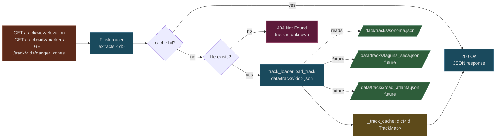

The cache lives in-process (the bridge is single-process by design — see [ADR-010](adr/010-http-bridge-warm-path.md)). Track JSONs are small (10–50 KB each) so an LRU isn't needed.

---

## Driver evolution pipeline (multi-session)

`/driver/<id>/evolution` is the only endpoint that joins data **across sessions**. It reads from the existing `sessions`, `laps`, `telemetry`, and `driver_events` tables — no new tables needed.

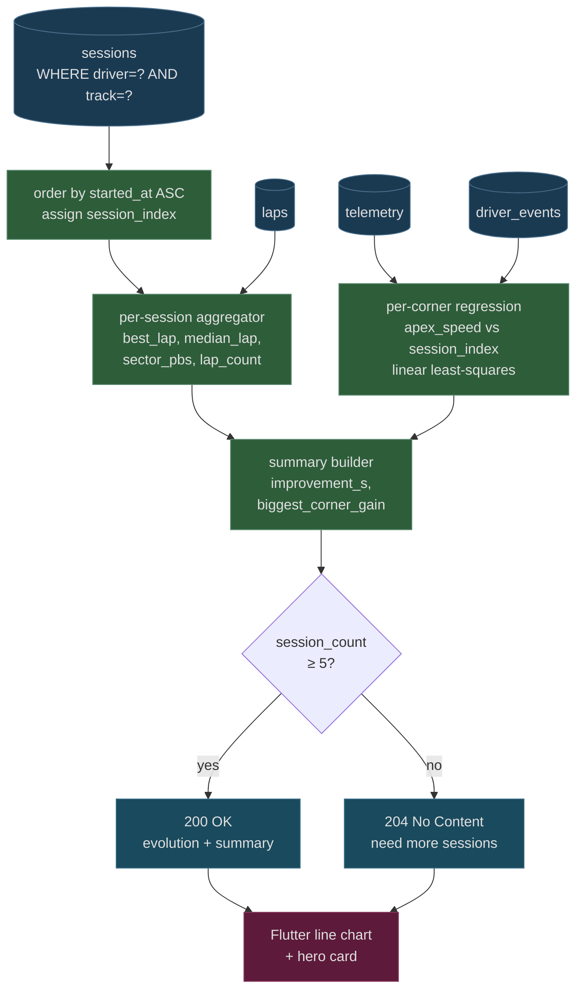

The 5-session minimum is a noise floor — single-session drivers always look like outliers in a regression. The empty-state UI (`204`) tells the frontend to render a "you need 3 more sessions to unlock evolution" placeholder instead of a misleading chart.

---

## Comprehensive backend topology

The full as-shipped picture, including Phase 6. Every node is a real module or table; every edge a real call or query.

```mermaid
flowchart TB
  classDef sensor fill:#5d4a1a,stroke:#8a6e3a,color:#e0e0e0
  classDef bridge fill:#1a4a5d,stroke:#3a6e8a,color:#e0e0e0
  classDef sim fill:#2e5d3a,stroke:#5a8a6e,color:#e0e0e0
  classDef store fill:#1a3a52,stroke:#4a6e8a,color:#e0e0e0
  classDef tools fill:#5d2a1a,stroke:#8a4e3a,color:#e0e0e0
  classDef ui fill:#5d1a3a,stroke:#8a3a5e,color:#e0e0e0
  classDef data fill:#3a3a3a,stroke:#6e6e6e,color:#e0e0e0

  subgraph SENSORS["📡 Sensors"]
    RL[Racelogic VBO<br/>10 Hz]:::sensor
    OBD[USB-CAN Adapter]:::sensor
    CAM[Pixel dashcam]:::sensor
  end

  subgraph TOOLS["🛠 scripts/"]
    BULK[bulk_import_<br/>sonoma_vbos.py]:::tools
    BEST[best_sonoma_lap.py<br/>S/F line projection]:::tools
    EXTRACT[extract_gold_lap.py]:::tools
    THUMB[extract_marker_<br/>thumbnails.py]:::tools
    GPS_IMP[import_sonoma_<br/>real_gps.py]:::tools
    ENRICH[enrich_sonoma_<br/>track.py]:::tools
    VAL[validate_litert.py]:::tools
  end

  subgraph BRIDGE["🌉 src/pitwall/ — 56 endpoints"]
    direction TB

    subgraph BRG_INGEST["ingest"]
      B_FRAMES[/session/&lt;id&gt;/frames]:::bridge
      B_VFRAMES[/session/&lt;id&gt;/video_frames]:::bridge
      B_IMPORT[/session/import]:::bridge
      B_RESET[/session/reset]:::bridge
    end

    subgraph BRG_COACH["coach"]
      B_ANALYZE[/analyze]:::bridge
      B_BRIEF[/coach/brief]:::bridge
      B_DEBRIEF[/coach/debrief]:::bridge
    end

    subgraph BRG_QUERY["analysis"]
      B_SCORE[/scorecard /highlights /stats]:::bridge
      B_FRIC[/friction_circle /hustle_map]:::bridge
      B_EOB[/eob /incidents /map /clips /sync]:::bridge
      B_LAPTAB[/lap_time_table /lap_time_distribution]:::bridge
      B_IDEAL[/ideal_lap /sector_times]:::bridge
      B_PEDAL[/pedal_behavior /throttle_corner_box]:::bridge
      B_BAND[/corner_classification /straight_line_speed]:::bridge
      B_BRK[/brake_acceleration]:::bridge
    end

    subgraph BRG_META["meta"]
      B_HEALTH[/health /insights]:::bridge
      B_TRACK[/track/&lt;id&gt;/markers /danger_zones]:::bridge
      B_WX[/track/&lt;id&gt;/weather /elevation]:::bridge
      B_LAP_CRUD[/lap /laps]:::bridge
    end

    subgraph BRG_PROFILE["profile"]
      B_PROF[/driver/&lt;id&gt;/profile]:::bridge
      B_EVOL[/driver/&lt;id&gt;/evolution]:::bridge
    end
  end

  subgraph SIM["🐍 src/pitwall/features/"]
    direction TB
    S_SONOMA[sonoma.py<br/>constants + lore]:::sim
    S_VBO[vbo_parser.py]:::sim
    S_TRACK[track_loader.py<br/>multi-track aware]:::sim
    S_GOLD[gold_standard.py]:::sim
    S_GRADE[corner_grader.py]:::sim
    S_ANAL[analytics.py<br/>13+ analysers]:::sim
    S_HL[highlight_finder.py]:::sim
    S_PROF[driver_profile.py]:::sim
    S_ANALYZER[session_analyzer.py]:::sim
    S_COACH[coaching/<br/>engine_base + rule_coach +<br/>litert_coach + arbiter +<br/>prompts + pedagogy]:::sim
    S_SONIC[coaching/sonic_model.py]:::sim
    S_APP[pitwall_app.py]:::sim
    S_LAPDET[lap_detector<br/>NEW]:::sim
    S_PEDAL[pedal_classifier<br/>NEW]:::sim
    S_BAND[corner_bander<br/>NEW]:::sim
  end

  subgraph DB["💾 DuckDB"]
    direction TB
    T_S[(sessions)]:::store
    T_L[(laps)]:::store
    T_T[(telemetry)]:::store
    T_V[(video_frames)]:::store
    T_N[(coaching_notes)]:::store
    T_E[(driver_events)]:::store
  end

  subgraph DATA["📂 data/"]
    direction TB
    D_TRACKS[/data/tracks/<br/>&lt;id&gt;.json/]:::data
    D_REAL[/sonoma_real_gps.json/]:::data
    D_GOLD[/reference/<br/>sonoma_gold.json/]:::data
    D_THUMB[/markers/sonoma/<br/>*.jpg/]:::data
  end

  subgraph FE["📱 Flutter / Kotlin"]
    direction TB
    UI_HUD[on-track HUD]:::ui
    UI_PADDOCK[paddock review]:::ui
    UI_MAP[track map overlay]:::ui
    UI_CHART[charts<br/>box-plots, lines]:::ui
    UI_EVOL[evolution<br/>hero card]:::ui
  end

  RL --> BULK & B_IMPORT
  OBD --> B_FRAMES
  CAM --> B_VFRAMES

  BULK --> B_IMPORT
  EXTRACT -.feeds.-> D_GOLD
  GPS_IMP -.feeds.-> D_REAL
  ENRICH -.feeds.-> D_TRACKS
  THUMB -.feeds.-> D_THUMB
  BEST -.diagnostics.-> T_T
  VAL -.smoke-tests.-> B_HEALTH

  BRG_INGEST --> T_T & T_V & T_N & T_L
  BRG_COACH --> S_COACH
  BRG_QUERY --> S_ANALYZER & S_LAPDET & S_PEDAL & S_BAND
  BRG_META --> S_TRACK & S_SONOMA
  BRG_PROFILE --> S_PROF & S_ANALYZER

  S_LAPDET --> T_T & T_L
  S_PEDAL --> T_T
  S_BAND --> T_T

  S_ANALYZER --> S_GRADE & S_ANAL & S_HL & S_GOLD & S_PROF
  S_COACH --> S_SONOMA & S_TRACK
  S_GRADE --> S_SONOMA
  S_HL --> S_SONOMA
  S_PROF --> T_E
  S_GOLD -.reads.-> D_GOLD
  S_TRACK -.reads.-> D_TRACKS & D_REAL
  S_APP --> S_COACH & S_SONIC & S_TRACK & S_VBO

  %% (audio_engine.py, sonic_model_v2.py, lstm_predictor*.py, sequence_predictor.py,
  %%  track_map.py, helpers.py — all deleted as dead code in PR #30)

  BRG_QUERY --> UI_HUD & UI_PADDOCK & UI_CHART & UI_MAP
  BRG_PROFILE --> UI_EVOL
  D_THUMB --> UI_MAP
  D_REAL --> UI_MAP
```

This is the canonical "what's in the box" diagram — print it and tape it to the rig.

---

## Endpoint × DuckDB table read/write matrix

Which tables each endpoint touches. Useful when reasoning about migration safety: changing a column shape only affects the rows in the **R** column; deleting an endpoint frees nothing in the **W** column unless every other writer is also gone.

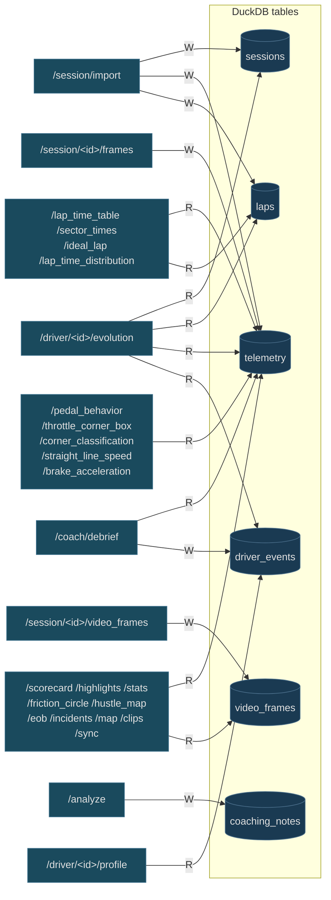

**Rule of thumb:** `telemetry` is the hottest read table — most analysis endpoints touch it. `driver_events` is append-only and small; safe to add columns. `coaching_notes` is the only table written by the live `/analyze` path, so it accumulates fast — consider a TTL prune in a future migration.

---

## Key invariants the architecture enforces

1. **Backend owns inference** ([ADR-013](adr/013-frontend-backend-boundary.md)). Frontend never imports `mediapipe`, never builds prompts, never grades a corner.
2. **One source of truth** for system prompts: `coaching/prompts.py:build_system_prompt(driver_level, track, mode)` (also re-exported from the legacy `coach_engine` shim). Every coach (RuleCoach, LitertCoach, future GeminiCoach) consumes the same composer.
3. **Sonoma is the product** ([ADR-014](adr/014-sonoma-as-the-product.md)). `sonoma.py` is hardcoded; track JSON is the only data file the bridge needs at runtime.
4. **DuckDB is the source-of-truth store** for sessions, laps, telemetry, video metadata, coaching notes, and driver events. `session_id` is the universal join key. `timestamp` (epoch seconds) is the universal clock.
5. **Markers carry both anonymized and real GPS** so analytics that join against the dataset's anonymized frame and frontend that renders on a real-world map both work without conflict.
6. **Three-tier graceful degradation** for the LLM: LitertCoach → RuleCoach → mock. Anything that calls a coach can always rely on a string back.
