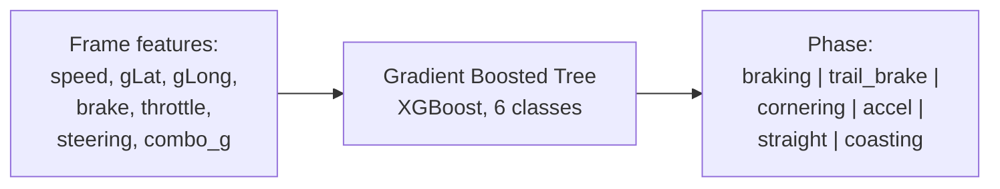
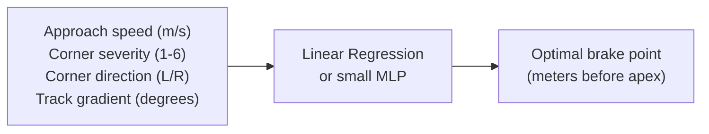
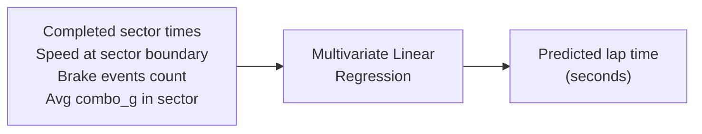
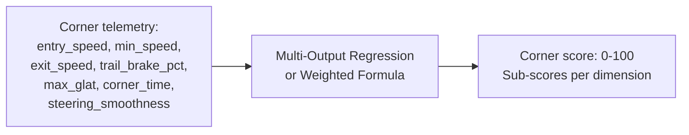
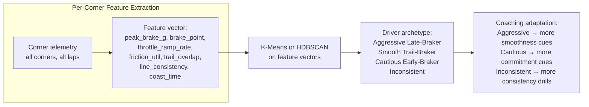
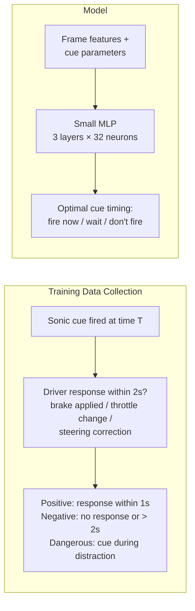
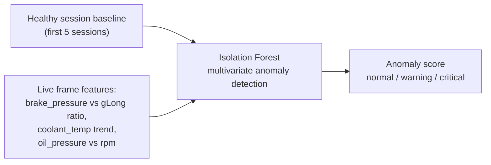
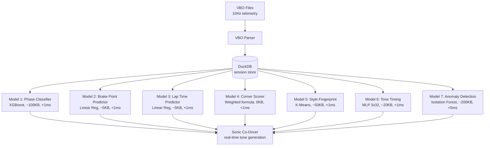

# ML Models for Telemetry

Models built and tested on 183 VBO sessions (535K frames, 14.9 hours, 8 tracks). Held-out evaluation on an entirely unseen track.

---

## Data Profile: Full Dataset (52 Hot Lap Sessions)

From 456,711 hot lap frames across 3 primary tracks (Sonoma, Track 2, Track 8):

| Phase | Frames | % of Driving | Key Insight |
|-------|--------|-------------|-------------|
| Cornering (powered) | 199,584 | 43.7% | Largest phase. Corner speed + exit speed are the primary coaching targets. |
| Straight | 66,297 | 14.5% | Full throttle — no coaching needed. |
| Transition | 65,694 | 14.4% | Between phases — smoothness matters. |
| Cornering (coast) | 45,906 | 10.1% | In a corner but not on throttle — coaching opportunity. |
| Braking | 40,399 | 8.8% | Brake point and pressure. Peak: 107 bar. P95: 28.4 bar. |
| **Coasting (wasted)** | **28,734** | **6.3%** | **#1 coaching target.** ~6s per lap doing nothing. |
| Trail braking | 10,097 | 2.2% | Rare, highest-skill. Only 2.2% but enormous value per second. |

**Training split (held-out by track, not random):**

| Split | Data | Frames | Purpose |
|-------|------|--------|---------|
| Train | Sonoma (80%) + Track 2 | 292,944 | Learn from 2 tracks |
| Val | Sonoma (20% held-out sessions) | 50,737 | Same track, different sessions |
| Test | Track 8 (entirely unseen) | 92,972 | Cross-track generalization |

---

## Model 1: Driving Phase Classifier

**What:** Classify each frame into a driving phase: braking, trail-braking, cornering, accelerating, straight, coasting.

**Why:** Phase detection is the foundation for all other models. The sonic model needs to know "we're in trail braking right now" to play the right tone. The coaching engine needs to know "driver is coasting" to fire the right pedagogical vector.

**Architecture:**



**Features (7):**

| Feature | Why |
|---------|-----|
| speed (m/s) | Differentiates high-speed vs low-speed phases |
| g_lat (G) | Cornering intensity |
| g_long (G) | Braking/acceleration intensity |
| brake_pressure (bar) | Separates braking from cornering |
| throttle (%) | Separates acceleration from coasting |
| steering (degrees) | Separates turning from straight |
| combo_g (G) | Overall grip usage |

**Labels:** Derived from thresholds on the Gold Standard lap:

```python
def label_phase(frame):
    if frame.brake > 5 and abs(frame.g_lat) > 0.4:
        return "trail_brake"
    if frame.brake > 5:
        return "braking"
    if abs(frame.g_lat) > 0.4 and frame.throttle > 20:
        return "cornering"      # powered cornering
    if abs(frame.g_lat) > 0.4:
        return "cornering"      # coasting through corner
    if frame.throttle > 50 and abs(frame.g_lat) < 0.3:
        return "straight"
    if frame.throttle < 10 and frame.brake < 2:
        return "coasting"
    return "accelerating"
```

**Model:** XGBoost classifier. 100 trees, max depth 5. Size: ~100KB. Inference: <1ms.

**Training data:** Label every frame in the Gold Standard lap. Train on 70%, validate on 30%. Expected accuracy: >95% (phases are well-separated in feature space).

**Use:** The phase label feeds into the sonic model as a primary input. Instead of hand-coded `if/else` for each tone layer, the sonic model says "we're in trail_brake phase → play trail brake tone."

---

## Model 2: Brake Point Predictor

**What:** Predict the optimal brake point (distance from corner entry) for each corner, given approach speed.

**Why:** The sonic model needs to know **when** to fire the brake approach tone. Currently it uses fixed geofence distances per corner. A trained model adapts to the actual speed.

**Architecture:**



**Training data:** From the Gold Standard lap, extract:

```python
for each corner:
    approach_speed = speed at 200m before corner entry
    brake_start = distance where brake_pressure first exceeds 5 bar
    brake_point = corner_entry_distance - brake_start
    
    → (approach_speed, severity, direction, gradient) → brake_point
```

One session gives 12 corner samples (12 corners × 1 lap). Ten sessions = 120 samples. AJ's lap gives the "correct" brake points.

**Model:** Linear regression for v1 (brake_point ≈ a * speed + b * severity + c). Upgrade to small MLP (2 layers, 16 neurons) if non-linear effects matter (they will — aero downforce makes high-speed braking points shorter than linear prediction).

**Use:** The sonic model fires the brake approach tone at `predicted_brake_point + margin` meters before the corner. The margin decreases as the model's confidence increases (more data = tighter timing).

---

## Model 3: Lap Time Predictor

**What:** Predict the final lap time from partial telemetry (after each sector).

**Why:** Audio chime at sector boundaries tells the driver if they're ahead or behind pace.

**Architecture:**



**Training data:** Split each lap into 3 sectors. After sector 1, predict the full lap from sector 1 time + sector 1 telemetry stats. After sector 2, prediction improves with more data.

```python
features_after_sector_1 = [
    sector_1_time,
    sector_1_avg_speed,
    sector_1_max_glat,
    sector_1_brake_events,
    sector_1_coast_time,
]
label = full_lap_time
```

**Model:** Linear regression. With 8+ laps per session, even one session gives enough data for a per-track model. Prediction improves through the lap (sector 1 alone: ±3s accuracy, sector 2: ±1s, sector 3: ±0.3s).

**Use:** At each sector boundary, play ascending chimes (ahead of prediction) or descending (behind). The driver instantly knows their pace without looking at a screen.

---

## Model 4: Corner Performance Scorer

**What:** Score each corner pass 0-100 against the Gold Standard.

**Why:** The post-session report card needs a single number per corner. The sonic model can use it for end-of-corner chimes (high score = ascending chime, low = descending).

**Architecture:**



**Scoring dimensions:**

| Dimension | Weight | 100 = | 0 = |
|-----------|--------|-------|-----|
| Entry speed | 15% | ≥ AJ's entry speed | < 80% of AJ's |
| Min speed | 20% | ≥ AJ's min speed | < 70% of AJ's |
| Exit speed | 25% | ≥ AJ's exit speed | < 75% of AJ's |
| Corner time | 20% | ≤ AJ's corner time | > 130% of AJ's |
| Trail brake quality | 10% | Smooth release, brake at apex | No trail brake or abrupt release |
| Smoothness | 10% | Low steering variation | High steering corrections |

**Model:** Weighted formula for v1 (no ML needed — just normalized comparison to Gold Standard). Upgrade to a trained regressor if you want the model to learn which dimensions matter most for lap time.

**Use:** Corner score drives the end-of-corner chime in the sonic model. Score > 80 = ascending chime. Score < 50 = descending. Between = neutral. Over time, the driver hears the chime pattern and internalizes which corners need work.

---

## Model 5: Driving Style Fingerprint

**What:** Cluster telemetry patterns into a driver style profile that evolves over sessions.

**Why:** Coaching should adapt to the driver. An aggressive late-braker needs different advice than a smooth trail-braker.

**Architecture:**



**Feature vector per corner per lap (7 features):**

```python
features = [
    peak_brake_g,           # MAX(|g_long|) during braking phase
    brake_point_distance,   # how early they brake vs AJ
    throttle_ramp_rate,     # d(throttle)/dt from apex to exit
    friction_circle_util,   # AVG(combo_g / max_g) through corner
    trail_brake_overlap,    # frames where brake > 5 AND |gLat| > 0.4
    steering_stddev,        # steering variation through corner (smoothness)
    coast_duration,         # time with no throttle and no brake
]
```

**Model:** K-Means (k=4 archetypes) for initial clustering. One session gives 12 corners × N laps = ~96 feature vectors. Enough for clustering after 2-3 sessions.

**Use:** The driver's archetype adjusts the sonic model's behavior:
- Aggressive → grip tone is more prominent (they need limit awareness)
- Cautious → brake approach tone extends further (they need to commit later)
- Inconsistent → lap estimate chimes are more frequent (they need consistency feedback)

---

## Model 6: Optimal Tone Timing (Learned Sonic Model)

**What:** Learn the mapping from telemetry → audio parameters from driver feedback data.

**Why:** The hand-tuned sonic model (v1) uses fixed thresholds. A trained model can learn when the driver **actually responded well** to a tone vs when they ignored it, and adjust timing accordingly.

**Architecture:**



**Training data:** The simulator exports frame + cue pairs (the CSV we just generated: 8,273 rows). After real sessions, we also capture the **driver's response** — did the brake tone lead to braking? Did the throttle pulse lead to throttle application?

```python
for each cue that fired:
    response_time = time until driver action matching the cue
    if response_time < 1.0:
        label = "effective"     # driver responded quickly
    elif response_time < 2.0:
        label = "late"          # driver responded slowly — fire earlier next time
    elif response_time > 5.0:
        label = "ignored"       # driver didn't respond — wrong cue or wrong time
```

**Model:** Small MLP (3 layers, 32 neurons). Input: telemetry features + proposed cue parameters. Output: probability the driver will respond effectively. Size: ~20KB. Inference: <1ms.

**Use:** Before firing a cue, the sonic model queries this model: "If I fire a brake approach tone right now, what's the probability the driver responds?" If probability < 0.3, delay the cue. This makes the sonic model adaptive to each driver's reaction time and style.

---

## Model 7: Anomaly Detection for Car Health

**What:** Detect abnormal telemetry patterns that indicate mechanical problems.

**Why:** Catch brake fade, overheating, pressure drops before they become dangerous.

**Architecture:**



**Monitored relationships:**

| Relationship | Normal | Anomaly |
|-------------|--------|---------|
| brake_pressure vs gLong | Linear — more pressure = more G | Ratio decreasing = brake fade |
| coolant_temp over session | Rises then stabilizes at 85-95°C | Keeps rising past 100°C = cooling issue |
| oil_pressure vs rpm | Higher RPM = higher pressure | Pressure drops at high RPM = pump issue |
| combo_g max per corner | Consistent lap-to-lap | Decreasing = tire degradation or driver fatigue |

**Model:** Isolation Forest (scikit-learn). Train on the first 3-5 healthy sessions. Flag frames with anomaly score > threshold.

**Use:** If anomaly detected, the sonic model plays a distinct warning pattern (different from grip/brake/throttle tones). On the post-session dashboard, anomalous frames are highlighted for the race engineer.

---

## Model Summary and Training Pipeline



**Total model size: ~380KB.** All models run in <5ms combined. Fits on any device including Pixel 10.

**Training data required:**

| Model | Min Sessions | Min Frames | When Usable |
|-------|-------------|------------|-------------|
| Phase Classifier | 1 (Gold Standard) | 8K | Day 1 (pre-trained on AJ's lap) |
| Brake Point Predictor | 1 | 12 corners | Day 1 |
| Lap Time Predictor | 3+ laps | 36 sectors | Lap 4 of first session |
| Corner Scorer | 1 (Gold Standard) | 12 corners | Day 1 |
| Style Fingerprint | 2-3 sessions | 200+ corners | Session 3 |
| Tone Timing | 5+ sessions with response data | 5000+ cue-response pairs | Session 5+ |
| Anomaly Detection | 3-5 sessions | 25K+ | Session 5+ |

Models 1-4 work from the first session. Models 5-7 improve over time. The system is useful on day 1 and gets better every session.
