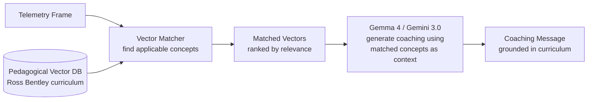
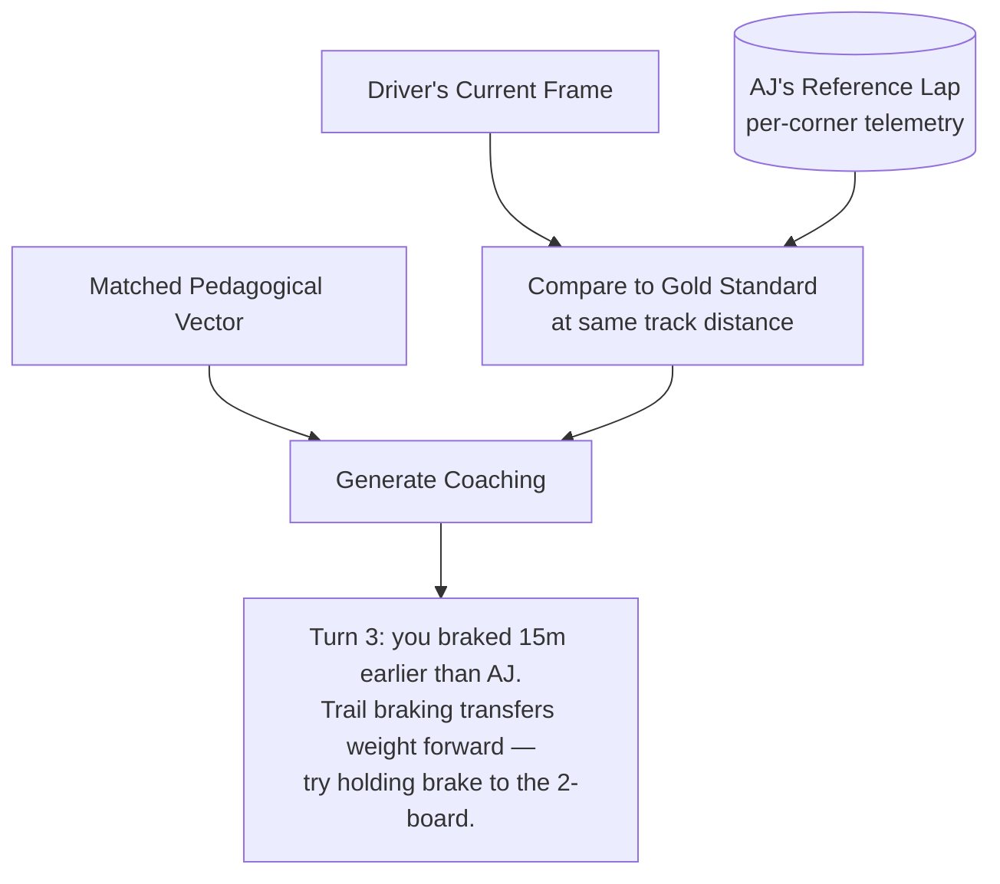

# Pedagogy: Ross Bentley Speed Secrets

The coaching system is grounded in Ross Bentley's driving curriculum. Coaching is not ad-hoc — every message traces back to a specific pedagogical concept with a telemetry trigger.

---

## Pedagogical Vector Retrieval

Each coaching concept is encoded as a **pedagogical vector**: a structured mapping from telemetry conditions to driving knowledge, calibrated for each skill level.



### Vector Schema

```json
{
  "id": "trail_braking",
  "concept": "Trail Braking",
  "category": "vehicle_dynamics",
  "source": "Ross Bentley, Speed Secrets",
  
  "trigger": {
    "conditions": "brake > 10 AND abs(g_lat) > 0.4",
    "confidence_required": {"brake": 0.70, "g_lat": 0.80},
    "corner_phase": "entry_to_apex"
  },
  
  "physics": "Maintaining brake pressure while turning transfers weight to the front tires, increasing their grip. This allows higher corner entry speeds and a tighter line to the apex. The key is a smooth, progressive release of the brake as steering angle increases.",
  
  "coaching_by_level": {
    "beginner": "Keep some brake on as you turn in. It helps the car turn.",
    "intermediate": "Trail brake to the apex. Smooth release — the front tires need that weight.",
    "advanced": "Trail to apex, {brake_pct}% at turn-in. AJ holds {gold_brake_pct}% here."
  },
  
  "anti_patterns": [
    {"condition": "brake == 0 AND abs(g_lat) > 0.6", "message": "You released the brake before the corner. Keep some pressure to load the fronts."},
    {"condition": "brake > 50 AND abs(g_lat) > 0.8", "message": "Too much brake in the corner. You're overloading the fronts. Ease off."}
  ],
  
  "gold_standard_reference": {
    "corner": "Turn 3",
    "aj_brake_at_apex": 15,
    "aj_trail_distance_m": 45
  }
}
```

---

## Core Pedagogical Vectors

### Vehicle Dynamics

#### Weight Transfer and Traction

**Concept:** Every input (brake, throttle, steering) causes weight transfer. Weight transfer changes grip per tire. Smoother inputs = less weight transfer = more total traction.

**Telemetry trigger:** Sudden gLong or gLat spikes (>0.3G change in <200ms) indicate abrupt inputs.

**Coaching:**
- Beginner: "Be smoother with your inputs. Smooth is fast."
- Intermediate: "That brake application transferred too much weight. Squeeze the brake, don't stab it."
- Advanced: "Load rate {g_dot} G/s. Target <0.5 G/s for smooth transfer."

#### Traction Circle (Friction Circle)

**Concept:** The total grip available is a circle in the gLat/gLong plane. You can brake OR turn at maximum, but not both. Trail braking and corner exit throttle trade braking for cornering and vice versa.

**Telemetry trigger:** `sqrt(g_lat^2 + g_long^2)` relative to max observed G.

**Coaching:**
- Utilization < 50%: "You're leaving grip on the table. Push harder."
- Utilization 80-95%: "Good, using most of the grip available."
- Utilization > 100%: "Over the limit — tires are sliding."

#### Understeer Detection and Correction

**Concept:** Front tires have less traction than rears. Car pushes wide. Caused by too much speed, too much steering input, or too much throttle transferring weight rearward.

**Telemetry trigger:** `yaw_rate < expected_yaw_from_steering AND steering > 30°`

**Coaching (from Ross Bentley):**
- Look where you want to go, not where the car is headed
- Ease off the throttle (transfer weight forward)
- Straighten the steering slightly (reduce front tire slip angle)
- Be patient — wait for weight transfer to take effect

#### Oversteer Detection and Correction

**Concept:** Rear tires have less traction than fronts. Car rotates more than intended. Caused by too much throttle (RWD), too much braking, or lift-off mid-corner.

**Telemetry trigger:** `yaw_rate > expected_yaw_from_steering * 1.2 AND speed > 60`

**Coaching (from Ross Bentley):**
- Look and steer where you want to go (counter-steer naturally follows vision)
- Gently modulate throttle to transfer weight rearward
- If power oversteer: ease off throttle smoothly (don't lift abruptly — makes it worse)

### Cornering

#### Reference Points: Turn-in, Apex, Exit

**Concept:** Every corner has three reference points. Turn-in (start steering), Apex (closest to inside), Exit (use all the track). Late apex is almost always faster than geometric line.

**Telemetry trigger:** GPS position relative to defined corner geometry.

**Coaching:**
- Early turn-in detected (steering input before turn-in point): "Wait for the turn-in. Patience."
- Early apex (car at inside before apex point): "You turned in early. Late apex lets you accelerate sooner."
- Not using full track on exit: "Use all the road on exit. The car should track out to the edge."

#### Exit Speed Over Corner Speed

**Concept:** Speed on the following straight matters more than speed through the corner. Sacrificing 2mph in the corner to gain 5mph on exit is always worth it.

**Telemetry trigger:** `throttle < 50% at exit point AND speed < gold_standard_exit_speed * 0.95`

**Coaching:**
- Beginner: "Get on the throttle earlier as you exit."
- Intermediate: "Exit speed matters more than corner speed. Sacrifice entry for a better exit."
- Advanced: "Exit speed {speed} vs AJ's {gold_speed}. Throttle pickup is {distance}m late."

### The Mental Game

#### Vision: Look Ahead

**Concept:** Look as far ahead as possible. Look where you want to go, not where you don't want to go. Turn your head around corners.

**Telemetry trigger:** This can't be measured directly from vehicle telemetry. Inferred from:
- Late braking reactions (reaction time tracking)
- Inconsistent turn-in points
- Steering corrections mid-corner (suggests the driver is looking at the apex, not the exit)

**Coaching:**
- "Look further ahead. Your eyes should already be on the exit."
- "Think through the corner as you look through it."

---

## Gold Standard Integration

Each pedagogical vector can reference the Gold Standard (AJ's reference lap) for concrete comparisons:



The Gold Standard provides **concrete, measurable targets**. These are real numbers from the Sonoma track definition, auto-generated from the dataset:

| Corner | Entry km/h | Apex km/h | Exit km/h | Brake Zone | Brake Bar | Elevation | Coaching Focus |
|--------|-----------|-----------|-----------|-----------|-----------|-----------|---------------|
| **Turn 3** | 104 | 87 | 102 | 50m | 12 bar | +11m uphill | Uphill braking — zone is shorter than expected |
| **Turn 6** | 92 | 77 | 105 | 86m | 29 bar | -11m downhill | **Downhill into corner — brake earlier.** Key safety corner. |
| **Turn 9** | 121 | 116 | 132 | 66m | 25 bar | -16m downhill | Long 288m corner, fast exit onto straight |
| **Turn 10** | 106 | 73 | 108 | **124m** | **47 bar** | flat | **Heaviest braking corner on Sonoma.** Trail brake training ground. |
| **Turn 11** | 88 | 64 | 95 | **134m** | 34 bar | flat | Final corner — exit speed onto main straight is critical |

**Coaching with real numbers:** "Turn 10: typical brake zone starts 124m before entry at 47 bar peak. You braked at 132m — 8m early. Hold to the 124m marker next lap."

---

## Vector Testing

Each pedagogical vector includes test cases (from Pitwall ADR-008 rule testing, adapted):

```json
{
  "id": "trail_braking",
  "tests": [
    {
      "input": {"brake": 25, "g_lat": 0.6, "brake_confidence": 0.95},
      "should_match": true,
      "expected_category": "vehicle_dynamics"
    },
    {
      "input": {"brake": 0, "g_lat": 0.8, "brake_confidence": 0.95},
      "should_match": false,
      "note": "No brake = not trail braking, but should trigger anti-pattern"
    },
    {
      "input": {"brake": 25, "g_lat": 0.6, "brake_confidence": 0.15},
      "should_match": false,
      "note": "Derived brake confidence too low — vector should not activate"
    }
  ],
  "reference_sessions": {
    "sonoma_aj_reference": {"expected_triggers": 8, "tolerance": 2}
  }
}
```
