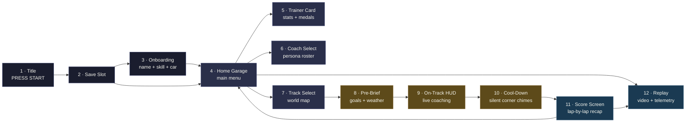

# Pitwall-Web — GBA-Style Coaching Game UX Spec

**Status:** Draft
**Date:** 2026-04-29
**Audience:** Anyone scaffolding `pitwall-web` (Vue PWA), generating sprite assets, or sequencing the May 23 demo.

---

## Tone

A real racing-coach product disguised as a Game Boy Advance racing-RPG.

Two things at once:

1. **Underneath: a serious telemetry tool.** Every gauge, every chart, every spoken cue is grounded in real Sonoma physics, real DBC-decoded CAN frames, real Bentley pedagogy.
2. **On the surface: a game that boots with PRESS START.** Save slots, coach characters with portraits and reactions, achievement medals, world-map track unlocks, score screens, retro fonts, chiptune SFX.

The aesthetic isn't ironic — it's load-bearing. The gamification *is* the trust UX from `docs/ux.md` made tangible. A driver who'd never sit through a Tukey-box-plot of throttle distribution will sit through the *exact same data* when it's "Lap 4 — 86 points · GREAT TRAIL BRAKE · Coach approves." Pixel art lowers the activation energy on engaging with the analytics.

This doc is the design for the Vue PWA that ships in `pitwall-web/` (per [ADR-016](adr/016-can-bus-ingest-and-frontend-pivot.md)). The bridge stays as-is.

---

## Visual language

### Resolution + scaling

GBA native is 240×160. We don't pixel-lock to that — modern Pixels are 1080×2400+, blowing it up 6× looks bad. Instead:

- **Design grid:** 480×320 (2× GBA). Every UI element is laid out on this grid in *logical pixels*.
- **Scale to viewport:** integer scaling only — 1×, 2×, 3×, 4×… The PWA picks the largest scale that fits the viewport. On a Pixel 10 portrait that's roughly 4×.
- **Render with `image-rendering: pixelated`.** All sprites stay crisp at any integer scale.

```
Phone portrait (Pixel 10 ~ 412×892 dp):
  4× scale → 1920×1280 logical → letterbox top + bottom

Laptop landscape (1920×1080):
  6× scale → 2880×1920 (overflows) → 5× scale → 2400×1600 → letterbox
```

### Palette

A 32-colour palette inspired by GBA-era racing palettes (F-Zero Maximum Velocity meets Pokémon dark-night cutscenes):

```
Track / asphalt:   #0d0d12  #1a1d2e  #2a2f4a  #3d4470
Curb / kerb:       #c93838  #ee9c3a  #f2dc5d  #ffffff
Sky / panels:      #6e8ec4  #9bb3dd  #c8d8f0
Greenery:          #2e5d3a  #5a8a6e  #87b67d
Coach UI accent:   #d33682  #cb4b16  #b58900  #859900
Health / good:     #2aa198  #859900
Warning / bad:     #dc322f  #b58900
Text:              #f8f8f0  #b8b8a8  #5a5a4a
Shadows / depth:   #000000  #1a1a1a  #2a2828
```

Implemented as Tailwind theme tokens:

```ts
// tailwind.config.ts — selected
theme: {
  colors: {
    track: { 900: '#0d0d12', 800: '#1a1d2e', 700: '#2a2f4a', 600: '#3d4470' },
    curb:  { red: '#c93838', orange: '#ee9c3a', yellow: '#f2dc5d', white: '#ffffff' },
    coach: { magenta: '#d33682', orange: '#cb4b16', amber: '#b58900', green: '#859900' },
    grip:  { good: '#2aa198', warn: '#b58900', bad: '#dc322f' },
    ink:   { 100: '#f8f8f0', 300: '#b8b8a8', 500: '#5a5a4a', 900: '#000000' },
  },
  fontFamily: {
    title: ['"Press Start 2P"', 'monospace'],   // big + chunky; H1, START prompt
    ui:    ['"VT323"', 'monospace'],             // body, dialogue, tables
    nums:  ['"DSEG7-Classic"', 'monospace'],     // 7-segment LCD style for laps
  },
}
```

All three fonts are free + Google Fonts hostable. `Press Start 2P` and `VT323` ship with Google Fonts. `DSEG7` is a CC-licensed 7-segment LCD font from `keshikan.net`.

### Typography rules

- **Titles** in `Press Start 2P`, all caps, tight letter-spacing. Limit to ≤16 chars.
- **Dialogue + body** in `VT323`. Multi-line is fine; line-height ≈1.1.
- **Numbers (lap times, speed, distance)** in `DSEG7`. Right-aligned. Fixed-width by default — laps don't bounce when digits change.
- **Coach phrases** in `VT323`, *teletyped* — characters appear one at a time at ~30 char/sec. Tap-to-skip. Adds the GBA-RPG dialogue-box feel for free and gives slow readers room.

### Frames + edges

UI containers are GBA-style **9-slice nine-patch frames** rendered as PNG sprites scaled with `image-rendering: pixelated`. Three core frames:

| Frame | Use | Pixel art motif |
|---|---|---|
| `frame-default` | Menus, lists, settings | Single-pixel white outline + 2-pixel dark drop shadow |
| `frame-dialogue` | Coach speech bubbles | Thicker outline, small triangle pointer at bottom-left |
| `frame-card` | Trainer card, achievement medal | Doubled outline + corner notch motifs |

CSS implementation: `border-image: url('/sprites/frame-default.png') 8 fill / 16px / 0 stretch;`. Three sprites covers the whole UI.

### Animation

- **Transitions** between screens: a 4-frame horizontal swipe wipe. ~150 ms. 60 fps.
- **Coach portraits** on the dialogue screen breathe (2-frame idle loop at 1.5 Hz) and have a 2-frame "talking" animation (mouth open/closed) cycling at 6 Hz when text is teletyping.
- **Score screen** numbers count up from 0 to final value over 1.5 s with a click SFX per digit tick.
- **Menu cursor** is a pixel arrow (▶) that bounces 1 px horizontally at 4 Hz.

---

## Information architecture

12 screens. The flow:



Two persistent UI elements across every screen:

- **Top status bar** — current driver name, level, coach badge (left), real-world clock (right). 16 px tall.
- **Bottom hint bar** — context-sensitive button hints (`▶ START · ◀ BACK · A SELECT · B CANCEL`). 12 px tall.

Both are part of the GBA aesthetic — they make every screen feel like a game state, not a webpage.

---

## Screen-by-screen specs

### Screen 1 — Title

The boot screen. Plays on PWA launch + after sign-out. Holds for ~2 s, then idle-loops a chiptune until the user presses START.

```
┌────────────────────────────────────────────┐
│                                            │
│                                            │
│        ╔═══════════════════════╗           │
│        ║                       ║           │
│        ║       ▓▓▓▓▓▓▓▓        ║           │
│        ║       PITWALL          ║           │
│        ║       ▓▓▓▓▓▓▓▓        ║           │
│        ║                       ║           │
│        ║   AI RACING COACH     ║           │
│        ╚═══════════════════════╝           │
│                                            │
│                                            │
│             ▶ PRESS  START ◀               │
│                  (blink)                   │
│                                            │
│         © 2026  Sonoma Edition             │
│                                            │
└────────────────────────────────────────────┘
```

**Key elements:**
- "PITWALL" logo as a 256×64 sprite, centred. Generated by nano-banana (prompt below).
- Subtitle in `Press Start 2P`, `ink-300`.
- "PRESS START" blinks at 2 Hz, `curb-yellow`.
- Background: a 4-layer parallax-scrolling pixel-art Sonoma silhouette. Layers move at 0.5×, 1×, 2×, 4× speed when the cursor is moved.
- SFX on START: a classic GBA "intro chime" — three rising chiptune notes (C-E-G).

**Why a title screen?** It's the load-bearing first impression. It says: *this is a game first.* Anyone showing the app at the May 23 field test sees the title and instantly gets the tone.

### Screen 2 — Save Slot Select

Three slots, like Pokémon. One slot per *driver* (so multiple people sharing a phone don't collide).

```
┌────────────────────────────────────────────┐
│  SELECT  SAVE  SLOT                        │
│  ──────────────────────────────────────    │
│                                            │
│  ╔══════════════════════════════════════╗  │
│  ║ SLOT 1                               ║  │
│  ║   TAHA · LV. 12 · INTERMEDIATE       ║  │
│  ║   BMW M3 (E46) · 47 SESSIONS         ║  │
│  ║   BEST 1:46.8 · 14 MEDALS            ║  │
│  ║   LAST PLAYED · YESTERDAY            ║  │
│  ╚══════════════════════════════════════╝  │
│                                            │
│  ╔══════════════════════════════════════╗  │
│  ║ SLOT 2 · NEW DRIVER                  ║  │
│  ╚══════════════════════════════════════╝  │
│                                            │
│  ╔══════════════════════════════════════╗  │
│  ║ SLOT 3 · NEW DRIVER                  ║  │
│  ╚══════════════════════════════════════╝  │
│                                            │
│   ▶ A · LOAD     B · DELETE     ◀ ▶  MOVE  │
└────────────────────────────────────────────┘
```

**Key elements:**
- Selecting an existing slot → Home Garage (Screen 4).
- Selecting a NEW DRIVER slot → Onboarding (Screen 3).
- B on an existing slot prompts a "ARE YOU SURE?" dialogue with coach disapproval portrait.
- Slot data lives in IndexedDB; never leaves the device.

### Screen 3 — Onboarding

90-second flow described in `docs/ux.md`'s "Hardware Setup" section, restyled. Seven mini-screens in a wizard flow:

1. **Welcome** — single dialogue box with Coach T-Rod sprite saying "Welcome to Pitwall, kid. Let's set you up." Tap to continue.
2. **Name entry** — 6×4 character grid (A-Z + . - _ space + DEL/END), classic Pokémon-style. Max 12 chars.
3. **Skill picker** — three big 9-slice frames: BEGINNER / INTERMEDIATE / PRO. Each shows a coach-portrait reaction sprite. Choosing PRO triggers Coach Drill Sergeant: "We'll see about that."
4. **Coach picker** — full roster (Screen 6 layout, embedded). Default: T-Rod.
5. **Car picker** — list of supported cars; default BMW M3 E46. Highlights which DBC signals you'll get with each.
6. **Hardware pair** — animated "INSERT USB CABLE" sprite illustrates the OBD-II connector. Live `/health` poll animates a "✗ DISCONNECTED" → "✓ CONNECTED" flip when the bridge reports CAN frames.
7. **Calibration lap** — 10-second still-car sensor read; coach explains "I'm checking that everything talks to me. Hold tight."

End on the Home Garage with a coach line: "Alright, you're all set. Let's go play."

### Screen 4 — Home Garage

The hub. Five tiles arranged in a GBA-RPG menu grid. The driver's avatar stands in front of an animated pixel-art garage scene.

```
┌────────────────────────────────────────────┐
│ TAHA · LV. 12 · ⚙ T-ROD          15:32     │
│ ──────────────────────────────────────────│
│                                            │
│   ╔═══════════════╗  ╔══════════════════╗  │
│   ║   ▶ TRACK     ║  ║   TRAINER CARD   ║  │
│   ║                ║  ║                  ║  │
│   ║  GO RACING    ║  ║  STATS · MEDALS  ║  │
│   ╚═══════════════╝  ╚══════════════════╝  │
│                                            │
│   ╔═══════════════╗  ╔══════════════════╗  │
│   ║   COACHES     ║  ║   REPLAY         ║  │
│   ║   ┌─┐┌─┐      ║  ║                  ║  │
│   ║   └─┘└─┘ +3   ║  ║  WATCH PAST LAPS ║  │
│   ╚═══════════════╝  ╚══════════════════╝  │
│                                            │
│   ╔════════════════════════════════════╗   │
│   ║          GARAGE                    ║   │
│   ║   CAR + DBC + TRACK CONFIG         ║   │
│   ╚════════════════════════════════════╝   │
│                                            │
│ A · SELECT       B · TITLE   ◆ MENU        │
└────────────────────────────────────────────┘
```

**Key elements:**
- Driver avatar sprite stands in front of a pit-garage backdrop, breathing idle animation.
- T-Rod silhouette occasionally walks across the bottom of the screen (every ~30 s) — sets the *vibe*.
- Selecting a tile triggers the swipe transition.
- Tile cursor wraps top↔bottom and left↔right (D-pad style).

### Screen 5 — Trainer Card

Pokémon-trainer-card aesthetic, exposing the analytics from `GET /driver/<id>/profile` + `GET /driver/<id>/evolution`.

```
┌────────────────────────────────────────────┐
│ ╔════════════════════════════════════════╗ │
│ ║   ┌──────────┐                         ║ │
│ ║   │ AVATAR   │   TAHA                  ║ │
│ ║   │  64 × 64 │   LV. 12 · INTERMEDIATE ║ │
│ ║   │          │   47  TRACK SESSIONS    ║ │
│ ║   │   sprite │   ★ BEST 1:46.8         ║ │
│ ║   └──────────┘   ▼ 5.2s vs YEAR AGO    ║ │
│ ║                                        ║ │
│ ║  CAR ░░░ BMW M3 (E46)                  ║ │
│ ║  COACH ░ T-ROD · INTERMEDIATE          ║ │
│ ║  TRACK ░ SONOMA RACEWAY                ║ │
│ ╚════════════════════════════════════════╝ │
│                                            │
│ SKILL RADAR                ★ MEDALS  14   │
│  BRAKING       ████████░░  ★ ★ ★ ░ ░       │
│  TRAIL BRAKE   ██████████  ★ ★ ★ ★ ★       │
│  CORNER SPEED  ███████░░░  ★ ★ ★ ░ ░       │
│  THROTTLE      ████████░░  ★ ★ ★ ★ ░       │
│  CONSISTENCY   ██████████  ★ ★ ★ ★ ★       │
│  LINE          ███████░░░  ★ ★ ★ ░ ░       │
│                                            │
│ A · MEDALS    ◆ EVOLUTION CHART  B · BACK  │
└────────────────────────────────────────────┘
```

**Two sub-views:**
- **Medals** (A): a grid of 5×5 medal sprites; locked ones show silhouettes. Tapping a medal shows its acquisition criteria + when you got it. Examples: *"First Lap Under 1:50"*, *"5 Consecutive Clean Laps"*, *"100 Sessions"*, *"Trail Brake Master"*, *"T-Rod's Approval"*.
- **Evolution chart** (◆): the Pokémon-style "your stats vs 1 month ago vs 3 months ago" — backed by `GET /driver/<id>/evolution`. Shows best lap, median lap, sector PBs as overlapping pixel-line graphs.

### Screen 6 — Coach Select

The roster. Five coaches as full-body sprite portraits with name plates. Selecting a coach plays a 2-second voice line + dialogue box.

```
┌────────────────────────────────────────────┐
│ CHOOSE  YOUR  COACH                        │
│ ──────────────────────────────────────────│
│                                            │
│  ┌──────┐  ┌──────┐  ┌──────┐  ┌──────┐    │
│  │      │  │      │  │      │  │      │    │
│  │ T-ROD│  │BENTLEY│  │DRILL │  │CALM │    │
│  │ ▼    │  │      │  │ SGT  │  │ PRO │    │
│  │ 96×96│  │ 96×96│  │ 96×96│  │96×96│    │
│  └──────┘  └──────┘  └──────┘  └──────┘    │
│   T-ROD     BENTLEY    DRILL S.   CALM P.  │
│   default                                  │
│                                            │
│            ┌──────┐                        │
│            │      │                        │
│            │BUDDY │                        │
│            │ 96×96│                        │
│            └──────┘                        │
│             BUDDY                          │
│                                            │
│ ┌──────────────────────────────────────┐   │
│ │ ▼ "Distance is king."  -- T-Rod      │   │
│ └──────────────────────────────────────┘   │
│                                            │
│ A · SELECT  ◀ ▶ MOVE  B · BACK             │
└────────────────────────────────────────────┘
```

**Key elements:**
- Highlighted coach has a pulsing outline (2 Hz, `curb-yellow`).
- Bottom dialogue box plays one of each coach's `TROD_VOICE`-equivalent canonical phrases when selected — teletype animation + sprite mouth animation.
- The five coaches map directly to the personas defined in `docs/ux.md` § "Coaching personas".

### Screen 7 — Track Select

A pixel-art world map (US coast view, since Sonoma is the only track today) with track icons that unlock as the user travels:

```
┌────────────────────────────────────────────┐
│  WORLD  MAP                                │
│ ──────────────────────────────────────────│
│                                            │
│         ░░░░░░░░ pacific  ░░░░░░░░         │
│        ░░░  ◉ SONOMA   1:46.8  ░░░         │
│       ░░░    └──RACEWAY──┐    ░░░          │
│      ░░░     ★ ★ ★ ★ ★    │   ░░░          │
│     ░░░                   │  ░░░           │
│    ░░░    ◯ LAGUNA SECA   │ ░░░            │
│   ░░░     LOCKED          │░░░             │
│  ░░░                      ░░░              │
│ ░░░    ◯ THUNDERHILL  LOCKED               │
│░░░                                         │
│░░░    ░░░░░░  california  ░░░░░░░░░░       │
│                                            │
│ ┌──────────────────────────────────────┐   │
│ │ SONOMA · 4.26km · 11 corners · ★★★★★ │   │
│ │ "Half the lap is in the corners."    │   │
│ │ NEXT SESSION: open                   │   │
│ └──────────────────────────────────────┘   │
│                                            │
│ A · ENTER     B · BACK   ◀▶ MOVE           │
└────────────────────────────────────────────┘
```

**Key elements:**
- Sonoma icon pulses (1 Hz). Locked tracks are silhouettes.
- Tapping the open track → pre-brief screen.
- A "fast travel" cursor moves between tracks; the map's parallax stars shift slightly as it moves.
- Future tracks (Laguna, Thunderhill) appear as locked silhouettes with `LOCKED — DRIVE 50 SESSIONS AT SONOMA TO UNLOCK`. Pure vapour for now; sets up the progression carrot.

### Screen 8 — Pre-Brief

Goal-setting + weather. The chosen coach delivers the briefing as dialogue.

```
┌────────────────────────────────────────────┐
│  PRE-SESSION  BRIEFING                     │
│ ──────────────────────────────────────────│
│                                            │
│   ┌──────────┐  ┌────────────────────┐     │
│   │          │  │                    │     │
│   │  T-ROD   │  │ "Today's surface  │     │
│   │   sprite │  │  is peak grip.    │     │
│   │  talking │  │  Lean on the      │     │
│   │   anim   │  │  marks. T7 is     │     │
│   │          │  │  costing you 0.4s │     │
│   └──────────┘  │  vs last week."  │     │
│                 └────────────────────┘     │
│                                            │
│  PICK  YOUR  GOALS  (1–3)                  │
│ ──────────────────────────────────────────│
│  ☑ ▶ APEX SPEED AT T7    +3 km/h target  │
│  ☑ ▶ BREAK 1:48          previous best    │
│  ☐   TRAIL BRAKE EVERY ENTRY              │
│  ☐   SECTOR 2 SUB-37s                     │
│                                            │
│  WEATHER  ░ PEAK GRIP  · 13:00              │
│  TRACK    ░ DRY · 21°C                     │
│                                            │
│ A · CONFIRM   B · BACK    ◆ EDIT GOALS     │
└────────────────────────────────────────────┘
```

**Key elements:**
- Coach dialogue is fetched from `GET /coach/brief?driver=...&hour_local=...`. The text teletypes.
- Goal list is pulled from the driver profile's "weak spots" auto-suggestions, plus a "custom goal" entry.
- Selected goals carry into the on-track HUD as silent attention anchors (the coach pre-empts cues for goal-related corners) and into the post-session score screen as scored objectives.
- "CONFIRM" plays a 3-note chime + transition wipe to HUD.

### Screen 9 — On-Track HUD

The live driving interface. **Maximum information at peripheral-vision glance.** This is where the GBA aesthetic earns its keep — the chunky pixel-bar HUD reads cleaner at 130 mph than any line graph.

```
┌────────────────────────────────────────────┐
│ LAP 3 / 8     1:47.2 (-0.4s pb)            │
│ ──────────────────────────────────────────│
│                                            │
│   ╔════╗                          ╔════╗   │
│   ║▓▓▓▓║                          ║░░░░║   │
│   ║▓▓▓▓║   GRIP                   ║░░░░║   │
│   ║▓▓▓▓║                          ║░░░░║   │
│   ║▓▓▓▓║   ░░░░░░░░░░░░░░░░░░     ║░░░░║   │
│   ║▓▓▓▓║   ░░░░  TRACK MAP  ░░░░  ║░░░░║   │
│   ║▓▓▓▓║   ░░░░  ▶ pos     ░░░░   ║░░░░║   │
│   ║▓▓▓▓║   ░░░░░░░░░░░░░░░░░░     ║░░░░║   │
│   ║▓▓▓▓║                          ║░░░░║   │
│   ║▓▓▓▓║                          ║░░░░║   │
│   ║░░░░║   T7 ENTRY  82km/h       ║░░░░║   │
│   ║░░░░║   BRAKE AT THE 4-BOARD   ║░░░░║   │
│   ║░░░░║                          ║░░░░║   │
│   ║░░░░║                          ║░░░░║   │
│   ║░░░░║                          ║░░░░║   │
│   ╚════╝                          ╚════╝   │
│   GRIP                            OVER     │
│   (left)                          (right)  │
│                                            │
│ ░ T-ROD: "ROLL THE BRAKE TO THE APEX"      │
└────────────────────────────────────────────┘
```

**Key elements:**
- **Two grip bars** flank the screen — same as the existing `docs/ux.md` HUD spec, but pixel-art chunky. Left bar shrinks as friction-circle utilisation rises; right bar grows when over-limit.
- **Centre track map** shows the full Sonoma layout as a 2-pixel-wide pixel line + the driver's current position as a 4×4 sprite arrow pointing in heading direction.
- **Upcoming corner card** below the map: corner name, target speed, brake reference. Updates on corner-approach.
- **Coach dialogue** at the bottom — same teletype animation as the dialogue screens. Limited to 1 line at all times. Shows the latest coaching phrase from the SSE stream.
- **Top status:** lap count + current lap time + delta to PB. `DSEG7` font.
- Wake Lock prevents screen-off; PWA fullscreen kills the browser chrome.

### Screen 10 — Cool-Down

Triggered by the bridge after the cool-down state machine fires (per `docs/ux.md` § "Mode Switching"). All coaching is silenced; only corner-score chimes play, with a sprite reaction per corner.

```
┌────────────────────────────────────────────┐
│  COOL  DOWN                                │
│ ──────────────────────────────────────────│
│                                            │
│         ┌──────┐                           │
│         │      │   "GREAT LAP."            │
│         │ T-ROD│                           │
│         │ thumb│                           │
│         │  up  │   T1   ●●●●○   GOOD       │
│         └──────┘   T2   ●●●●●   PERFECT    │
│                    T3   ●●○○○   LOST 0.3s  │
│                    T4   ●●●●○   GOOD       │
│                    T5   ●●●●●   PERFECT    │
│                    T6   ●●●○○   OK         │
│                    T7   ●○○○○   LOST 0.5s  │
│                    T8   ●●●●○   GOOD       │
│                    T9   ●●●●●   PERFECT    │
│                    T10  ●●●●●   PERFECT    │
│                    T11  ●●●●○   GOOD       │
│                                            │
│         LAP 3 · 1:47.2  · -0.4s PB         │
│                                            │
│  → SCORE SCREEN ON TRACK STOP              │
└────────────────────────────────────────────┘
```

**Key elements:**
- One corner-score chime per corner, low-priority audio.
- Coach sprite reacts to overall lap (thumbs-up / shrug / disappointed).
- Mode-switch to Score Screen is automatic when the bridge transitions Cool-Down → Paddock.

### Screen 11 — Score Screen

The post-session debrief. **The most game-like screen in the whole product.** Everything counts up; SFX punctuates each metric reveal; coach reacts; medals get awarded with a slot-machine "ding".

```
┌────────────────────────────────────────────┐
│  SESSION  COMPLETE !                       │
│ ──────────────────────────────────────────│
│                                            │
│           ░░░░░░░░░░░░░░░░░░░░             │
│           ░░░  TOTAL SCORE  ░░░             │
│           ░░░     8420       ░░░             │
│           ░░░░░░░░░░░░░░░░░░░░             │
│                                            │
│     BEST LAP        1:46.8     -0.4s PB    │
│     IDEAL LAP       1:46.4     0.4s gain   │
│     CONSISTENCY     ★★★★☆     σ=0.6s       │
│     TRAIL BRAKE %   78%        +5 vs last  │
│     COAST TIME      8%         ↓4 GOOD     │
│                                            │
│  GOALS                                     │
│   ✓ APEX SPEED T7      82 → 86 km/h        │
│   ✓ BREAK 1:48         got 1:46.8          │
│   ✗ TRAIL BRAKE EVERY  4 of 11 entries     │
│                                            │
│  ★ NEW MEDALS                              │
│   ┌────┐  ┌────┐                           │
│   │ ★  │  │ ★  │   "Trail Brake Apprentice"│
│   │    │  │    │   "Sub-1:47"              │
│   └────┘  └────┘                           │
│                                            │
│   ┌──────────────────────────────────────┐ │
│   │ T-ROD: "Now THAT was distance."      │ │
│   └──────────────────────────────────────┘ │
│                                            │
│ A · REPLAY  B · HOME    ◆ SHARE            │
└────────────────────────────────────────────┘
```

**Animation sequence on entry (~5 s):**
1. Curtain-drop wipe in; chiptune fanfare plays.
2. Total score counts 0 → 8420 over 1.2 s with click-per-100 SFX.
3. Each metric appears one row at a time, 100 ms apart, click SFX per row.
4. Goal results fade in: ✓ in green, ✗ in red, score-tick SFX per result.
5. Medals slide in from the right with their own "ding-ding" SFX. Tapping a medal pops a tooltip describing the criteria.
6. Coach dialogue teletypes the last thing — adapts to performance band (great / mid / poor) using existing `coach_engine` phrases.

**Score formula** (transparent — driver can see how it's computed in settings):

| Component | Weight | Source |
|---|---|---|
| Best lap delta vs PB | 30% | `lap_time_table.best_lap_s` |
| Consistency (1 / stddev) | 20% | `lap_time_distribution.stddev_s` |
| Goal completion | 25% | session goals |
| Bentley concept hits | 15% | sum of `coach_engine` rule fires |
| Lap count vs target | 10% | `laps.lap_count` |

### Screen 12 — Replay

Once video is wired (deferred per the earlier decision), this screen pairs telemetry with the dashcam footage:

```
┌────────────────────────────────────────────┐
│  REPLAY · LAP 3 · 1:46.8                   │
│ ──────────────────────────────────────────│
│                                            │
│  ┌────────────────────────────────────┐    │
│  │                                    │    │
│  │      ▼                              │    │
│  │   VIDEO  PANEL                     │    │
│  │   <video>                          │    │
│  │   480 × 270                        │    │
│  │                                    │    │
│  │                                    │    │
│  └────────────────────────────────────┘    │
│                                            │
│  ─── SPEED ───                             │
│   ▲     ╱╲                                 │
│   │    ╱  ╲     ╱╲                          │
│   │   ╱    ╲   ╱  ╲   ▼ scrubber            │
│   │__/______╲_/____╲_____________            │
│                                            │
│  ─── BRAKE ───                             │
│  ─── G-LAT ───                             │
│  ─── COACH NOTES ───                       │
│   T1 · "carry throttle through"            │
│   T7 · "you braked 15m early"              │
│                                            │
│ A · PLAY  B · BACK   ◀▶ SCRUB  ◆ SQL        │
└────────────────────────────────────────────┘
```

**Key elements:**
- HTML5 `<video>` styled with `image-rendering: pixelated` on the video element's *frame* (not the video itself — that stays smooth). Video plays in a chunky pixel-art frame.
- Three telemetry charts under the video, scrubbable. Drives `<video>.currentTime` from chart cursor and vice versa.
- ◆ SQL opens a modal with a Monaco editor pre-loaded with DuckDB-Wasm + the current session's parquet. Power-user surface.

---

## Character system

### Driver avatars

8 base sprites, each 64×64. Selectable in onboarding + customisable in the garage:

| Slot | Sprite description | Vibe |
|---|---|---|
| 1 | Helmet up, racing suit, neutral pose | Track-day default |
| 2 | Cap backwards, t-shirt | Casual driver |
| 3 | Race suit + balaclava | Pro look |
| 4 | Open-face helmet, retro racing gloves | Vintage |
| 5 | Female driver, race suit | (parity with 1) |
| 6 | Female driver, casual | (parity with 2) |
| 7 | Older driver with greyed hair, instructor look | Mentor archetype |
| 8 | Mystery hooded driver | Locked unlockable |

Each avatar has 4 frame states:
- `idle` — 2-frame breathing loop
- `victory` — fist pump (used on score screen for new medals)
- `disappointed` — head down (used on score screen for missed goals)
- `helmet_on` — used in HUD avatar slot

### Coach roster

The five coaches from `docs/ux.md`. Each gets a much richer sprite set since they're seen often:

| Coach | Sprite size | Frames per emotion | Total frames |
|---|---|---|---|
| T-Rod | 96×96 portrait + 32×32 mini | 4 emotions × 2 frames + 2 talking + 1 idle | 11 |
| Bentley | same | same | 11 |
| Drill Sergeant | same | same | 11 |
| Calm Pro | same | same | 11 |
| Buddy | same | same | 11 |

Total: **55 coach frames** across 5 coaches.

Emotions: `neutral`, `encouraging`, `disappointed`, `hyped`. Each has a 2-frame breathing animation + 2-frame talking animation (mouth open/closed).

### Performance reaction matrix

The score screen picks coach reaction frames based on:

| Performance band | Frame used |
|---|---|
| Hit all goals + new PB | `hyped` |
| Hit goals OR new PB | `encouraging` |
| Improved but missed goals | `neutral` |
| Got worse | `disappointed` |

This is rendered server-side: the score endpoint already classifies — frontend just looks up the right sprite.

---

## Gamification systems

### Save slots

3 slots in IndexedDB. Each holds:

```ts
interface SaveSlot {
  id: 1 | 2 | 3
  driverName: string
  level: number              // derived: floor(sessions / 5) + 1
  skillLevel: 'beginner' | 'intermediate' | 'pro'
  car: string
  preferredCoach: 'trod' | 'bentley' | 'drill' | 'calm' | 'buddy'
  avatarSlot: 1..8
  unlockedAvatars: number[]
  unlockedTracks: string[]
  unlockedCoaches: string[]
  medals: { id: string, awardedAt: ISODateString }[]
  bestLapBySession: Record<string, number>     // session_id → best_lap_s
  goals_history: SessionGoal[]
  createdAt: ISODateString
  lastPlayedAt: ISODateString
}
```

### Levelling

- Driver level = `floor(sessions / 5) + 1`.
- Each level unlocks: at level 5, the Drill Sergeant coach. At 10, a new avatar slot. At 20, the locked Hooded Driver. At 50, a permanent +10% score multiplier (cosmetic — doesn't change the actual driving).

### Medals

40 medals across categories. Examples:

**Speed / time medals:**
- *First Lap* (any complete lap) — Bronze
- *Sub 1:55 / 1:50 / 1:48 / 1:46 / 1:44* — escalating gold
- *Personal Best Streak — 5 sessions* — Platinum

**Technique medals:**
- *Trail Brake Apprentice* — 50% trail-brake entries in a session
- *Trail Brake Master* — 90% in a session
- *Late Apex* — score 5 corners as late-apex in a single lap
- *Hustle* — full throttle for >80% of straight time

**Consistency medals:**
- *Steady Hand* — stddev < 0.5s across a 10-lap session
- *Metronome* — 5 consecutive laps within 0.2s of each other

**Coach affinity medals:**
- *T-Rod's Approval* — receive the "perfect" reaction 5 times with T-Rod selected
- *Bentley Student* — accumulate 100 hours across all sessions with Bentley
- *Drill Sgt's Recruit* — survive 10 sessions on PRO skill level

**Track milestones:**
- *Sonoma Veteran* — 50 sessions at Sonoma
- *11-Corner Mastery* — score "PERFECT" on every corner in a single lap

Medals are computed server-side via post-session analysis (extends `POST /coach/debrief`); the PWA fetches and renders.

### Achievements bar (in-session)

A small toast that pops up *during* the session (off-track + cool-down only — never mid-corner) when an achievement triggers:

```
┌────────────────────────────────────────────┐
│  ★ ACHIEVEMENT UNLOCKED                    │
│  TRAIL BRAKE APPRENTICE                    │
└────────────────────────────────────────────┘
```

3-second pop, slide-in from right, classic GBA-style. SFX: a 4-note ascending chime.

### Track unlocks

For now, only Sonoma is open. Locked tracks display silhouettes. The unlock criteria are *aspirational* — they hint at future content without committing to a date. Examples:

| Track | Unlock |
|---|---|
| Sonoma Raceway | open |
| Laguna Seca | "Drive 50 sessions at Sonoma" |
| Thunderhill | "Earn 25 medals" |
| Buttonwillow | "Reach Driver Level 20" |

Until those tracks have real geometry + DBC + Bentley pedagogy, they stay locked. The carrots set up post-Sonoma roadmap conversations.

---

## Sprite asset spec

This is what you hand to nano-banana (Gemini's image-generation model) to actually generate the assets.

### General style brief (use as preamble for every prompt)

> A 2D pixel-art character sprite in the style of a Game Boy Advance racing RPG, around the year 2003. Limited 32-colour palette. Crisp, clean pixel art with a single-pixel outline. Soft drop shadow. Centred composition. The character is in a neutral lit racing-paddock environment. No anti-aliasing. No JPEG artefacts. Square aspect ratio. Flat colour fills, minimal dithering.

### Coach prompts

Five coaches, four emotions each, 96×96 — each generated with consistency-anchor.

```
Coach T-Rod (default):
  A male racing instructor in his late 30s, T-shirt, baseball cap, mirrored
  sunglasses pushed up. Warm tan skin. Confident relaxed stance. Holds a
  stopwatch in one hand. Pixel art, 96×96, GBA-era, centred portrait,
  neutral expression.

  Variant 2: same character, same pose, encouraging smile + thumbs up.
  Variant 3: same character, disappointed face + crossed arms.
  Variant 4: same character, hyped — fist pump + open mouth shouting.

Coach Bentley:
  A British male racing coach in his 50s, button-down shirt, glasses,
  receding hairline, professional posture. Holds a clipboard. Pale skin.
  Pixel art, 96×96, GBA-era, centred portrait. (4 emotion variants as above)

Coach Drill Sergeant:
  A muscular ex-military male in his 40s, race-suit top half-unzipped,
  buzzcut, intense stare. Pointing at the viewer. (4 emotion variants)

Coach Calm Pro:
  A female pro driver in her 30s, race suit zipped up, helmet under arm,
  very composed. Asian features. Quiet smile. (4 emotion variants)

Coach Buddy:
  A friendly male driver in his late 20s, hoodie + beanie, scruffy beard,
  warm earth tones. Latin-American features. Holds a coffee cup. Casual
  encouraging energy. (4 emotion variants)
```

For each coach, run the prompt 4 times (one per emotion) with the same seed and the same general style brief — Nano-Banana's consistency mode will keep the character recognisable across emotions.

**Output format:** PNG, 96×96, transparent background. Drop into `pitwall-web/public/sprites/coaches/<id>/<emotion>.png`.

### Driver avatar prompts

```
Driver Avatar 1 (helmet-up, default):
  A racing driver in a white-and-orange race suit, helmet under one arm,
  neutral relaxed pose. Track environment subtle in the background. Pixel
  art, 64×64, GBA-era. Centred composition.

Driver Avatar 2 (casual): same character, no race suit, t-shirt + cap.
Driver Avatar 3 (full pro): race suit zipped, helmet on (visor up).
Driver Avatar 4 (vintage): open-face helmet, retro gloves, classic suit.
Driver Avatar 5: female driver, race suit, helmet under arm.
Driver Avatar 6: female driver, casual.
Driver Avatar 7: older greying instructor.
Driver Avatar 8 (LOCKED): hooded mystery driver, face shadowed.
```

Each avatar gets 4 frames (idle×2, victory, disappointed, helmet_on).

### Environment prompts

```
Garage scene background:
  A pixel-art racing-team pit garage interior. Large rolling toolbox,
  tire stack, hanging fluorescent lights, overhead hoist, BMW M3 E46
  silhouette mid-frame. Bottom 1/3 has a cleared "stage" area for the
  driver sprite to stand on. Side-view, no perspective. Dark blue concrete
  floor. 480×320, GBA-era, 32-colour palette.

Sonoma raceway track map:
  A top-down pixel-art rendering of Sonoma Raceway's full lap. White track
  outline, kerb stripes, 11 corners labelled with small "1"–"11" numerals.
  Ground colour: warm dusty brown. Grass: muted olive-green. 256×256, GBA
  cartography style.

Title screen background:
  Stylised pixel-art Sonoma turn-11 viewpoint at sunset. Distant hills, lit
  paddock, BMW silhouette mid-corner. Wide aspect 480×320. GBA-era F-Zero
  Maximum Velocity vibe. Strong silhouettes, gradient sky from amber to
  deep blue.
```

### UI element prompts

```
Logo "PITWALL":
  Bold pixel-art word mark "PITWALL" in chunky GBA-era logotype. White +
  orange + black palette. 256×64. Centred. Vague checkered-flag motif on
  the P and final L. Subtitle slot underneath for "AI Racing Coach".

Frame nine-slice "frame-default":
  An 8×8 nine-slice frame tile with a single-pixel white outline, 2-pixel
  dark drop shadow, and clean corners. Tilable for stretch.

Medal sprite generic:
  Round pixel-art medal, 32×32, viewed face-on, with a star embossed in
  the centre. Generate one per category — bronze, silver, gold, platinum,
  rainbow.

START prompt arrow:
  Two pixel-art arrows pointing inward to text: ▶ PRESS START ◀
  GBA-era, 256×24, white on transparent.
```

### Sprite-sheet packing

Use [TexturePacker](https://www.codeandweb.com/texturepacker) or
[free-tex-packer](https://free-tex-packer.com/) to combine all per-sprite PNGs
into one packed sheet per category:

- `coaches.png` + `coaches.json` (frame data)
- `drivers.png` + `drivers.json`
- `medals.png` + `medals.json`
- `ui.png` + `ui.json`

Vue components consume the JSON to render via CSS `background-position`.

Packed dimensions targets:
- `coaches.png` ≤ 1024×512
- `drivers.png` ≤ 512×512
- `medals.png` ≤ 256×256
- `ui.png` ≤ 512×128

Each PNG should be < 100 KB after PNG optimisation (pngcrush / oxipng).

---

## Sound design

8-bit chiptune SFX library. ~20 distinct samples, all generated via [jsfxr](https://github.com/loov/jsfxr/) (web-based, free) or recorded from public-domain GBA-era sample packs.

| SFX | When | Style |
|---|---|---|
| `boot_chime` | Title screen entry | 3-note rising arpeggio (C-E-G) |
| `cursor_move` | D-pad menu nav | Tiny click |
| `cursor_select` | A button confirm | Two-note ding |
| `cancel` | B button | Soft thud |
| `dialogue_blip` | Per char during teletype | Very soft tick |
| `transition_wipe` | Screen change | Whoosh |
| `lap_complete` | Lap finish | 4-note fanfare |
| `pb_unlock` | New personal best | 6-note ascending fanfare with a triumphant final chord |
| `medal_award` | New medal | Slot-machine-style "ding-ding-ding" |
| `coach_thinking` | Pre-brief generating | 4-tone loop |
| `over_grip` | HUD: friction circle exceeded | Buzzer |
| `coast_warning` | HUD: coasting too long | Slow descending tone |
| `corner_apex` | HUD: hit apex marker | Quick chirp |
| `score_tick` | Per metric reveal on score screen | Click |
| `score_total` | Total score reveal | Big positive chord |
| `error_quiet` | Bridge offline / network drop | 2-note descending soft sad tone |
| `goal_complete` | Session goal achieved | Heroic 3-note motif |
| `goal_miss` | Session goal missed | 2-note flat tone |
| `idle_loop` | Title screen background | 8-bar chiptune loop in C major |
| `garage_loop` | Home Garage background | 8-bar chiptune loop in A minor |

Use `howler.js` for unified Web Audio playback across browsers.

**Volume rules:**
- All UI SFX: 30% master.
- Music: 15% master, ducks to 5% during dialogue.
- Coach TTS: full volume regardless.
- All audio mutes during On-Track HUD *except* TTS + safety chimes (per the existing `docs/ux.md` audio rules).

---

## Tech stack

| Layer | Pick | Why |
|---|---|---|
| Framework | Vue 3 + `<script setup>` + Vite | Fast HMR, clean templates, smaller bundle than React |
| State | Pinia | First-party, well-typed, simple stores |
| Styling | Tailwind 4 | Design tokens map cleanly to the GBA palette |
| Routing | Vue Router | Standard |
| Local persistence | IndexedDB via `idb-keyval` | Save slots + OPFS Parquet cache; survives PWA reinstall |
| Charts | `vue-chartjs` + Chart.js + a custom pixel-art theme | Light, retro-themable |
| Audio | Howler.js | One Web Audio wrapper, mute / volume / pool |
| TTS | Web Speech API + Howler for pre-rendered MP3s | Falls back from cloud-Gemini-TTS when offline |
| SQL analytics | `@duckdb/duckdb-wasm` | Power-user SQL panel + offline analytics |
| Sprites | Custom Vue components reading TexturePacker JSON | No big game-engine dependency |
| Bridge client | Custom `bridge.ts` typed wrapper | 50 endpoints typed via TS interfaces generated from a hand-maintained schema |
| PWA | Workbox via `vite-plugin-pwa` | Service worker + manifest in 5 lines |
| Wake Lock | Native `navigator.wakeLock` | Keep screen on during HUD |
| Fonts | Google Fonts: `Press Start 2P`, `VT323`; self-host `DSEG7` | All free / OFL |

### Project layout

```
pitwall-web/
├── public/
│   ├── manifest.json
│   ├── icons/                       ← PWA icons 48 / 192 / 512
│   ├── sprites/
│   │   ├── coaches.png
│   │   ├── coaches.json
│   │   ├── drivers.png
│   │   ├── medals.png
│   │   └── ui.png
│   └── sfx/                         ← *.ogg, *.mp3
│
├── src/
│   ├── main.ts
│   ├── App.vue
│   ├── router.ts
│   ├── views/
│   │   ├── TitleScreen.vue          ← Screen 1
│   │   ├── SaveSlot.vue              ← Screen 2
│   │   ├── Onboarding.vue            ← Screen 3
│   │   ├── HomeGarage.vue            ← Screen 4
│   │   ├── TrainerCard.vue           ← Screen 5
│   │   ├── CoachSelect.vue           ← Screen 6
│   │   ├── TrackSelect.vue           ← Screen 7
│   │   ├── PreBrief.vue              ← Screen 8
│   │   ├── OnTrackHud.vue            ← Screen 9
│   │   ├── CoolDown.vue              ← Screen 10
│   │   ├── ScoreScreen.vue           ← Screen 11
│   │   └── Replay.vue                ← Screen 12
│   ├── components/
│   │   ├── Sprite.vue                ← reads from packed JSON
│   │   ├── DialogueBox.vue           ← teletype text
│   │   ├── PixelButton.vue
│   │   ├── PixelFrame.vue            ← 9-slice border
│   │   ├── GripBar.vue               ← HUD left bar
│   │   ├── OverBar.vue               ← HUD right bar
│   │   ├── TrackMap.vue
│   │   ├── PixelChart.vue            ← chartjs wrapper
│   │   └── MedalGrid.vue
│   ├── stores/
│   │   ├── save.ts                   ← driver / save slot state
│   │   ├── session.ts                ← active session state
│   │   ├── bridge.ts                 ← health, last-fetched data
│   │   └── duckdb.ts                 ← Wasm DuckDB instance + parquet cache
│   ├── lib/
│   │   ├── bridge.ts                 ← typed HTTP client
│   │   ├── sse.ts                    ← coaching cue stream
│   │   ├── audio.ts                  ← Howler wrapper
│   │   ├── tts.ts                    ← Web Speech + cached MP3
│   │   ├── teletype.ts               ← string-by-char animation hook
│   │   └── transitions.ts            ← screen wipe controller
│   └── styles/
│       ├── tokens.css
│       └── pixel.css                 ← image-rendering: pixelated
│
├── tests/                            ← vitest
│   ├── lib/teletype.test.ts
│   └── stores/save.test.ts
│
├── vite.config.ts
├── tailwind.config.ts
└── package.json
```

### Bridge integration

One typed client, one SSE wrapper. The PWA never talks to BLE / USB / DuckDB directly — everything routes through the bridge.

```ts
// src/lib/bridge.ts (excerpt)
const BASE = import.meta.env.VITE_BRIDGE_URL ?? 'http://127.0.0.1:8765'

export const bridge = {
  health:               () => fetch(`${BASE}/health`).then(r => r.json()),
  sessions:             () => fetch(`${BASE}/sessions?limit=50`).then(r => r.json()),
  session:    (sid: string) => fetch(`${BASE}/session/${sid}`).then(r => r.json()),
  capabilities: (sid: string) => fetch(`${BASE}/session/${sid}/capabilities`).then(r => r.json()),
  // … all 50 endpoints typed
}

export function liveCues(sid: string, onCue: (cue: Cue) => void) {
  const es = new EventSource(`${BASE}/cues/stream?session_id=${sid}`)
  es.onmessage = e => onCue(JSON.parse(e.data))
  return () => es.close()
}
```

(The `/cues/stream` SSE endpoint is the one new bridge addition the PWA needs — covered in the next phase.)

### Pixel-perfect rendering

```css
/* src/styles/pixel.css */
img,
.sprite,
.frame {
  image-rendering: pixelated;
  image-rendering: -moz-crisp-edges;
  image-rendering: crisp-edges;
}

#app {
  font-family: 'VT323', monospace;
  background: var(--track-900);
  color: var(--ink-100);
  /* viewport-locked integer scaling */
  --base-w: 480px;
  --base-h: 320px;
  width: 100vw;
  height: 100vh;
  display: grid;
  place-items: center;
}

.viewport {
  width: var(--base-w);
  height: var(--base-h);
  transform: scale(var(--scale, 4));
  transform-origin: center;
  position: relative;
  overflow: hidden;
}
```

A small `useViewportScale()` composable computes the largest integer scale that fits the window and writes `--scale` on root.

### PWA manifest

```json
{
  "name": "Pitwall",
  "short_name": "Pitwall",
  "start_url": "/",
  "display": "fullscreen",
  "orientation": "portrait",
  "theme_color": "#0d0d12",
  "background_color": "#0d0d12",
  "icons": [
    { "src": "/icons/icon-192.png", "sizes": "192x192", "type": "image/png" },
    { "src": "/icons/icon-512.png", "sizes": "512x512", "type": "image/png" }
  ]
}
```

---

## MVP cut for May 23

Not all 12 screens have to ship. **Minimum** for the field test:

| Phase | Screens shipped | Days | Why |
|---|---|---|---|
| 1 | Title · Save Slot · Home Garage · Track Select · Pre-Brief | 5 | proves the gameloop entry → exit |
| 2 | On-Track HUD · Cool-Down · Score Screen | 4 | proves the *driving* gameloop |
| 3 | Coach Select · Trainer Card · Onboarding | 2 | makes saves usable end-to-end |
| 4 | Replay · Settings | 2 | nice-to-have |

**13 days total.** Sonoma is in 25. Skip Phase 4 if needed; the May 23 demo doesn't require Replay.

Sprite generation (nano-banana batches) can run in parallel with Phase 1 dev — should take 3-4 hours of prompt iteration once the style is dialled.

---

## Open questions

1. **Live coaching during demos** — at the May 23 field test, does the audience see the on-track HUD or only the score screen? If on-track, we need the SSE cue stream working end-to-end (bridge needs the new `/cues/stream` endpoint added — small, but real).
2. **Track unlocks** — Sonoma is enough for now. Should locked tracks be visually present in the world map (motivating the carrot) or hidden until earned (cleaner)? My pick: visible + locked, like Smash Bros character grids.
3. **Score formula transparency** — should the Score Screen *show* the score formula (build trust) or hide it (preserve the "magic")? My pick: transparent, in a settings panel under "How is my score calculated?". Driver agency > black-box ego stroking.
4. **Multiplayer / leaderboards** — out of scope for May 23. Worth designing the data model now (each save's medals + best laps could ship to a future leaderboard endpoint without schema changes) but no UI.
5. **Coach unlocks** — should all 5 coaches be available at level 1, or earn them? Pick: T-Rod + Buddy at level 1, others unlock at levels 5/10/20. Adds progression carrots without gating useful coaching.

---

## What this isn't

- **Not a real game.** No fail states, no death, no PvP, no XP-grinding. The "game" wrapper exists to make the analytics digestible. The driving is the real thing.
- **Not GBA-emulated.** We're not building a webGBA — we're using the *visual language* of GBA to make a modern PWA feel game-shaped.
- **Not blocking the bridge.** All of this is additive to `pitwall`. If the PWA never ships, the bridge is still complete and useful. The PWA is a UX surface, not a dependency.

---

## Related

- [`docs/ux.md`](ux.md) — the foundational UX principles this riffs on (audio-first, silence-is-coaching, fail-open, confidence-shapes-phrasing, no-number-chasing). The GBA wrapper *enforces* these — it's harder to chase numbers when the score is a single number; harder to ignore confidence when it shows up as different sprite emotions.
- [ADR-013 — Frontend Visualizes, Backend Reasons](adr/013-frontend-backend-boundary.md) — frontend is purely presentation; bridge owns all logic. A pixel-art frontend is *exactly* what this ADR enables.
- [ADR-016 — USB-CAN Ingest + Vue PWA Frontend](adr/016-can-bus-ingest-and-frontend-pivot.md) — establishes the Vue PWA as the canonical frontend.
- [ADR-015 — Universal Telemetry Sink](adr/015-universal-telemetry-sink.md) — capability gating drives the *enabled coach rules* shown in the Score Screen and HUD.
