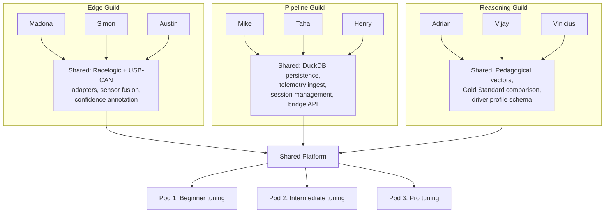
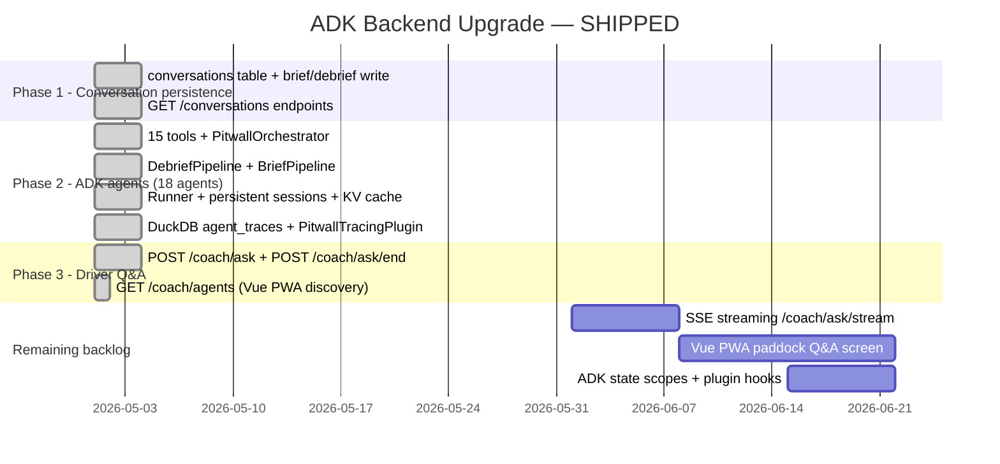

# Sprint Plan

April 8 -- May 30, 2026. Engineering-first with a hard technical gate.

!!! success "Delivered post-merge (2026-04-28)"
    Several deliverables originally pegged to the architecture-gate (Apr 29) and integration phases landed early. The current state:

    - **Bridge + Coach engine wired**: `tools/pitwall_bridge.py:/analyze` returns rally-style pace notes from `RuleCoach` + `LitertCoach`, persists them to DuckDB. See [`api.md`](api.md), [ADR-010](adr/010-http-bridge-warm-path.md).
    - **On-device LLM committed**: Gemma 4 E2B via MediaPipe Genai (LiteRT-LM `.task` from `litert-community/gemma-4-E2B-it-litert-lm`). No cloud LLM tier. See [ADR-012](adr/012-coach-engine-adapter.md).
    - **Frontend / backend boundary defined**: backend owns LLM logic + system prompts; frontend renders only. See [ADR-013](adr/013-frontend-backend-boundary.md).
    - **Sonoma research integrated**: 16 named track markers across 8 corners, per-corner Bentley + T-Rod tips, T-Rod voice in the Sonoma system prompt. 42 % of pace notes per lap reference real landmarks. See [`markers.md`](markers.md), [`sonoma_track_intelligence.md`](sonoma_track_intelligence.md), [`trod_sonoma_session.md`](trod_sonoma_session.md).
    - **Session management API**: `/session/start`, `/sessions`, `/session/<id>`, `/session/<id>/end` + `coaching_notes` table for off-track replay.

    Items still on the original timeline below: field-test prep, regression suite, dry run.

---

## Timeline

## The Hard Gate: April 29

**No code, no track.** Architecture review must demonstrate:

- [ ] Sensor fusion engine running with Racelogic + USB-CAN data
- [ ] Confidence-annotated frames flowing through the pipeline
- [ ] Local DuckDB persistence working end-to-end
- [ ] Gemma 4 inference on Pixel 10 TPU at <50ms
- [ ] Message arbiter preventing conflicting coaching
- [ ] At least 3 pedagogical vectors firing correctly on recorded telemetry
- [ ] End-to-end: sensor → fusion → coaching → audio on a replayed session

---

## Team Structure: F1 Garage Matrix

### Vertical Pods

Each pod owns a complete user experience for one driver skill level.

| Role | Team 1: Beginner (Rental) | Team 2: Intermediate (M3) | Team 3: Advanced (Race Car) |
|------|---------------------------|---------------------------|----------------------------|
| **Tech Lead** | Jigyasa Grover | Hemanth HM | Vikram Tiwari |
| **Edge / Telemetry** | Madona Wambua | Simon Margolis | Austin Bennett (Mentor) |
| **AGY Pipeline** | Mike Wolfson | **Taha Bouhsine** | Henry A Ruiz Guzman |
| **Data Reasoning** | Adrian Catalan | Vijay Vivekanand (Founder) | Vinicius F. Caridá |
| **UX / Frontend** | Rabimba Karanjai (Mentor) | Aileen Villanueva | Francisco Mere (Founder) |

### Horizontal Guilds

Cross-pod collaboration to build shared infrastructure once.

**Build horizontally first, tune vertically second.**

Guilds build the shared platform (sensor fusion, Antigravity pipeline, pedagogical vectors) in Phase 1-2. Once the platform works end-to-end, each pod returns to vertical tuning: adjusting coaching language, thresholds, and persona for their specific driver level.

---

## Taha's Role: AGY Pipeline, Team 2

Your scope on the Pipeline Guild:

### Phase 1 (Apr 8-21): Build the Antigravity Pipeline

1. **Telemetry Persistence** on Pixel 10: DuckDB-backed frame persistence with session management
2. **Bridge API** on localhost: Flask endpoints for coaching, analysis, and session lifecycle
3. **Local reliability**: DuckDB survives process restarts, no lost frames
4. **Burst format**: Confidence-annotated frames in JSON, session metadata, driver level

### Phase 2 (Apr 18-28): Connect to Reasoning

5. **Feed LitertCoach**: Pass telemetry + Gold Standard + pedagogical vectors to on-device Gemma 4 E2B
6. **Return warm path coaching**: Route LitertCoach response to arbiter in-process

### Phase 3 (Apr 28 - May 15): Team 2 Vertical Tuning

7. **Tune for M3 / Intermediate**: Adjust coaching cadence, LitertCoach prompt, coaching language for Team 2's BMW M3 and intermediate driver
8. **CAN configuration**: Ensure USB-CAN adapter reads M3-specific CAN signals via DBC correctly

### Phase 4 (May 15-23): Field Prep

9. **Sonoma dry run**: End-to-end test on a local track or parking lot
10. **Regression tests**: Verify pipeline on recorded Sonoma reference data

---

## Deliverables

### Completed (Pre-Sprint Data Analysis & Model Training)

- [x] **VBO parser** — parses all 183 Racelogic .vbo files (535K frames, 14.9 hours)
- [x] **Track builder** — auto-generates track definitions from GPS curvature. 3 tracks built: Sonoma (11 corners), Track 2 (9 corners), Track 8 (11 corners)
- [x] **Data analysis** — 52 hot lap sessions profiled. Driving phase distribution: 43.7% cornering, 8.8% braking, 6.3% coasting, 2.2% trail braking
- [x] **Signal audit** — 11 usable coaching signals, 7 broken/unmapped CAN signals documented
- [x] **LSTM v3 sequence predictor** — trained on 140K sequences, tested on unseen track. Speed MAE: 3.3 km/h at 1s. Brake MAE: 2.7 bar at 1s.
- [x] **Phase classifier** — XGBoost, 100% accuracy (labels are deterministic from features)
- [x] **Brake point predictor** — linear regression, 15.9m MAE, each m/s adds 2.36m to brake zone
- [x] **Style fingerprint** — K-Means 4 archetypes (aggressive, smooth, heavy braker, cautious)
- [x] **Sonic model v1** — hand-tuned audio cues (grip, brake approach, trail brake, throttle, coast)
- [x] **Sonic model v2** — LSTM-driven delta cues. Tested on Sonoma: fires speed_delta, brake_delta, lookahead, grip, corner score
- [x] **Simulator** — replays VBO with real track data + LSTM model, exports labeled CSV
- [x] **Data documentation** — 6 docs covering VBO format, signal reference, derived features, dataset overview, data quality
- [x] **Architecture docs** — 12 pages + 9 ADRs for sprint edition
- [x] **Kaggle training pipeline** — preprocessed data uploaded, training script tested on 2x T4 GPU

### By April 29 (Architecture Gate)

- [ ] Antigravity Tx/Rx working end-to-end
- [x] Confidence-annotated frames flowing through pipeline (simulator demonstrates this)
- [ ] Store-and-forward tested (simulate 5G dropout)
- [ ] On-device warm path generating coaching via LitertCoach
- [ ] Warm path response delivered to arbiter → earbuds
- [x] Track definitions auto-generated for Sonoma (validated against real data)
- [x] LSTM model predicting speed/brake/throttle 2 seconds ahead on unseen track

### By May 23 (Field Test)

- [ ] Full system running on Pixel 10 in an M3
- [ ] Audio coaching audible and coherent via Pixel Earbuds
- [ ] Signal Light HUD showing grip bars
- [ ] Lap times computed from GPS crossing
- [x] Corner report card framework built (corner scorer in train_models.py)
- [ ] Driver profile updated from session data
- [ ] System runs fully on-device without cloud dependency
- [x] Pedagogical vectors defined with real Sonoma corner data

### By May 30 (Sprint Wrap)

- [ ] Session recordings from Sonoma field test
- [ ] Post-session analysis comparing 3 pods
- [x] Architecture documentation updated with field test findings (data analysis complete)
- [ ] Reference architecture ready for Google I/O narrative

---

## ADK Backend Upgrade — Shipped 2026-05-01

All phases delivered ahead of schedule. 358/358 tests passing.
See [ADR-019](adr/019-adk-multi-agent-backend.md), [ADR-020](adr/020-adk-agent-architecture-refactor.md), [ADR-021](adr/021-adk-second-audit.md), and [adk-agent-architecture.md](adk-agent-architecture.md).

### Phase 1 — delivered ✅

- [x] `conversations` table in `get_db()` schema
- [x] `brief()` + `debrief()` write narratives to `conversations`
- [x] `GET /conversations/<session_id>`
- [x] `GET /conversations/driver/<driver_id>`

### Phase 2 — delivered ✅

- [x] `google-adk` installed, `tools/adk_tools.py` (15 tools), `tools/adk_agents.py` (18 agents)
- [x] `PitwallOrchestrator(BaseAgent)` with `_classify_intent()` deterministic routing
- [x] `DebriefPipeline`: `SequentialAgent` → `ParallelAgent([Highlights, Telemetry, Pedagogy])` → `NarrativeAgentDebrief`
- [x] `BriefPipeline`: `SequentialAgent` → `PedagogyAgent` → `NarrativeAgentBrief`
- [x] `Runner` + `InMemorySessionService` + `run_adk()` (canonical sync entry point)
- [x] Persistent sessions per driver — KV cache reuse via session cloning, `reset_driver_session()` called at `POST /session/start`
- [x] `PitwallTracingPlugin(BasePlugin)` + `agent_traces` DuckDB table — full agent + tool telemetry
- [x] `AgentMetaAgent` — queries `agent_traces` for system observability
- [x] All 7 ADR-020 audit fixes + 6 ADR-021 audit fixes shipped
- [x] 358/358 tests passing

### Phase 3 — delivered ✅

- [x] `POST /coach/ask` — multi-turn Q&A, 6-turn rolling context, `_qa_histories` with 1-hour TTL
- [x] `POST /coach/ask/end` — flush turns to `conversations` table
- [x] `GET /coach/agents` — `AGENT_REGISTRY` for Vue PWA discovery

### Remaining backlog

- [ ] `POST /coach/ask/stream` — SSE streaming (RunConfig + StreamingMode.SSE)
- [ ] Vue PWA paddock Q&A screen
- [ ] ADK state scopes (`user:`, `app:`, `temp:`) — driver prefs persist across sessions
- [ ] `before_tool_callback` per-agent SQL validation
- [ ] `LoopAgent` for Q&A refinement (max 3 iterations)
- [ ] Artifact storage for session PDF export
