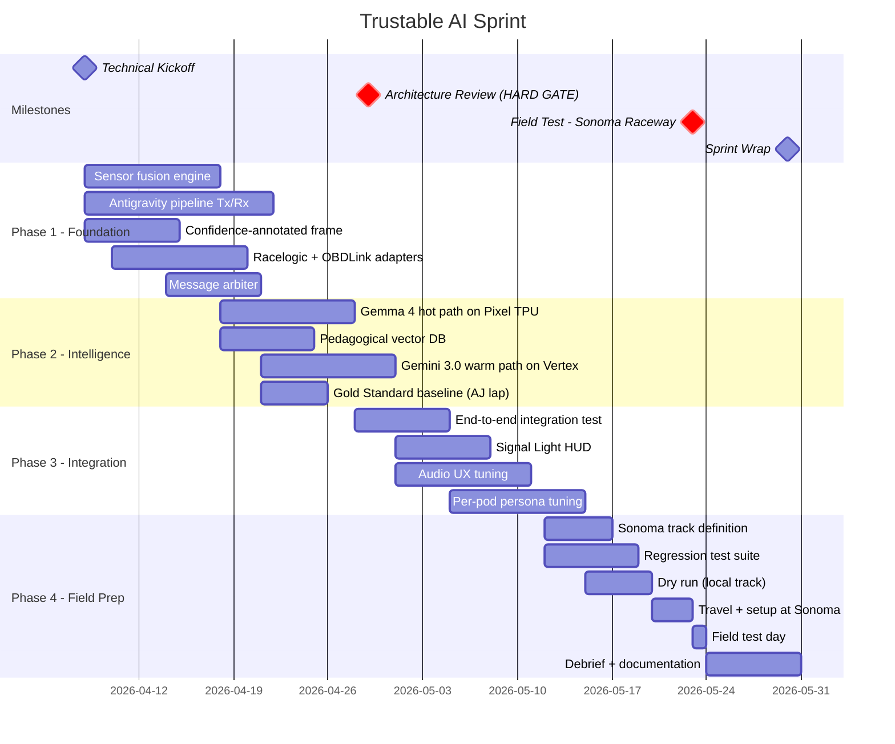
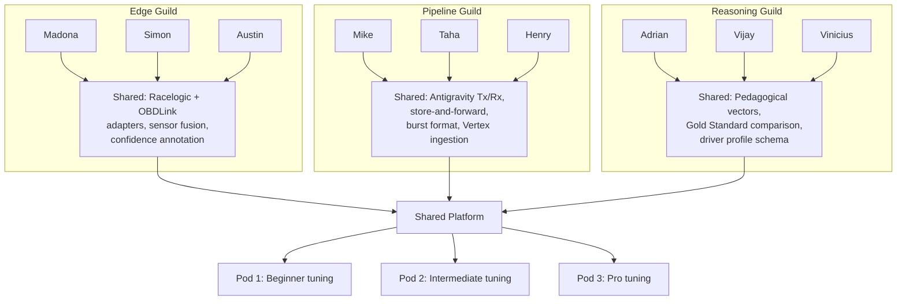

# Sprint Plan

April 8 -- May 30, 2026. Engineering-first with a hard technical gate.

---

## Timeline

## The Hard Gate: April 29

**No code, no track.** Architecture review must demonstrate:

- [ ] Sensor fusion engine running with Racelogic + OBDLink data
- [ ] Confidence-annotated frames flowing through the pipeline
- [ ] Antigravity store-and-forward working with Vertex AI
- [ ] Gemma 4 inference on Pixel 10 TPU at <50ms
- [ ] Message arbiter preventing conflicting coaching
- [ ] At least 3 pedagogical vectors firing correctly on recorded telemetry
- [ ] End-to-end: sensor → fusion → coaching → audio on a replayed session

---

## Team Structure: F1 Garage Matrix

### Vertical Pods

Each pod owns a complete user experience for one driver skill level.

| Role | Team 1: Beginner (Rental) | Team 2: Intermediate (M3) | Team 3: Advanced (Race Car) |
|------|---------------------------|---------------------------|----------------------------|
| **Tech Lead** | Jigyasa Grover | Hemanth HM | Vikram Tiwari |
| **Edge / Telemetry** | Madona Wambua | Simon Margolis | Austin Bennett (Mentor) |
| **AGY Pipeline** | Mike Wolfson | **Taha Bouhsine** | Henry A Ruiz Guzman |
| **Data Reasoning** | Adrian Catalan | Vijay Vivekanand (Founder) | Vinicius F. Caridá |
| **UX / Frontend** | Rabimba Karanjai (Mentor) | Aileen Villanueva | Francisco Mere (Founder) |

### Horizontal Guilds

Cross-pod collaboration to build shared infrastructure once.

**Build horizontally first, tune vertically second.**

Guilds build the shared platform (sensor fusion, Antigravity pipeline, pedagogical vectors) in Phase 1-2. Once the platform works end-to-end, each pod returns to vertical tuning: adjusting coaching language, thresholds, and persona for their specific driver level.

---

## Taha's Role: AGY Pipeline, Team 2

Your scope on the Pipeline Guild:

### Phase 1 (Apr 8-21): Build the Antigravity Pipeline

1. **Antigravity Tx** on Pixel 10: Buffer fused frames, pack into bursts, send via 5G
2. **Antigravity Rx** on Vertex AI: Receive bursts, parse, validate, store, trigger Gemini 3.0
3. **Store-and-forward reliability**: Persist to local disk when 5G drops, send when restored
4. **Burst format**: Confidence-annotated frames in JSON, session metadata, driver level

### Phase 2 (Apr 18-28): Connect to Reasoning

5. **Feed Gemini 3.0**: Pass telemetry burst + Gold Standard + pedagogical vectors to Gemini
6. **Return warm path coaching**: Route Gemini response back to Pixel 10 via 5G → arbiter

### Phase 3 (Apr 28 - May 15): Team 2 Vertical Tuning

7. **Tune for M3 / Intermediate**: Adjust Antigravity burst cadence, Gemini prompt, coaching language for Team 2's BMW M3 and intermediate driver
8. **CAN configuration**: Ensure OBDLink MX reads M3-specific CAN signals correctly

### Phase 4 (May 15-23): Field Prep

9. **Sonoma dry run**: End-to-end test on a local track or parking lot
10. **Regression tests**: Verify pipeline on recorded Sonoma reference data

---

## Deliverables

### Completed (Pre-Sprint Data Analysis & Model Training)

- [x] **VBO parser** — parses all 183 Racelogic .vbo files (535K frames, 14.9 hours)
- [x] **Track builder** — auto-generates track definitions from GPS curvature. 3 tracks built: Sonoma (11 corners), Track 2 (9 corners), Track 8 (11 corners)
- [x] **Data analysis** — 52 hot lap sessions profiled. Driving phase distribution: 43.7% cornering, 8.8% braking, 6.3% coasting, 2.2% trail braking
- [x] **Signal audit** — 11 usable coaching signals, 7 broken/unmapped CAN signals documented
- [x] **LSTM v3 sequence predictor** — trained on 140K sequences, tested on unseen track. Speed MAE: 3.3 km/h at 1s. Brake MAE: 2.7 bar at 1s.
- [x] **Phase classifier** — XGBoost, 100% accuracy (labels are deterministic from features)
- [x] **Brake point predictor** — linear regression, 15.9m MAE, each m/s adds 2.36m to brake zone
- [x] **Style fingerprint** — K-Means 4 archetypes (aggressive, smooth, heavy braker, cautious)
- [x] **Sonic model v1** — hand-tuned audio cues (grip, brake approach, trail brake, throttle, coast)
- [x] **Sonic model v2** — LSTM-driven delta cues. Tested on Sonoma: fires speed_delta, brake_delta, lookahead, grip, corner score
- [x] **Simulator** — replays VBO with real track data + LSTM model, exports labeled CSV
- [x] **Data documentation** — 6 docs covering VBO format, signal reference, derived features, dataset overview, data quality
- [x] **Architecture docs** — 12 pages + 9 ADRs for sprint edition
- [x] **Kaggle training pipeline** — preprocessed data uploaded, training script tested on 2x T4 GPU

### By April 29 (Architecture Gate)

- [ ] Antigravity Tx/Rx working end-to-end
- [x] Confidence-annotated frames flowing through pipeline (simulator demonstrates this)
- [ ] Store-and-forward tested (simulate 5G dropout)
- [ ] Gemini 3.0 receiving bursts and generating coaching
- [ ] Warm path response delivered to arbiter → earbuds
- [x] Track definitions auto-generated for Sonoma (validated against real data)
- [x] LSTM model predicting speed/brake/throttle 2 seconds ahead on unseen track

### By May 23 (Field Test)

- [ ] Full system running on Pixel 10 in an M3
- [ ] Audio coaching audible and coherent via Pixel Earbuds
- [ ] Signal Light HUD showing grip bars
- [ ] Lap times computed from GPS crossing
- [x] Corner report card framework built (corner scorer in train_models.py)
- [ ] Driver profile updated from session data
- [ ] System survives 5G dropouts without data loss
- [x] Pedagogical vectors defined with real Sonoma corner data

### By May 30 (Sprint Wrap)

- [ ] Session recordings from Sonoma field test
- [ ] Post-session analysis comparing 3 pods
- [x] Architecture documentation updated with field test findings (data analysis complete)
- [ ] Reference architecture ready for Google I/O narrative
