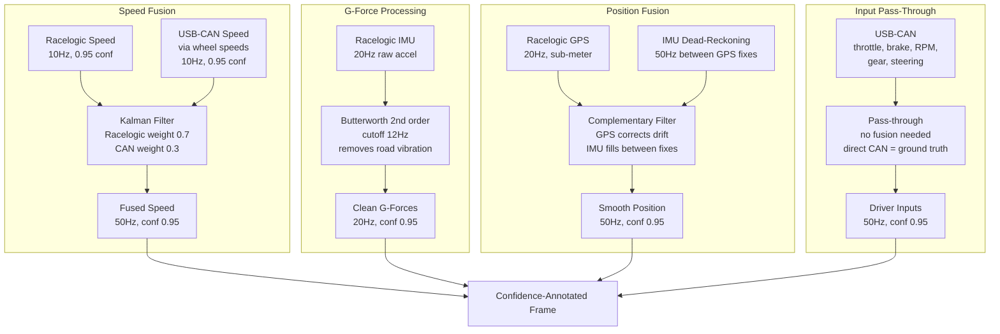
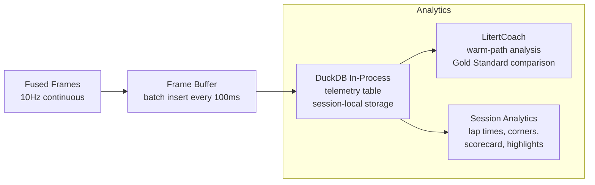

# Telemetry Pipeline

The pipeline has three stages: **ingestion** (sensors → raw data), **fusion** (raw → confidence-annotated frame), and **distribution** (frame → hot path + DuckDB persistence).

---

## Stage 1: Ingestion

### Racelogic Mini

Professional-grade GPS + IMU. **Actual VBO output is 10Hz** (sample period 0.100s), not the hardware-native 20Hz. This is the effective rate for all downstream processing.

| Signal | Rate | Range (Observed from 183 sessions) | Confidence |
|--------|------|------------------------------------|------------|
| Latitude / Longitude | 10Hz | 8 tracks identified by GPS clustering | 0.95 |
| Speed | 10Hz | 0–198 km/h (peak in VBOX0318) | 0.95 |
| Heading | 10Hz | 0–360° | 0.95 |
| Lateral Acceleration | 10Hz | -1.81 to +1.63 G | 0.95 |
| Longitudinal Acceleration | 10Hz | -1.66 to +0.21 G | 0.95 |
| Combined Acceleration | 10Hz | 0–2.29 G | 0.95 |
| Altitude | 10Hz | 8–93 m (48m delta at Sonoma) | 0.80 |

**Connection:** Bluetooth or serial to Pixel 10.

**Confidence adjustment:** If satellite count drops below 60 (encoded quality flag, not literal count) or HDOP exceeds 2.0, GPS confidence drops to 0.60. IMU confidence remains 0.95 regardless of GPS quality.

!!! note "10Hz, Not 20Hz"
    The Racelogic hardware captures at 20Hz internally, but the VBO file output is 10Hz (sample period 0.100s confirmed across all 183 files). All latency budgets, frame rates, and model inference timings are based on 10Hz = 100ms per frame.

### USB-CAN Adapter

CAN bus extraction via USB (`python-can` + `cantools`). Signal ranges verified across 183 VBO sessions (originally recorded with OBDLink MX; the as-shipped architecture uses USB-CAN adapters for lower latency):

| Signal | Rate | Range (Observed) | Confidence | Status |
|--------|------|------------------|------------|--------|
| Brake Pressure | 10Hz | 0–104 bar | 0.95 | **Working — most valuable CAN signal** |
| Brake Position | 10Hz | 0–1.0 | 0.95 | Working |
| Throttle Position | 10Hz | 0–99% | 0.95 | Working |
| Steering Angle | 10Hz | -1024° to +372° (clip to ±500°) | 0.90 | Working, wraps at extremes |
| Engine RPM | 10Hz | 843–8,582 rpm | 0.95 | Working |
| Coolant Temp | 10Hz | 68–99°C | 0.90 | Working |
| Oil Temp | 10Hz | 84–121°C | 0.90 | Working |
| Oil Pressure | 10Hz | 0.6–5.85 bar | 0.85 | Working |
| Fuel Level | 10Hz | 20–46% | 0.80 | Working |
| Battery Voltage | 10Hz | 13.1–13.6 V | 0.90 | Working |
| Gear | — | 255 (constant) | — | **Not mapped** — derive from RPM/speed |
| Clutch Position | — | 255 (constant) | — | **Not mapped** |
| Air Fuel Ratio | — | 500 (constant) | — | **Not connected** |
| Exhaust Temp | — | -50 (constant) | — | **Not connected** |
| Vehicle Speed (OBD) | — | 500 (constant) | — | **Not configured** — use GPS velocity |

**Connection:** Bluetooth SPP to Pixel 10.

!!! warning "7 Broken Signals"
    Gear, Clutch, AFR, EGT, Vehicle Speed, Head Temp, and Brake_Press_(Calc) are constant or mislabeled across all 183 files. These CAN IDs are not mapped in the DBC configuration for this car (BMW M3 S54). Gear must be derived from RPM/speed ratio.

**Confidence adjustment:** If the USB-CAN adapter disconnects, all CAN signals are marked stale within 100ms. Reconnection triggers 2-second validation before restoring confidence.

---

## Stage 2: Sensor Fusion

Even with professional hardware, fusion adds value.



### Why Fuse Pro Hardware?

1. **Racelogic GPS in a tunnel/tree cover:** GPS drops to 5Hz, HDOP spikes. Fusion detects this and reduces GPS confidence while IMU dead-reckoning maintains smooth position.
2. **Road surface vibration:** Even Racelogic's IMU picks up bumps. Butterworth filter at 12Hz removes road noise while preserving real driving dynamics (which peak at ~5Hz for aggressive cornering).
3. **Racelogic vs CAN speed disagreement:** If one sensor has a momentary glitch, the Kalman filter smooths through it instead of passing a spike to the coaching engine.

### Confidence-Annotated Frame

Every signal carries metadata (from Pitwall ADR-001, adapted for pro hardware):

```python
@dataclass
class SignalValue:
    value: float
    confidence: float    # 0.0-1.0
    source: str          # "racelogic:gps", "racelogic:imu", "usb_can:can"
    hz: float            # actual update rate
    stale: bool          # no update in >2x expected period

@dataclass  
class TelemetryFrame:
    timestamp: float
    sources: list[str]
    
    # Position (fused)
    latitude: SignalValue
    longitude: SignalValue
    speed: SignalValue
    heading: SignalValue
    
    # G-forces (Racelogic IMU, filtered)
    g_lat: SignalValue
    g_long: SignalValue
    
    # Driver inputs (USB-CAN, direct)
    throttle: SignalValue
    brake: SignalValue
    rpm: SignalValue
    gear: SignalValue
    steering: SignalValue
    
    # Derived
    distance: SignalValue        # cumulative from GPS
    corner_proximity: float      # meters to nearest corner
    current_corner: str | None   # "Turn 3" or None
    lap: int
    lap_time: float
```

---

## Stage 3: Distribution

The fused frame goes to two consumers simultaneously:

### Hot Path Feed (Local, <20ms)

Direct in-process feed to Gemma 4 on the Pixel 10 TPU. No serialization, no network.

```python
# In the fusion engine's output callback:
async def on_frame(frame: TelemetryFrame):
    # Hot path: direct function call, no network
    gemma_response = await gemma_engine.evaluate(frame)
    if gemma_response:
        await arbiter.submit(gemma_response)
    
    # Buffer for DuckDB persistence
    burst_buffer.append(frame)
```

Frame rate: 10Hz (every 100ms). The hot path evaluates every frame.

### DuckDB Persistence (Local, in-process)

Telemetry frames are persisted locally to DuckDB as they arrive. No cloud dependency.



**Persistence cadence:** Every 100ms (configurable via `--can-flush-ms`). Frames are batch-inserted into the `telemetry` wide table.

**Reliability guarantee:** DuckDB runs in-process with zero network dependency. Session data is persisted to disk and survives process restarts.

**Burst format:**

```json
{
  "session_id": "sonoma-2026-05-23-team2",
  "burst_id": 42,
  "timestamp_start": 1716483600.0,
  "timestamp_end": 1716483610.0,
  "frame_count": 500,
  "driver_level": "intermediate",
  "car": "BMW M3",
  "track": "sonoma",
  "frames": [
    {
      "timestamp": 1716483600.0,
      "speed": {"value": 42.5, "confidence": 0.95, "source": "fused:kalman"},
      "g_lat": {"value": 0.85, "confidence": 0.95, "source": "racelogic:imu"},
      "brake": {"value": 72.0, "confidence": 0.95, "source": "usb_can:can"},
      ...
    }
  ]
}
```

---

## Local Analytics: DuckDB

In addition to feeding the hot path, the fusion engine maintains a DuckDB in-process database for all analytics and warm-path coaching:

```python
# Append every frame to DuckDB in-memory table
duckdb.execute("""
    INSERT INTO telemetry VALUES (?, ?, ?, ?, ?, ?, ?, ?, ?)
""", [frame.timestamp, frame.speed.value, frame.g_lat.value, ...])
```

**Use cases:**

- Rolling G-force envelope (last 10 seconds) for friction circle HUD
- Lap time splits (computed from GPS crossing start/finish)
- Corner-by-corner metrics for the event-sourced driver profile
- Post-session aggregation that feeds the driver profile events

**DuckDB is the sole persistence layer.** All analytics, coaching, and session queries run locally with zero latency. There is no cloud dependency.

| Query | Engine | Latency |
|-------|--------|---------|
| "What's my rolling max gLat?" | DuckDB | <1ms |
| "How does this lap compare to my best?" | DuckDB | <10ms |
| "How does Driver A compare to Driver B across all sessions?" | DuckDB | <100ms |
| "Generate the post-session debrief" | LitertCoach + DuckDB data | 2–15s |
