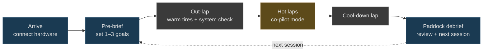
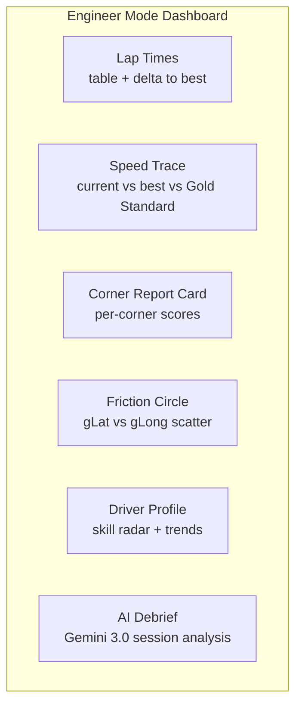
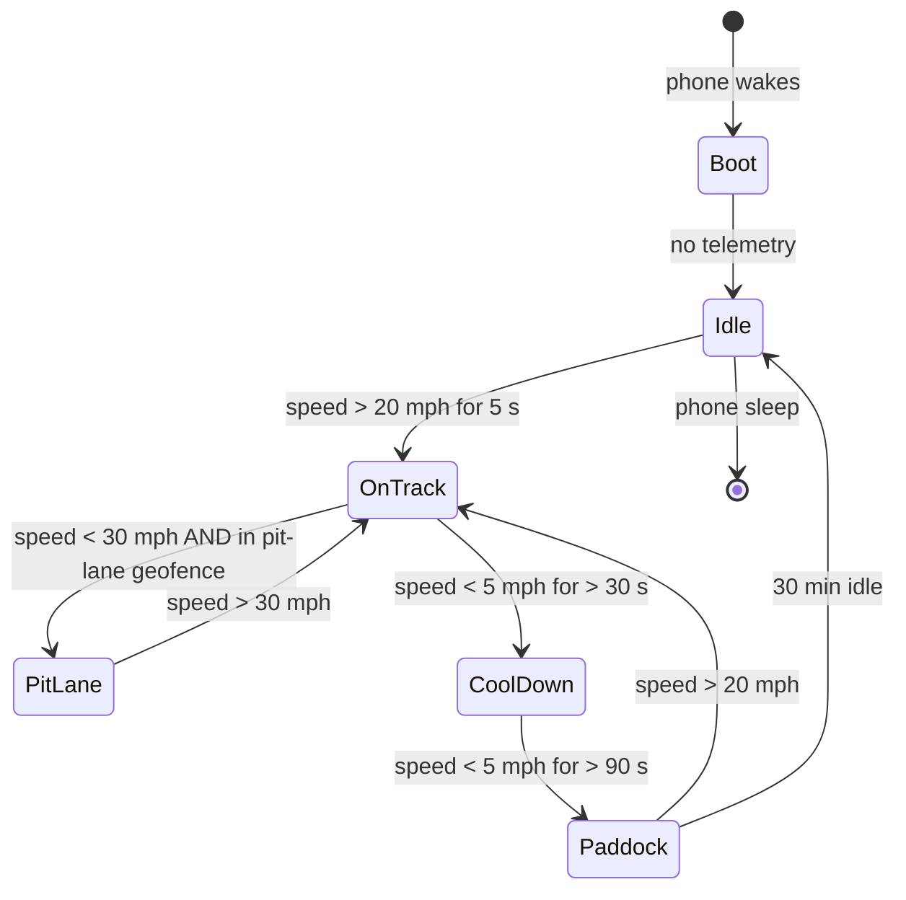
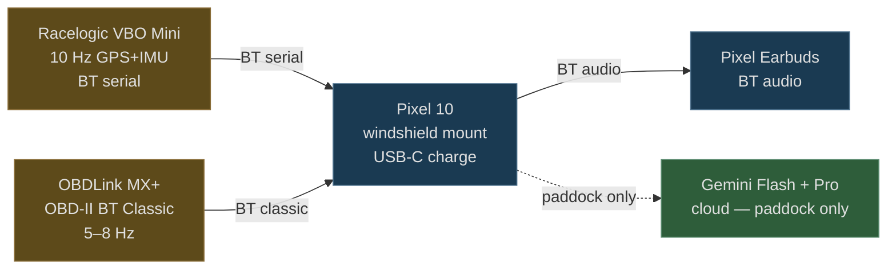
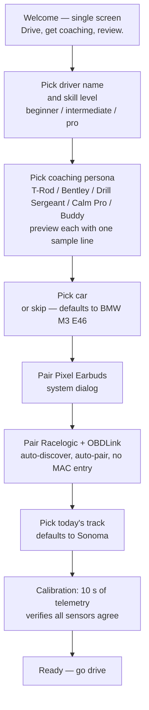

# UX: Audio-First, Minimal Visual

Two modes. On-track: the co-pilot (audio + minimal HUD). Off-track: the race engineer (full dashboard).

The mode boundary is not a tab the driver picks — it switches automatically based on speed. The driver never has to think about which screen they're on.

---

## Design Principles

These five principles override every UX decision. When a feature seems valuable but conflicts with one, the principle wins.

### 1. Audio-first, peripheral vision second

A driver at 130 mph on the back straight has zero capacity for reading text. The co-pilot's primary channel is **TTS through Pixel Earbuds**; the screen is a *peripheral-vision* signal at most. We test every visual element by asking: *can a driver read this without taking their eyes off the apex marker?* If not, it's audio.

> Reference: ADR-013 (Frontend visualizes, backend reasons)

### 2. Silence is coaching

The arbiter (ADR-002) holds 78% of generated cues. Saying *nothing* when the driver is on a clean line is a feature: it tells them they're doing it right, and it preserves attention for the cue that actually matters. We measure cue suppression rate, not cue volume.

### 3. Fail open, never silent

If the bridge dies, the LLM times out, the network drops, or earbuds disconnect — the system degrades to the next-tier coach (sonic_model → mock → silence) without the driver having to do anything. **No error dialogs on track.** The signal-light HUD turns red if grip is exceeded regardless of whether the AI is reasoning.

> Reference: ADR-009 (Graceful degradation)

### 4. Confidence is part of the message

Coaching with high model confidence sounds different from low-confidence coaching. A confident cue is direct ("brake at the bridge"); a low-confidence cue is hedged ("you might want to brake earlier") and arrives quieter. Drivers learn to weigh advice by how it's phrased, not by a "AI confidence: 0.62" overlay they can't read.

> Reference: ADR-001 (Confidence-annotated frame)

### 5. No number-chasing on track

We deliberately hide lap times, deltas, and split timers from the on-track HUD. Drivers who chase numbers stop driving the corner in front of them. Numbers belong in the paddock — that's why mode-switching is automatic and the on-track screen is two coloured bars, not a dashboard.

---

## User Journey — A Day at Sonoma

The whole UX is structured around a track-day's natural arc. Each stage maps to specific endpoints in `tools/pitwall_bridge.py`.



| Stage | Duration | UX | API endpoint |
|---|---|---|---|
| **Arrive** | 5 min | Pair earbuds; bridge auto-detects Racelogic + OBDLink. Health check shows engine status, DuckDB ready, track loaded. | `GET /health` |
| **Pre-brief** | 2–4 min | Driver picks 1–3 session goals (corner focus / lap-time delta / technique). System reads weather phase, surfaces danger zones, picks today's focus corners from prior driver profile. Goals are *spoken aloud once* before pulling out, then become coaching anchors during the session. | `GET /coach/brief`, `GET /track/weather`, `GET /track/danger_zones`, `GET /driver/<id>/profile` |
| **Out-lap** | 1 lap (~2 min) | Co-pilot mode is on but **only safety cues fire** (P3). The driver hears no technique coaching while tires warm. Sonic-model grip tone is at 50% volume so the driver gets used to it. | `POST /analyze` (P3-only) |
| **Hot laps** | 4–8 laps | Full co-pilot. Audio coaching gated by the arbiter; signal-light HUD in peripheral vision; the 4 audio layers (grip, brake, throttle, trail) plus pace notes. Cue volume scales with the *current* lap-time vs goal — closer to goal, less coaching. | `POST /analyze`, `POST /session/<sid>/frames`, `POST /session/<sid>/signals` |
| **Cool-down** | 1 lap | All cues silenced *except* the corner-score chime. Driver hears "you went +0.4s, +0.1s, -0.2s, …" — pure summary, no advice. Lets the driver build their own mental model before the AI weighs in. | `POST /analyze` (chime-only) |
| **Paddock debrief** | 5–15 min | Engineer dashboard. AI debrief is the lead, then lap table, sector trends, friction circle, per-corner grades. The driver can ask the coach a follow-up: *"Why did I lose time at T7?"* — answered with citation back to the telemetry burst. Goals from pre-brief are scored: did you hit them? | `POST /coach/debrief`, `GET /session/<sid>/scorecard`, `GET /session/<sid>/lap_time_table`, `GET /session/<sid>/corners`, `GET /session/<sid>/ideal_lap`, `POST /score` |
| **Iterate** | — | Debrief feeds the *next* pre-brief: today's focus corners come from yesterday's weakness. The driver sees their evolution chart over the season. | `GET /driver/<id>/evolution` |

Every coaching moment is grounded in a previous moment. Out-lap warms into hot laps; hot laps feed the debrief; the debrief seeds tomorrow's pre-brief.

---

## Validated Cue Distribution (from Sonoma Simulator)

Running the LSTM-driven sonic model v2 on 11,737 frames of real Sonoma telemetry:

| Audio Layer | Frames Active | % of Session | Priority | When It Fires |
|------------|:---:|:---:|:---:|---|
| **Grip tone** | 6,475 | 55.2% | P0 (background) | Continuous — pitch tracks friction circle utilization |
| **Brake approach** | 4,970 | 42.3% | P1-P2 | Corner approaching, ascending pitch |
| **Speed delta** (LSTM v2) | ~2,100 | ~18% | P1-P2 | When actual speed deviates >5 km/h from LSTM prediction |
| **Throttle cue** | 377 | 3.2% | P1 | Past apex, driver not on throttle yet |
| **Coast warning** | 354 | 3.0% | P1 | Throttle <10%, brake <2 bar, speed >30 km/h |
| **Trail brake** | 138 | 1.2% | P1 | Brake >3 bar AND gLat >0.4G in a corner |
| **Corner score chime** | ~55 | ~0.5% | P0 | On exit of each corner (up/down/neutral chime) |
| **Silence** | 2,545 | 21.7% | — | On straights when everything is normal |

**Key finding:** The driver hears audio cues 78% of the time, with 22% silence. The grip tone is the continuous background layer — the driver habituates to it and notices changes in pitch. Active coaching (brake approach, speed delta, throttle) fires in ~25% of frames. This is the right balance — enough information without overwhelm.

---

## On-Track: The Co-Pilot

The driver's cognitive capacity at 130 mph is fully consumed by driving. The UX must **add information without adding cognitive load**.

### Audio (Primary Interface)

All coaching delivered via Pixel Earbuds TTS.

| Message Type | Length | Example | Priority |
|-------------|--------|---------|----------|
| Safety alert | 1-2 words | "BRAKE!" / "Lift!" / "Car right!" | P3 — immediate |
| Reflexive cue | 2-5 words | "Trail brake." / "Commit." / "Full send." | P2 — on straight |
| Technique | 5-15 words | "Trail brake to the apex. Smooth release." | P2 — on straight |
| Strategy | 10-25 words | "Turn 3: you braked 15m early vs AJ. Try holding to the 2-board." | P1 — queued |

**Delivery timing:** The message arbiter holds non-safety messages until the car is on a straight (|gLat| < 0.3G). This prevents mid-corner distraction.

**Message cadence:** Maximum one message every 3 seconds. A lap at Sonoma is ~100 seconds. That means ~15 coaching opportunities per lap, but typically 3-5 are used. Silence is coaching too.

### Coaching personas

The same coaching content can be delivered in five voices. Persona is a setting on the driver profile (changeable any time, no session restart) and only affects phrasing — the *substance* of every cue is identical across personas.

| Persona | Voice | Example: late-apex T11 cue | Best for |
|---|---|---|---|
| **T-Rod** *(default)* | Rally pace-note, terse, environmental anchors | "Wait for the bump, trail to the third tire stack, all the road on exit." | Drivers who already know the track |
| **Bentley** | Classroom, technical | "Initiate trail-brake at the bump. Maintain pressure to the apex; ease off as steering peaks. Open the wheel on exit and unwind progressively." | First-timers, learning the technique |
| **Drill Sergeant** | Direct, urgent | "Brake! Trail it! Apex! Throttle!" | Drivers who under-commit |
| **Calm Pro** | Quiet, measured | "Settling for T11. Brake on the bump. Trail to the apex." | Drivers prone to over-driving |
| **Buddy** | Conversational, warm | "Okay, T11 here — wait for that bump to settle, ride the brake all the way to the apex, you got it." | Beginners, anxious drivers |

Each persona pulls from the same Sonoma vocabulary (`SYSTEM_PROMPT_LORE` in `sonoma.py` — *the bridge, the K-wall bend, Calamity Corner, the bump, the third tire stack*). Personas don't invent track terms; they just rephrase. This keeps the safety-critical content stable while letting the *register* match the driver.

Skill level (`beginner | intermediate | pro`) is orthogonal: a beginner gets longer, more explanatory cues *in any persona*; a pro gets terser cues *in any persona*. The matrix is **5 personas × 3 skill levels = 15 phrasing modes**, all driven by the same underlying coach decisions.

### Signal Light HUD (Secondary Interface)

The Pixel 10 screen shows minimal visual information. No graphs. No numbers. No text.

```
┌─────────────────────────┐
│                         │
│    ┌───┐       ┌───┐    │
│    │   │       │   │    │
│    │   │       │   │    │
│    │ G │       │ R │    │
│    │ R │       │ E │    │
│    │ E │       │ D │    │
│    │ E │       │   │    │
│    │ N │       │   │    │
│    │   │       │   │    │
│    └───┘       └───┘    │
│                         │
│   GRIP OK    OVER LIMIT │
│                         │
└─────────────────────────┘
```

**Left bar (green):** Grip available. Height = percentage of friction circle unused. Full bar = car is well within limits. Shrinking = approaching the limit.

**Right bar (red):** Over-limit. Height = how far beyond the grip circle. Appears only when `sqrt(gLat^2 + gLong^2) > max_G * 0.95`. Growing = sliding more.

**Why this works:** The driver doesn't need to read it. In peripheral vision, green = OK, red appearing = back off. One glance, zero cognitive parsing.

### What the HUD Does NOT Show On-Track

- Lap times (distracting — driver focuses on chasing numbers instead of technique)
- Speed (driver can feel it)
- RPM (driver can hear it)
- Tire temps (driver can't act on it mid-corner)
- Coaching text (that's what audio is for)
- Dashboards, graphs, or charts of any kind

---

## Off-Track: The Race Engineer

When the car enters the paddock (speed < 5 mph for >30 seconds), the system switches to **engineer mode**: a full analytical dashboard on the Pixel 10 screen.



### Dashboard Panels

#### Session Goals

The pre-brief lets the driver set 1–3 session goals. Each goal is one of three shapes:

| Goal kind | Example | How it's scored |
|---|---|---|
| **Corner focus** | "Carry more apex speed at T7" | Apex speed delta vs prior session for that corner |
| **Lap-time delta** | "Break 1:48 on a clean lap" | Best lap of session vs target |
| **Technique** | "Trail-brake every corner entry" | % of corner entries with brake>3 bar AND |g_lat|>0.4 G |

The dashboard's first panel shows each goal with a check (✓ achieved), partial (◐ improved but not hit), or miss (✗) — and the *delta* in human terms ("apex speed at T7 went 81 → 84 km/h, +3 km/h"). Goals carry forward: if a goal misses, it's pre-selected for the next pre-brief.

The on-track audio coach knows the goals too. If "carry more apex speed at T7" is a goal, the coach pre-empts T7 cues in earlier corners ("**setup for T7 — exit T6 at full throttle**") and stays quieter elsewhere. Goals shape attention.

> Inspired by trustable-ai-codelab's `SessionGoal` API; pitwall ties scoring to the existing per-corner aggregates already exposed at `GET /session/<sid>/corners`.

#### Lap Times
Table of all laps with delta to personal best and Gold Standard (AJ).

#### Speed Trace Overlay
Three overlapping speed traces by track distance:
- **Current session best** (blue)
- **Personal all-time best** (green)
- **Gold Standard / AJ** (gold)

Shows exactly where the driver is faster/slower and by how much.

#### Corner Report Card
Per-corner scoring:

| Corner | Entry Speed | Min Speed | Exit Speed | Trail Brake | Time | vs AJ |
|--------|-----------|-----------|-----------|-------------|------|-------|
| Turn 3 | 78 mph (B) | 52 mph (C) | 68 mph (B) | 15% (A) | 4.2s | +0.4s |

Grades: A (within 5% of AJ), B (within 15%), C (within 25%), D (>25% gap).

#### Friction Circle
Live gLat vs gLong scatter plot from the session. Shows grip envelope utilization.

#### Driver Profile (Event-Sourced)
Skill radar chart computed from DuckDB session data. Dimensions: Braking, Trail Braking, Corner Speed, Throttle Application, Consistency, Line Accuracy.

#### AI Debrief
Gemini 3.0 generates a narrative session summary:

> "Good session. Best lap 1:42.3, 3.1s behind AJ. Your Turn 3 improved — exit speed up 4mph from last session. Focus area for next session: Turn 7 entry. You're braking 20m too early and losing 0.8s per lap. Try the 3-board as your brake reference. Overall consistency improved — lap time spread down from 2.1s to 1.4s."

---

## Mode Switching

The driver never picks a mode. The phone reads speed + GPS + a few timers and decides.



Five states, not two. The intermediate ones are the ones drivers hit on real track days.

| State | When | UX |
|---|---|---|
| **Boot** | Just paired with hardware | Health check splash; "Bridge OK · Track loaded · Earbuds connected" |
| **Idle** | Sitting in paddock, engine off | Dashboard visible; coaching off |
| **On-track** | Active driving | Signal-light HUD; full coaching |
| **Pit lane** | Coming in or rolling out | HUD on; coaching reduced to safety only; *no debrief generation* (the lap isn't done) |
| **Cool-down** | Just stopped, < 90 s | HUD fades; quiet "Lap complete." chime + corner score chimes; *not* full paddock yet |
| **Paddock** | Stopped > 90 s | Engineer dashboard; Gemini debrief begins generating in background |

### Edge cases that previously caused trouble

| Scenario | Naive behaviour | What we do |
|---|---|---|
| Driver stops at corner-station for marshall | Falsely enters Paddock, kills the session mid-lap | Pit-lane geofence + 90 s cool-down threshold defer mode-switch until clearly off-track |
| Bridge process dies mid-lap | Coaching dies silently | HUD goes amber; sonic_model in-app fallback fires; "AI offline — basic cues only" *spoken once* and never again |
| Earbuds disconnect | Audio dies, driver hears nothing | HUD bars compress to bottom of screen, exposing 3 single-icon cards (brake / throttle / corner) — *visual fallback*. Cards are large, low-saturation, glanceable |
| Network drops | Cloud LLM (Gemini Flash for debrief) unavailable | Debrief generation queued; banner says "Debrief queued — will generate when online". The on-device coach (Gemma 4 E2B via LiteRT-LM) is unaffected |
| Low battery (< 15%) | App keeps running, drains | HUD darkens to AMOLED black, drops to 30 fps; non-essential signals (gold-standard overlay, weather) disabled. "Battery saver — coaching active" surfaced once |
| Mid-session brief stop (red flag, fuel) | App switches to Paddock and starts debriefing the half-session | Cool-down phase persists indefinitely while speed < 5 mph but red-flag flag is on; rejoining track resumes On-track without restarting the session_id |
| End-of-day shutdown | App closes, latest session never gets debriefed | Paddock-mode 30-min idle timeout flushes a final debrief + emits a session summary push notification |

### What persists across mode switches

The `session_id` is **immutable** for a track day. Every state change writes more rows to the same DuckDB session — laps, frames, signals, capabilities, coaching notes. This is what makes `GET /driver/<id>/evolution` work: every session is bracketed cleanly even when the driver dipped in and out of pit lane four times.

---

## Accessibility & Sensory Constraints

A track-day cockpit is hostile to standard mobile-app UX. Helmet, gloves, glare, vibration, sweat, ear plugs. The product has to work in that environment for everyone.

### Hearing protection + noise

Most drivers wear earplugs *under* the helmet for ear protection. Pixel Earbuds go on top. The Earbuds' tight fit + active noise cancellation actually helps — engine + tire noise is filtered, TTS comes through clearly. Volume calibration:

| Cabin noise | Earbud volume | TTS speech rate |
|---|---|---|
| Pit lane idle | 60% | 1.0× |
| Out-lap (low rpm) | 70% | 1.0× |
| Hot lap straights (180 km/h) | 85% | 1.05× |
| Hot lap full throttle (~210 km/h) | 100% | 1.1× |

Volume + rate auto-tune by `speed_ms` from the wide telemetry table. The driver never touches volume mid-session.

### Hearing-impaired / deaf driver mode

Audio-first becomes audio-impossible. The Signal Light HUD takes over with **expanded glyphs** — same green/red bars as default, plus three large overlay icons:

```
┌─────────────────────────┐
│ 🅑 BRAKE     1.5G       │
│ 🅣 THROTTLE  18%        │
│ 🅒 CORNER    T7 entry   │
│ ┌───┐         ┌───┐     │
│ │   │         │   │     │
│ │ G │         │ R │     │
│ └───┘         └───┘     │
└─────────────────────────┘
```

Set in driver profile (`audio_disabled: true`). All audio is suppressed, all coaching becomes glyphs. Cadence is throttled to one new glyph every 2 s to prevent attention thrash.

### Gloves

The driver wears gloves. The phone is in a windshield mount; the only on-track interaction is *not* touching the phone. Off-track, the paddock dashboard accepts:

- Voice ("show me Turn 7", "play the best lap clip") via on-device speech recognition
- Large-tap zones (minimum 64 dp tap targets)
- No gesture-required interactions (no swipe-to-reveal, no long-press menus)

### Glare + low light

The on-track HUD uses **AMOLED-black backgrounds** with high-saturation green/red bars. The phone screen brightness is locked at 100% during On-track, autodims in Paddock. The dashboard also offers a **night mode** that swaps green/red for cyan/magenta — easier on dilated pupils during dusk testing.

### Vibration

The Pixel mount sits on the windshield where vibration is high. Fonts are minimum 24 sp; touch targets respect 12 dp deadband to absorb hand tremor.

---

## Failure Modes — Always-On UX

The system *must* keep producing useful output when components fail. Each failure has a specific UX response — defined per [ADR-009](adr/009-graceful-degradation.md).

| Failure | Driver-visible signal | Coaching impact | Recovery |
|---|---|---|---|
| Bridge process dies | HUD bars go amber once, "AI offline — basic cues only" spoken once | Falls back to in-app sonic_model rules; no LLM coaching, no debrief queue until recovery | Auto-reconnect attempted every 30 s |
| Cloud Gemini timeout | Banner in paddock dashboard: "Debrief queued — generates when online" | On-device coach (Gemma 4 E2B via LiteRT-LM) handles real-time coaching unaffected | Queued debrief generated on next network |
| Earbuds disconnect | Audio dies, three large glyph cards appear (brake/throttle/corner) | Coaching becomes visual; cadence drops to one cue per 2 s | Auto-pair on reconnect |
| Bluetooth telemetry drop (Racelogic / OBDLink) | HUD bars freeze and dim 50%; "Telemetry lost" spoken once | Coaching uses last-known frame for ≤ 2 s, then suppressed | Auto-reconnect; resume mid-session_id |
| Network drop (cell + WiFi) | Tiny "○" indicator at corner of HUD; debrief panel shows queued state | On-device pipeline unaffected | Sync resumes when network returns |
| Low battery (< 15%) | "Battery saver" spoken once; HUD darkens to AMOLED black, drops 60→30 fps; gold-standard overlay disabled | Coaching continues at full quality | Plug in |
| Phone overheats | Frame rate drops to 15 fps, optional non-essential signals (weather, danger zones) disabled; "Cooling" spoken once | Coaching continues; on-device LLM may slow | Cool the phone (shade, fan) |
| GPS lost (tunnel, garage) | Bars don't move; "GPS lost" spoken once | Coaching pauses (no corner context) | Auto-resume on GPS lock |
| Track JSON missing | Boot fails — only state where the driver sees an error dialog (in paddock, not on track) | n/a — system won't proceed without a track | User picks a track from list |

The pattern: **one announcement, then go quiet**. Repeated error speech mid-corner is worse than the failure itself.

---

## Hardware Setup

The hardware story is intentionally minimal. Three things plug in, nothing else.



### What goes where

| Item | Mounting | Power | Why |
|---|---|---|---|
| Racelogic VBO Mini | suction-cup on the dash, antenna with clear sky | car 12 V via cigarette lighter | The canonical 10 Hz GPS + IMU source. Per ADR-006, GPS clock anchors all telemetry. |
| OBDLink MX+ | OBD-II port (driver footwell) | OBD-II port | Brake / throttle / steering / RPM — the channels GPS doesn't have |
| Pixel 10 | windshield mount, eye-level peripheral, charger run to centre console | USB-C from car 12 V → 65 W PD adapter | Compute + display + audio gateway. Stays charged for 4-hour track day. |
| Pixel Earbuds | in driver's ears, *over* foam earplugs | self-contained | Audio output. ANC + tight fit handles cabin noise. |

What's *not* on the list: a smartwatch, a GoPro feed, a separate cellular hotspot, a cloud account. The only cloud dependency is the post-session debrief — and even that degrades gracefully (queued, not blocking).

### First-run onboarding (driver setup)

The first time the app launches, a 90-second flow:



The driver hits *seven* screens before the system is ready. After that, every subsequent session is **zero-touch**: power-on the car, the phone auto-pairs the same hardware, the same persona/level/track are used. The driver pulls onto the track and the system is already coaching.

### Per-session pre-flight check

Even on the second session of the day, the system runs a 5-second health check before the driver pulls out:

```
Bridge      ✓
DuckDB      ✓ session-20260423-1004 ready
Track       ✓ Sonoma Raceway
Racelogic   ✓ 10.0 Hz, 11 sats
OBDLink     ✓ 7.8 Hz
Earbuds     ✓ 87% battery
Coach       ✓ T-Rod / intermediate
Goals       ◐ 2 set (carry T7 apex, break 1:48)
            tap to add a third or skip
```

This is the *only* paddock screen the driver looks at before driving. Any failure here gets a one-tap "retry" before the car moves; once the car moves, the screen flips to On-track HUD and that's it.

### Why no smartwatch / no haptic

Tested early; rejected. Wrist haptics during active driving are missed (the wrist is busy steering). Watch face is occluded by gloves. Adding a wearable adds another pairing step + battery to manage. The phone is enough.

---

## Trust UX

The product name is **trustable** AI racing coach. Trust isn't a tagline — it's a UX surface. Three concrete mechanisms encode it.

### 1. Confidence shapes phrasing, not a number

A driver at 130 mph cannot read "AI confidence: 0.62". So confidence becomes part of the *spoken* cue, not a UI overlay. Per ADR-001, every coaching message carries a confidence score; the coach engine maps confidence to register:

| Confidence | Phrasing | Volume | Example |
|---|---|---|---|
| **high** (>0.85) | Direct, imperative | 100% | "Brake at the bridge." |
| **medium** (0.6–0.85) | Hedged, suggestive | 90% | "You can probably brake later — try the 4-board." |
| **low** (0.4–0.6) | Question, observational | 80% | "You're braking earlier than yesterday — was that on purpose?" |
| **very low** (<0.4) | Suppressed | — | (nothing said) |

Drivers learn the register quickly. By session three, they know "you can probably" means *AI is not certain*, and they weight it accordingly. This is the trust surface — the AI never lies about how sure it is.

### 2. Provenance is one tap away

Every coaching phrase the AI ever speaks has a source. In the paddock dashboard, every line of the AI debrief is **tappable** — tapping reveals the provenance trail:

```
"Your Turn 3 improved — exit speed up 4mph from last session."
                              ↓ tap
                              ┌──────────────────────────────────┐
                              │ Source: telemetry burst #247     │
                              │ Frames 2812–2877                 │
                              │ Exit speed: 71 mph (this session)│
                              │            67 mph (last session) │
                              │ Compared to: AJ gold standard    │
                              │              68 mph              │
                              │ [Show on speed trace ▶]          │
                              └──────────────────────────────────┘
```

For coaching grounded in pedagogy, the citation reveals the source page:

```
"Trail-brake to the apex, smooth release."
                              ↓ tap
                              ┌──────────────────────────────────┐
                              │ From: Bentley, Performance       │
                              │       Driving Illustrated, p.84  │
                              │ Concept: trail_brake             │
                              │ T-Rod also: "Roll the brake to   │
                              │              the apex" (TROD_VOICE)│
                              └──────────────────────────────────┘
```

This is *zero-effort* provenance for the curious driver, *invisible* for the driver who just wants to drive. The information lives in the existing pipeline — `bentley_concept` is already attached to every CoachingMessage; we just need to render it tappable.

### 3. Disabled coaches explain themselves

When a coach rule can't fire because the session is missing a signal (per ADR-015 capability gating), the dashboard shows it explicitly:

```
Coaches active in this session
✓ Base pace note
✓ Trail-brake score
✓ Oil temp warning at T11

Coaches disabled
✗ Clutch balance — your car doesn't expose clutch position
✗ TPMS drift — pressure data is at 1.0 Hz, needs ≥5 Hz
```

The driver always knows what the coach *isn't* watching. No silent gaps, no "did the AI miss something or is it not tracking that?" anxiety. The capabilities envelope at `GET /session/<sid>/capabilities` is exactly this list.

---
