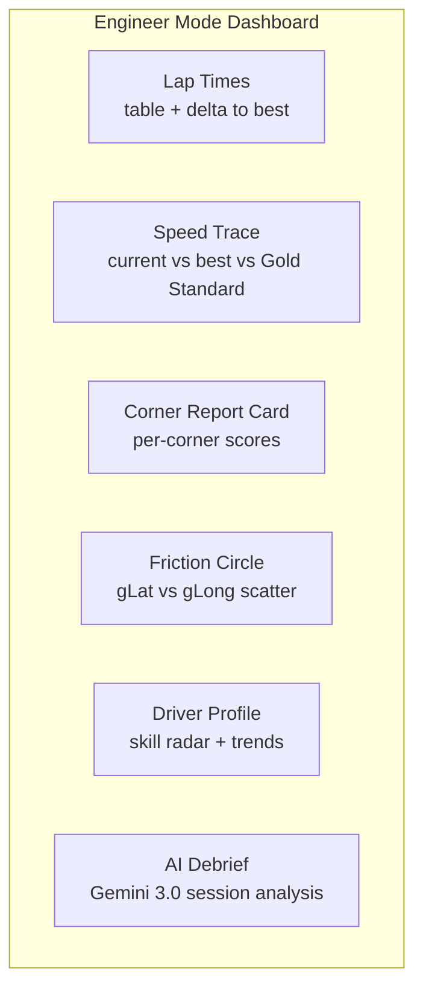
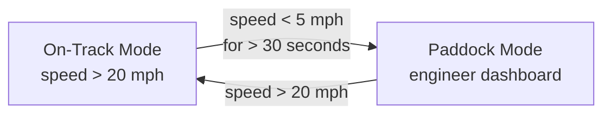

# UX: Audio-First, Minimal Visual

Two modes. On-track: the co-pilot (audio + minimal HUD). Off-track: the race engineer (full dashboard).

## Validated Cue Distribution (from Sonoma Simulator)

Running the LSTM-driven sonic model v2 on 11,737 frames of real Sonoma telemetry:

| Audio Layer | Frames Active | % of Session | Priority | When It Fires |
|------------|:---:|:---:|:---:|---|
| **Grip tone** | 6,475 | 55.2% | P0 (background) | Continuous — pitch tracks friction circle utilization |
| **Brake approach** | 4,970 | 42.3% | P1-P2 | Corner approaching, ascending pitch |
| **Speed delta** (LSTM v2) | ~2,100 | ~18% | P1-P2 | When actual speed deviates >5 km/h from LSTM prediction |
| **Throttle cue** | 377 | 3.2% | P1 | Past apex, driver not on throttle yet |
| **Coast warning** | 354 | 3.0% | P1 | Throttle <10%, brake <2 bar, speed >30 km/h |
| **Trail brake** | 138 | 1.2% | P1 | Brake >3 bar AND gLat >0.4G in a corner |
| **Corner score chime** | ~55 | ~0.5% | P0 | On exit of each corner (up/down/neutral chime) |
| **Silence** | 2,545 | 21.7% | — | On straights when everything is normal |

**Key finding:** The driver hears audio cues 78% of the time, with 22% silence. The grip tone is the continuous background layer — the driver habituates to it and notices changes in pitch. Active coaching (brake approach, speed delta, throttle) fires in ~25% of frames. This is the right balance — enough information without overwhelm.

---

## On-Track: The Co-Pilot

The driver's cognitive capacity at 130 mph is fully consumed by driving. The UX must **add information without adding cognitive load**.

### Audio (Primary Interface)

All coaching delivered via Pixel Earbuds TTS.

| Message Type | Length | Example | Priority |
|-------------|--------|---------|----------|
| Safety alert | 1-2 words | "BRAKE!" / "Lift!" / "Car right!" | P3 — immediate |
| Reflexive cue | 2-5 words | "Trail brake." / "Commit." / "Full send." | P2 — on straight |
| Technique | 5-15 words | "Trail brake to the apex. Smooth release." | P2 — on straight |
| Strategy | 10-25 words | "Turn 3: you braked 15m early vs AJ. Try holding to the 2-board." | P1 — queued |

**Delivery timing:** The message arbiter holds non-safety messages until the car is on a straight (|gLat| < 0.3G). This prevents mid-corner distraction.

**Message cadence:** Maximum one message every 3 seconds. A lap at Sonoma is ~100 seconds. That means ~15 coaching opportunities per lap, but typically 3-5 are used. Silence is coaching too.

### Signal Light HUD (Secondary Interface)

The Pixel 10 screen shows minimal visual information. No graphs. No numbers. No text.

```
┌─────────────────────────┐
│                         │
│    ┌───┐       ┌───┐    │
│    │   │       │   │    │
│    │   │       │   │    │
│    │ G │       │ R │    │
│    │ R │       │ E │    │
│    │ E │       │ D │    │
│    │ E │       │   │    │
│    │ N │       │   │    │
│    │   │       │   │    │
│    └───┘       └───┘    │
│                         │
│   GRIP OK    OVER LIMIT │
│                         │
└─────────────────────────┘
```

**Left bar (green):** Grip available. Height = percentage of friction circle unused. Full bar = car is well within limits. Shrinking = approaching the limit.

**Right bar (red):** Over-limit. Height = how far beyond the grip circle. Appears only when `sqrt(gLat^2 + gLong^2) > max_G * 0.95`. Growing = sliding more.

**Why this works:** The driver doesn't need to read it. In peripheral vision, green = OK, red appearing = back off. One glance, zero cognitive parsing.

### What the HUD Does NOT Show On-Track

- Lap times (distracting — driver focuses on chasing numbers instead of technique)
- Speed (driver can feel it)
- RPM (driver can hear it)
- Tire temps (driver can't act on it mid-corner)
- Coaching text (that's what audio is for)
- Dashboards, graphs, or charts of any kind

---

## Off-Track: The Race Engineer

When the car enters the paddock (speed < 5 mph for >30 seconds), the system switches to **engineer mode**: a full analytical dashboard on the Pixel 10 screen.



### Dashboard Panels

#### Lap Times
Table of all laps with delta to personal best and Gold Standard (AJ).

#### Speed Trace Overlay
Three overlapping speed traces by track distance:
- **Current session best** (blue)
- **Personal all-time best** (green)
- **Gold Standard / AJ** (gold)

Shows exactly where the driver is faster/slower and by how much.

#### Corner Report Card
Per-corner scoring:

| Corner | Entry Speed | Min Speed | Exit Speed | Trail Brake | Time | vs AJ |
|--------|-----------|-----------|-----------|-------------|------|-------|
| Turn 3 | 78 mph (B) | 52 mph (C) | 68 mph (B) | 15% (A) | 4.2s | +0.4s |

Grades: A (within 5% of AJ), B (within 15%), C (within 25%), D (>25% gap).

#### Friction Circle
Live gLat vs gLong scatter plot from the session. Shows grip envelope utilization.

#### Driver Profile (Event-Sourced)
Skill radar chart computed from DuckDB session data. Dimensions: Braking, Trail Braking, Corner Speed, Throttle Application, Consistency, Line Accuracy.

#### AI Debrief
Gemini 3.0 generates a narrative session summary:

> "Good session. Best lap 1:42.3, 3.1s behind AJ. Your Turn 3 improved — exit speed up 4mph from last session. Focus area for next session: Turn 7 entry. You're braking 20m too early and losing 0.8s per lap. Try the 3-board as your brake reference. Overall consistency improved — lap time spread down from 2.1s to 1.4s."

---

## Mode Switching



The transition is automatic. No driver interaction required.

When entering paddock mode:
1. Session recording continues (don't lose data)
2. DuckDB computes session aggregates
3. Dashboard panels load with current session data
4. Gemini 3.0 generates debrief (if 5G available)

When leaving paddock mode:
1. Dashboard hides, Signal Light HUD appears
2. Coaching engine reactivates
3. Arbiter resets cooldowns
