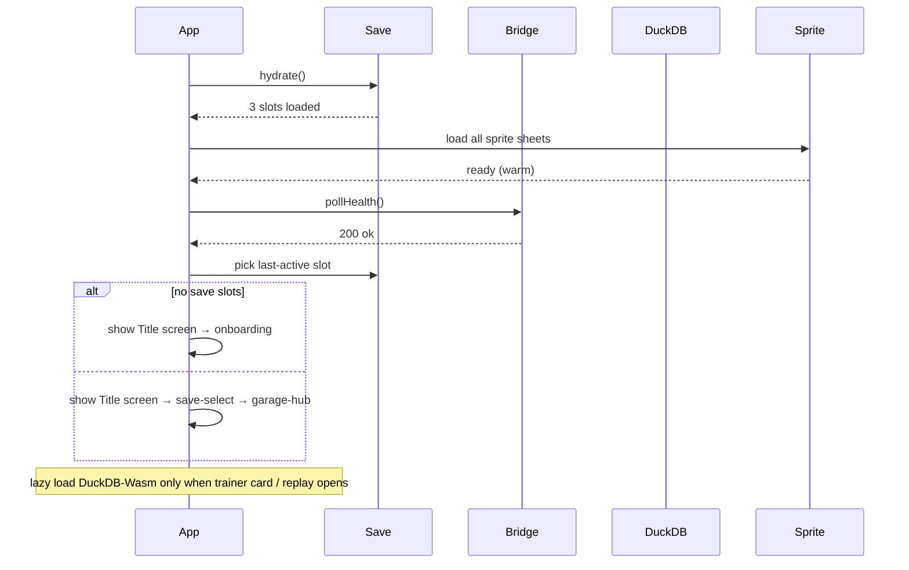

# 04 — State architecture

How the Vue PWA holds state. Pinia stores + IndexedDB persistence + an
OPFS-cached Parquet layer for analytics. **The bridge is the source of
truth for live data; local state is a cache + UI scaffolding.**

## Stores at a glance

| Store | Lifetime | Persisted? | Source of truth |
|---|---|---|---|
| `useSaveStore` | App lifetime | IndexedDB | Local (the player's save slots) |
| `useSessionStore` | Active session | None (memory only) | Bridge `/session/<sid>` |
| `useBridgeStore` | App lifetime | None | Bridge `/health` polled every 5 s |
| `useDuckDBStore` | App lifetime | OPFS Parquet cache | Bridge `/session/<sid>/export.parquet` |
| `useAudioStore` | App lifetime | LocalStorage (volume) | Local |
| `useSpriteStore` | App lifetime | None (loaded once on boot) | `/public/sprites/` |
| `useDialogueStore` | Active dialogue | None | Local |
| `useCoachStore` | App lifetime | IndexedDB (affinity per coach) | Local + bridge `/coach/concepts` |
| `useCueStore` | Active drive | None | Bridge SSE `/cues/stream` |
| `useTransitionStore` | App lifetime | None | Local |

## Save format (IndexedDB)

Three save slots — `slot:1`, `slot:2`, `slot:3`. Each is one document,
versioned. Schema:

```ts
// pitwall-web/src/types/save.ts
export interface SaveSlot {
  // Versioning
  schemaVersion: 1
  id: 1 | 2 | 3
  createdAt: string                 // ISO8601 UTC
  lastPlayedAt: string

  // Driver identity
  driverName: string                // 1-12 chars, A-Z + space
  skillLevel: 'beginner' | 'intermediate' | 'pro'
  car: string                       // e.g. "BMW M3 (E46)"
  avatarSlot: 1 | 2 | 3 | 4 | 5 | 6 | 7 | 8

  // Active selections
  preferredCoach: 'trod' | 'bentley' | 'drill' | 'calm' | 'buddy'
  preferredTrack: 'sonoma' | 'laguna' | 'thunderhill' | 'buttonwillow'

  // Progression
  level: number                     // floor(sessions / 5) + 1
  sessions: SessionSummary[]        // most recent 100; older stored as Parquet
  bestLapBySession: Record<string, number>     // session_id → best_lap_s

  // Coach affinity (persists across coach swaps)
  coachAffinity: Record<CoachId, number>       // 0..N sessions

  // Unlocks
  unlockedTracks:  TrackId[]
  unlockedAvatars: number[]         // [1..8]
  unlockedCoaches: CoachId[]        // initial: ['trod', 'buddy']

  // Achievements
  medals: { id: string, awardedAt: string, sessionId?: string }[]
  goalsHistory: SessionGoal[]

  // Settings (per-slot — driver A vs driver B can have different prefs)
  settings: SaveSettings
}

export interface SessionSummary {
  sessionId:   string
  startedAt:   string
  trackId:     string
  bestLapS:    number | null
  lapCount:    number
  coachId:     CoachId
  goalsHit:    number
  goalsTotal:  number
  totalScore:  number               // 0–100
  pbAchieved:  boolean
}

export interface SessionGoal {
  id:          string
  kind:        'corner_focus' | 'lap_time' | 'technique'
  description: string
  targetValue: number
  achievedAt?: string
  result?:     'hit' | 'partial' | 'miss'
}

export interface SaveSettings {
  audio: {
    masterVolume:   number    // 0..1
    musicVolume:    number
    sfxVolume:      number
    voiceVolume:    number
    coachMute:      boolean
  }
  display: {
    nightMode:      boolean
    reducedMotion:  boolean
    showFps:        boolean
  }
  controls: {
    keyboardLayout: 'wasd' | 'arrows' | 'igdk'
    swapAB:         boolean
  }
}
```

### Persistence library

Use [`idb-keyval`](https://github.com/jakearchibald/idb-keyval) — tiny
wrapper around IndexedDB, no schema management:

```ts
// pitwall-web/src/stores/save.ts
import { defineStore } from 'pinia'
import { get, set } from 'idb-keyval'

export const useSaveStore = defineStore('save', {
  state: () => ({
    slots: [null, null, null] as (SaveSlot | null)[],
    activeSlotId: null as 1 | 2 | 3 | null,
  }),
  actions: {
    async hydrate() {
      this.slots = await Promise.all([1, 2, 3].map(
        async (id) => (await get<SaveSlot>(`slot:${id}`)) ?? null
      ))
    },
    async save() {
      const id = this.activeSlotId
      if (id === null) return
      const slot = this.slots[id - 1]
      if (slot) await set(`slot:${id}`, slot)
    },
    /* ... */
  },
})
```

Auto-save triggers (in priority order):

1. After every screen-clear transition out of `Onboarding`
2. After every Stage Clear screen completes
3. After every coach swap
4. After every settings change
5. On `pagehide` event (PWA closing)

## Bridge state

Live bridge data is *not* persisted. Each store fetches what it needs
on screen entry; subsequent navigations re-fetch unless the data is
known fresh (< 30 s old).

```ts
export const useBridgeStore = defineStore('bridge', {
  state: () => ({
    health: null as HealthResponse | null,
    healthFetchedAt: 0,
    healthError: null as string | null,
  }),
  actions: {
    async pollHealth() {
      try {
        const r = await fetch('http://127.0.0.1:8765/health')
        this.health = await r.json()
        this.healthFetchedAt = Date.now()
        this.healthError = null
      } catch (e) {
        this.healthError = String(e)
      }
    },
    /* … */
  },
})

// Boot: useBridgeStore().pollHealth() on app mount;
// then setInterval every 5 s while in foreground.
```

## DuckDB-Wasm + OPFS

The PWA loads `@duckdb/duckdb-wasm` lazily (~6 MB gz). When a player
opens `screens/04-trainer-card.md` or `screens/11-replay.md`, the
DuckDB store fetches recent session Parquets from the bridge and
caches them in OPFS for offline replay.

```ts
// pitwall-web/src/stores/duckdb.ts
import { defineStore } from 'pinia'
import * as duckdb from '@duckdb/duckdb-wasm'

export const useDuckDBStore = defineStore('duckdb', {
  state: () => ({
    db: null as duckdb.AsyncDuckDB | null,
    cachedSessionIds: new Set<string>(),
  }),
  actions: {
    async init() {
      if (this.db) return
      const bundle = await duckdb.selectBundle(duckdb.getJsDelivrBundles())
      this.db = await duckdb.createDuckDB(bundle)
      await this.db.instantiate(bundle.mainWorker!, bundle.mainModule!)
    },
    async ensureSession(sid: string) {
      if (this.cachedSessionIds.has(sid)) return
      // Fetch from bridge → register with DuckDB-Wasm → save to OPFS
      const r = await fetch(
        `http://127.0.0.1:8765/session/${sid}/export.parquet?table=telemetry`,
      )
      const buf = new Uint8Array(await r.arrayBuffer())
      await this.db!.registerFileBuffer(`${sid}.parquet`, buf)
      // Persist to OPFS
      const root = await navigator.storage.getDirectory()
      const dir  = await root.getDirectoryHandle('sessions', { create: true })
      const fh   = await dir.getFileHandle(`${sid}.parquet`, { create: true })
      const ws   = await fh.createWritable()
      await ws.write(buf); await ws.close()
      this.cachedSessionIds.add(sid)
    },
    async query(sql: string) {
      const conn = await this.db!.connect()
      const result = await conn.query(sql)
      await conn.close()
      return result
    },
  },
})
```

## SSE cue stream (live drive)

When the player is on the on-track HUD screen, a long-lived SSE
connection feeds coaching cues:

```ts
// pitwall-web/src/stores/cue.ts
export const useCueStore = defineStore('cue', {
  state: () => ({
    es: null as EventSource | null,
    activeCue: null as Cue | null,
    queue: [] as Cue[],
  }),
  actions: {
    open(sid: string) {
      this.es?.close()
      this.es = new EventSource(
        `http://127.0.0.1:8765/cues/stream?session_id=${sid}`,
      )
      this.es.onmessage = (e) => {
        const cue = JSON.parse(e.data) as Cue
        this.queue.push(cue)
      }
      this.es.onerror = () => {
        this.activeCue = null
        // Bridge offline → HUD shows "AI offline" mode
      }
    },
    close() {
      this.es?.close(); this.es = null
    },
  },
})
```

The HUD pulls the next cue off the queue; the arbiter logic is on the
bridge side per ADR-002 / ADR-017.

## Boot sequence



Boot target: **< 1.5 s** from `app:mount` to interactive Title screen.
DuckDB loading deferred until first analytics screen — keeps cold start
snappy.

## Cross-store rules

These invariants must hold:

1. **Save slot writes are debounced.** Multiple state changes within
   200 ms collapse into one `idb-keyval.set()` call.
2. **Active session ↔ active slot.** A session always belongs to a
   save slot; if the user logs out (back to title), the active session
   ends.
3. **DuckDB reads never block the UI.** All `query()` calls await; HUD
   never awaits a Wasm query.
4. **Bridge data is never written to a save slot directly.** It's
   transformed into a `SessionSummary` first, then merged.
5. **Coach affinity increments on session end** — never per-cue, never
   per-second. This guards against affinity grinding.

## Failure modes

| Scenario | Behaviour |
|---|---|
| IndexedDB blocked / corrupt | Fall back to LocalStorage; show "save unavailable" warning on save-select screen |
| Bridge unreachable | Show offline icon in status bar; trainer card + replay still work from OPFS-cached Parquets |
| OPFS quota exhausted | Auto-evict oldest cached Parquet; warn user |
| DuckDB-Wasm fails to load | Skip the Monaco SQL panel + Parquet flows; pre-built panels stop working until reload |
| SSE drops mid-drive | Auto-reconnect with 1 s backoff; HUD shows the "ghost cue" pattern from `screens/08-on-track-hud.md` |

## Related

- [`05-routing-map.md`](05-routing-map.md) — when each store hydrates
- [`09-tech-stack.md`](09-tech-stack.md) — Pinia + idb-keyval +
  DuckDB-Wasm versions
- [Bridge api.md](../api.md) — endpoints the stores consume
