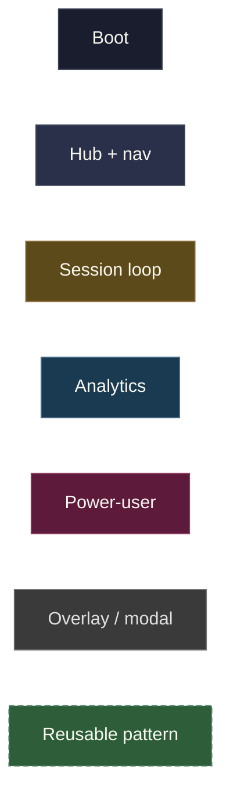
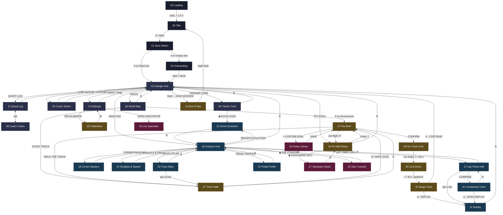
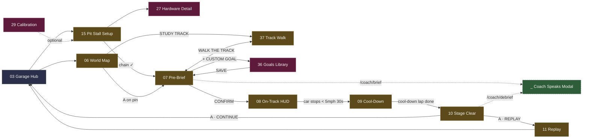
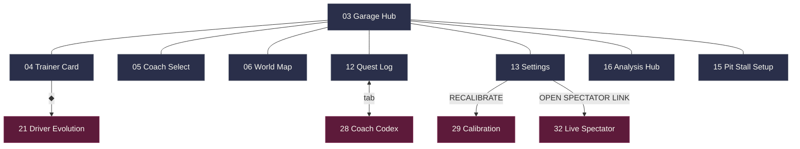
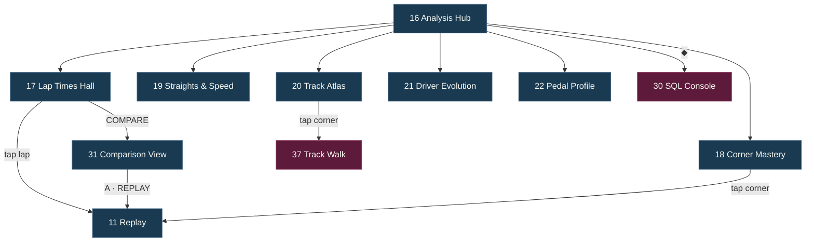
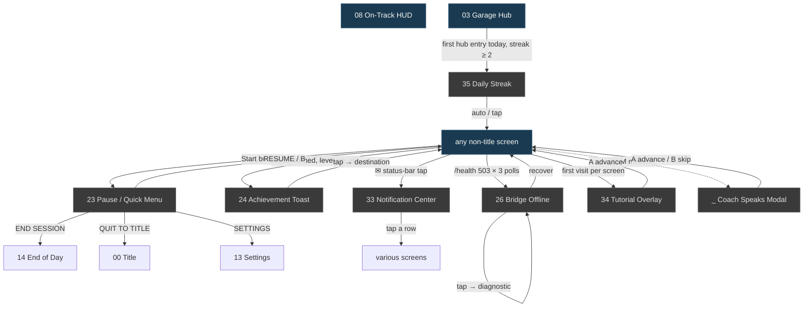
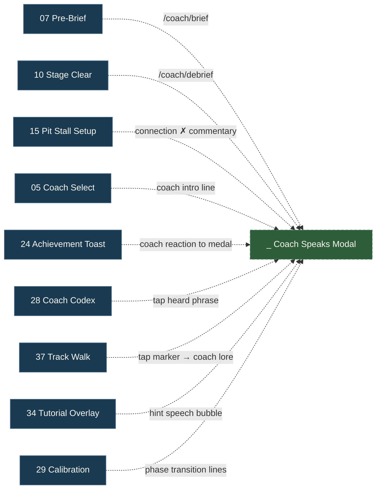
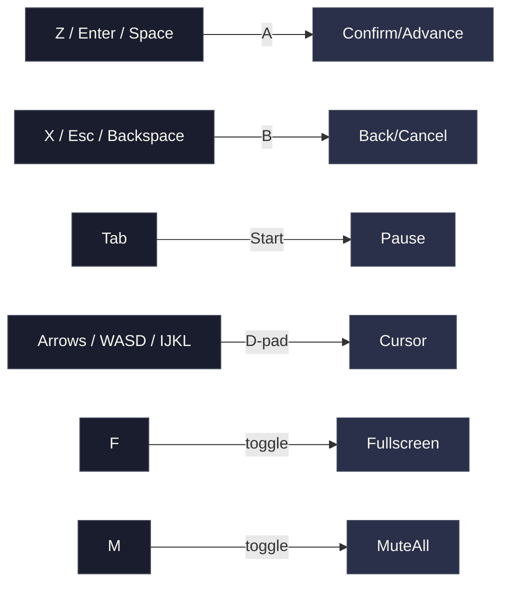

# 11 — Navigation map

The god mermaid. Every screen, every transition, every overlay,
all visualised. Read top-to-bottom: full overview first, then zoomed
subgraphs for the dense parts.

Use this as the quick-reference when wiring `router.ts` or asking
*"where does the B button on screen X take me?"*

## Legend

Solid arrow = forward navigation. Dashed = back navigation. Dotted =
auto-transition (state-driven). Arrow labels are the trigger
(`A` button, `B` button, `Start`, or specific event).

## Full overview — every full route

This shows every routed screen (overlays are in a separate diagram
below to keep it legible).

## Zoom: session loop

The hot path of the app — every track day touches this chain.

Three places the **Coach Speaks Modal** fires inside this loop —
pre-brief generation, debrief generation, and any LLM-driven moment.
Per [`screens/_coach-speaks-modal.md`](screens/_coach-speaks-modal.md).

## Zoom: hub radial

Garage Hub is the navigation centre. Six tiles + Start menu.

## Zoom: analytics radial

Analysis Hub is a sub-centre — the data dungeon entry.

## Overlays — where they fire

Overlays don't appear on the routed map because they overlay
*whatever screen is active*. Here's where each one can fire:

The on-track HUD has **special suppression rules** (per
`06-audio-design.md`) — Achievement Toasts and Tutorials defer to the
next safe moment when the player is mid-corner. Pause is the only
overlay that can interrupt.

## Coach Speaks Modal — usage map

Every place the canonical "LLM is talking" pattern fires:

The modal reads **emotion** from each caller per
[`10-coach-emotions.md`](10-coach-emotions.md). When the LLM is the
source, emotion comes from the response payload. When a canonical
phrase is the source, emotion comes from the static phrase library
tag.

## Per-screen incoming/outgoing reference

Quick-lookup table for *"who reaches screen N, and where does N
go?"*. Useful when implementing the router.

| # | Screen | Reachable from | Forward exits |
|---|---|---|---|
| 00 | Title | (boot, Quit-to-title from anywhere) | A → 01 Save Select |
| 01 | Save Select | 00, log-out | A on filled → 03; A on empty → 02 |
| 02 | Onboarding | 01 | step 7 done → 03 |
| 03 | Garage Hub | 01, 02, 10, 11, 13, 14, 12, all hubs | 6 tiles + Start menu |
| 04 | Trainer Card | 03 (TRAINER CARD), 24 (level-up tap) | ◆ → 21; B → 03 |
| 05 | Coach Select | 03 (COACHES), 24 (affinity tier) | swap → 03 |
| 06 | World Map | 03 (TRACK), 24 (track unlock) | A on Sonoma → 07; STUDY TRACK → 37 |
| 07 | Pre-Brief | 06 (A on pin) | CONFIRM → 08; WALK → 37; CUSTOM → 36 |
| 08 | On-Track HUD | 07 (CONFIRM, pre-flight ✓) | car stops → 09; B → Pause |
| 09 | Cool-Down | 08 (auto when stopped < 90 s) | t > 90 s in paddock → 10 |
| 10 | Stage Clear | 09 | A · CONTINUE → 03; A · REPLAY → 11 |
| 11 | Replay | 10, 17 (tap lap), 31, 18 (tap corner), 33 | B → 03 |
| 12 | Quest Log | 03, 24 (medal tap), 33 | tab → 28; B → 03 |
| 13 | Settings | 03, 23 Pause Menu | RECALIBRATE → 29; SPECTATOR → 32 |
| 14 | End of Day | 03 (Start → END SESSION) | night fade → 00 |
| 15 | Pit Stall Setup | 03 (PIT STALL), 07 (pre-flight ✗), 26 (offline diagnostic) | ◆ → 27; chain ✓ → 07 |
| 16 | Analysis Hub | 03 (ANALYSIS) | 6 tiles + ◆ → 30 |
| 17 | Lap Times Hall | 16 | tap lap → 11; COMPARE → 31; B → 16 |
| 18 | Corner Mastery | 16 | tap corner → 11 (replay); B → 16 |
| 19 | Straights & Speed | 16 | B → 16 |
| 20 | Track Atlas | 16, 06 (alt entry) | tap corner → 37; B → 16 |
| 21 | Driver Evolution | 16, 04 (◆), 33 | B → 16 |
| 22 | Pedal Profile | 16 | B → 16 |
| 23 | Pause / Quick Menu | Start on any screen | RESUME → parent; SETTINGS → 13; END SESSION → 14; QUIT → 00 |
| 24 | Achievement Toast | event-driven | tap → destination per kind |
| 25 | Loading | app boot | auto → 00 |
| 26 | Bridge Offline | event-driven (3+ failed polls) | tap → expanded; recover → silent |
| 27 | Hardware Detail | 15 (◆) | B → 15 |
| 28 | Coach Codex | 12 (tab) | B → 12 |
| 29 | Calibration | 13, 02 (step 7) | B → caller |
| 30 | SQL Console | 16 (◆) | B → 16 |
| 31 | Comparison View | 17 (COMPARE) | A · REPLAY → 11; B → 17 |
| 32 | Live Spectator | 13 (OPEN SPECTATOR LINK), URL | B → 13 |
| 33 | Notification Center | ✉ status-bar tap from any screen | tap row → various |
| 34 | Tutorial Overlay | first visit per screen per save slot | A advance → parent |
| 35 | Daily Streak | first garage entry today, streak ≥ 2 | tap / auto → 03 |
| 36 | Goals Library | 07 (+ CUSTOM GOAL) | SAVE → 07 |
| 37 | Track Walk | 07 (WALK), 06 (STUDY), 20 (tap corner) | A on corner → corner card; B → caller |
| _ | Coach Speaks Modal | 07, 10, 15, 05, 24, 28, 37, 34, 29 | A advance / B skip → caller |

## Keyboard quick-cheat

A second view: which keystrokes do what across the app.

## What this map enables

- **Implementing `router.ts`** — every entry in the Per-screen table
  becomes a route definition; the diagrams show what guards to wire
- **Reviewing UX coherence** — orphan screens, dead-end paths, or
  unreachable branches show up immediately
- **Onboarding new contributors** — one diagram instead of reading
  38 screen docs
- **Spotting transition cycles** — e.g., 07 ↔ 37 is a healthy
  back-and-forth; `pre-brief → on-track → cool-down → stage-clear →
  hub` is the canonical session arc
- **Mermaid renders inside mkdocs-material** out of the box per
  `mkdocs.yml`'s `pymdownx.superfences` config — these diagrams ship
  with the rendered docs

## Don't-do list

- **Don't move overlays into the routed map.** They overlay; they're
  not destinations. Mixing categories makes the map unreadable.
- **Don't add the Coach Speaks Modal as a screen in the router.** It's
  a component that lives over screens. Its usage map (above) is the
  reference.
- **Don't expand the per-screen table inline.** When the count grows
  past 50 screens, split into a sub-page. Today, 38 screens fit on
  one page.

## Related

- [`05-routing-map.md`](05-routing-map.md) — Vue Router specifics for
  every route in the diagrams
- [`07-controls.md`](07-controls.md) — input behaviour referenced in
  diagram labels
- Every screen doc under `screens/` — the destinations cross-linked
  here
